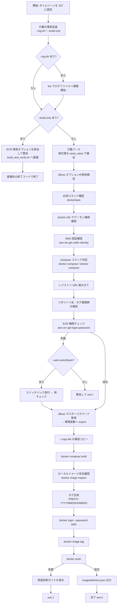
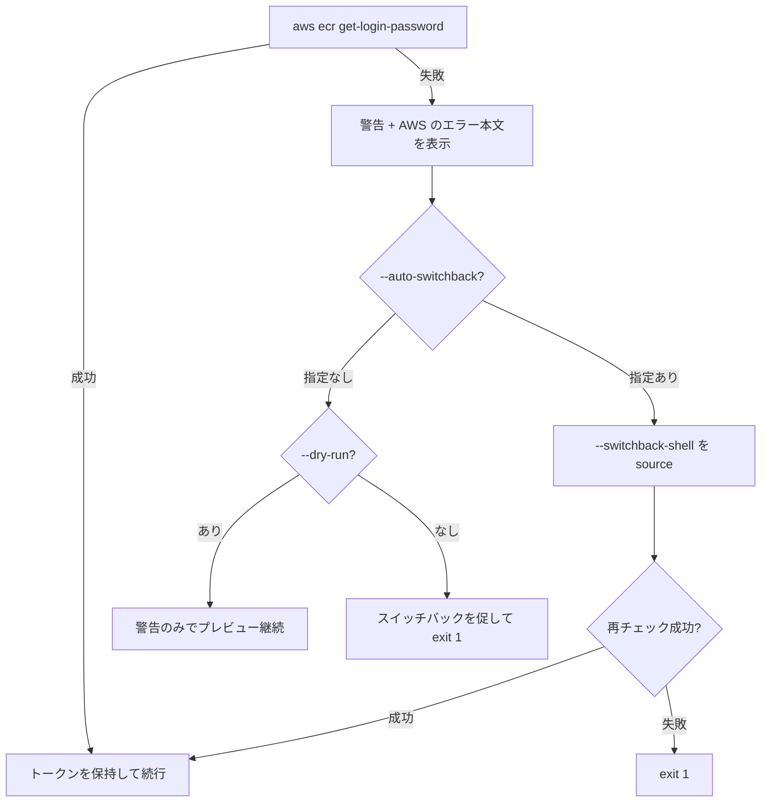

# build_and_push.sh 詳細ガイド

`compose.yml` でローカルベースイメージをビルドし、ECR へタグ付け・プッシュして
`imagedefinition.json` を出力するスクリプトの完全リファレンスです。

- 対象ファイル: `build_and_push.sh`
- 想定実行環境: RHEL 9.6 の EC2 インスタンス (bash 5.x / GNU coreutils / Docker CE)
- 関連ドキュメント: [buildx 版ガイド](buildx_build_and_push_guide.md) / [ビルド・動作確認ガイド](build_and_verify_guide.md)
- Excel 版: [build_and_push_guide.xlsx](build_and_push_guide.xlsx) — 仕様 / パラメータ / 既定で有効な動作 / 設定例 の 5 シート構成 (Meiryo UI)。
  本ファイルを更新したら `python3 docs/generate_guide_xlsx.py` で再生成してください

---

## 目次

1. [このスクリプトの役割](#1-このスクリプトの役割)
2. [全体構成](#2-全体構成)
3. [処理の流れ](#3-処理の流れ)
4. [パラメータ一覧](#4-パラメータ一覧)
5. [パラメータ詳細解説](#5-パラメータ詳細解説)
6. [環境変数](#6-環境変数)
7. [終了コード](#7-終了コード)
8. [入出力ファイル](#8-入出力ファイル)
9. [実行例](#9-実行例)
10. [エラーと対処](#10-エラーと対処)

---

## 1. このスクリプトの役割

`docker compose build` で生成したローカルベースイメージ (既定 `j1/base.local`) を、
ECR へ「日時付きタグ」でプッシュし、CodePipeline の ECS デプロイで使う
`imagedefinition.json` を出力します。

```
compose.yml ──> docker compose build ──> j1/base.local (ローカル)
                                              │
                                    docker image tag
                                              ▼
        <account>.dkr.ecr.<region>.amazonaws.com/<repository>:<prefix>-<YYYYMMDDHHMMSS>
                                              │
                                        docker push
                                              ▼
                                  imagedefinition.json 出力
```

### 3 スクリプトの使い分け

| 目的 | 使うスクリプト |
| --- | --- |
| compose でビルドして ECR へプッシュしたい | **build_and_push.sh** (このスクリプト) |
| Dockerfile を buildx で直接ビルドして ECR へプッシュしたい | `buildx_build_and_push.sh` |
| ビルドだけ / 起動確認や URL 確認までしたい (ECR 不要) | `build_and_verify.sh` (= `build_and_push.sh --build-only`) |

### 前提条件

| 前提 | 内容 |
| --- | --- |
| 認証 | 実行前に `aws login --remote` 済みであること。未認証なら `exit 1` |
| 権限 | ECR の操作権限。CodeCommit の権限は不要 |
| 権限が無い場合 | 既定は警告して終了 (`--warn-only`)。`--auto-switchback` で自動スイッチバック |
| 必須コマンド | `docker`、`aws`、`docker compose` または `docker-compose` |
| Docker | デーモンに接続できること (起動時に `docker info` で確認) |

---

## 2. 全体構成

### 2.1 ファイル内のセクション構成

| 行の位置 | セクション | 内容 |
| --- | --- | --- |
| 冒頭 | ヘッダーコメント | スクリプトの目的・前提・使い方 |
| 前半 | 表示タイムゾーン設定 | ログ・タグ・ログファイル名の時刻を JST に固定 |
| 前半 | 既定値 | 全パラメータの初期値 |
| 前半 | ログ用ヘルパ | `log` / `warn` / `err` / `diag` / `run` / `log_elapsed` ほか |
| 中盤 | `usage()` | `--help` の本文 |
| 中盤 | 引数の事前走査 | `--log-dir` / `--build-only` を本パース前に解釈 |
| 中盤 | ログファイル出力の準備 | `tee` によるコンソール出力の複製 |
| 中盤 | `--build-only` 委譲 | `build_and_verify.sh` へ引数を引き継いで委譲 |
| 中盤 | 引数パース | 本パース (`need_value` で値欠落を検出) |
| 中盤 | 各種検証 | JBoss オプション排他 / 依存コマンド / Docker / AWS 認証 / イメージ参照 |
| 後半 | ECR 権限チェック・スイッチバック | `check_ecr_permission` / `do_switchback` |
| 後半 | シークレット準備 | `prepare_jboss_password` |
| 後半 | 一時ファイルコピー | `prepare_copy_files` / `cleanup_copied_files` |
| 後半 | push 失敗診断 | `guide_iam` ほか 5 種の原因ガイド + `diagnose_push_failure` |
| 末尾 | メイン処理 | ビルド → タグ付け → ログイン → プッシュ → 出力 |

### 2.2 主要な関数

| 関数 | 役割 |
| --- | --- |
| `setup_display_timezone` | `Asia/Tokyo` → `JST-9` の順に試し、表示時刻を JST に固定する |
| `log` / `warn` / `err` | `[YYYY-MM-DD HH:MM:SS JST]` 付きでログ出力 (warn/err は stderr) |
| `diag` | 診断ガイド用。接頭辞を付けずそのまま stderr へ出力 |
| `run` | `--dry-run` 時はコマンドを表示するだけ、通常時は実行する |
| `log_elapsed` | 開始からの経過秒数を `HH:MM:SS` 付きで出力 (EXIT トラップ) |
| `finish_logging` | ログ複製 (tee) を閉じて書き込み完了を待つ (ログ末尾の欠落防止) |
| `new_temp_file` / `cleanup_temp_files` | 一時ファイルの安全な作成と一括削除 |
| `json_escape` | `imagedefinition.json` に埋め込む値の JSON エスケープ |
| `arg_takes_value` / `ecr_only_option` | 事前走査で「値を取るオプション」「ECR 専用オプション」を判定 |
| `need_value` | 値が必要なオプションで値が省略された場合にエラー終了 |
| `check_ecr_permission` | `aws ecr get-login-password` の可否で ECR 権限を判定。成功時はトークンを保持 |
| `warn_ecr_auth_error` | 上記が失敗したとき、AWS が返したエラー本文を表示 |
| `do_switchback` | 別チーム提供のスイッチバック用シェルを `source` で読み込む |
| `prepare_jboss_password` | パラメータストア等からマスターパスワードを取得し環境変数へ export |
| `prepare_copy_files` / `cleanup_copied_files` | ビルド前の一時コピーと、終了時の自動削除 |
| `diagnose_push_failure` | push 失敗時に AWS API を実際に叩いて原因を切り分け、調査手順を表示 |

### 2.3 EXIT トラップ

処理のどの経路 (成功・失敗・中断) でも、以下が必ず実行されます。
SIGINT (Ctrl-C) / SIGTERM で中断した場合も EXIT トラップが動作します。

```
cleanup_copied_files   … --copy-file でコピーしたファイルを削除
cleanup_temp_files     … 一時ファイル (push ログ・SSM エラー出力) を削除
log_elapsed            … 処理実行時間を記録
finish_logging         … ログファイルへの書き込みを完了させる
```

---

## 3. 処理の流れ

### 3.1 全体フロー



### 3.2 各ステップの詳細

| # | ステップ | 内容 | 失敗時 |
| --- | --- | --- | --- |
| 1 | タイムゾーン設定 | `Asia/Tokyo` が使えなければ tzdata 不要の `JST-9` へフォールバック。どちらも不可ならホストの TZ で継続 (警告) | 警告のみ |
| 2 | 引数の事前走査 | `--log-dir` の値取得と `--build-only` の検出。「値を取るオプションの値」をオプション名と取り違えないよう走査する | — |
| 3 | ログ複製開始 | `--log-dir` 指定時、`DIR/build_and_push_<YYYYMMDDHHMMSS>.log` へ全出力を複製 (画面表示は継続) | ディレクトリ作成失敗で `exit 1` |
| 4 | `--build-only` 委譲 | `build_and_verify.sh` を起動。ECR 専用オプションは警告して除去、`--log-dir` は委譲元で処理済みのため除去 | 委譲先が無ければ `exit 1` |
| 5 | 引数パース | 全オプションを解釈。値が必要なのに省略された場合は `exit 2` | `exit 2` |
| 6 | JBoss オプション検証 | `--jboss-password-param` と `--jboss-password` の同時指定禁止、環境変数名の形式検証 | `exit 2` |
| 7 | 必須コマンド確認 | `docker` と `aws` の存在確認 | `exit 1` |
| 8 | Docker 接続確認 | `docker info` でデーモンへ接続できるか確認 (`--dry-run` 時は警告のみ) | `exit 1` |
| 9 | AWS 認証確認 | `aws sts get-caller-identity` (`--dry-run` 時は警告のみ) | `exit 1` |
| 10 | compose 判定 | `docker compose` (v2) を優先、無ければ `docker-compose` (v1) | `exit 1` |
| 11 | レジストリ URL | `--registry` 指定時はそれを使用。未指定なら `<account-id>.dkr.ecr.<region>.amazonaws.com` を組み立て。末尾のスラッシュは除去 | `exit 2` |
| 12 | イメージ参照の検証 | `--repository` は小文字のみ、`--tag-prefix` は英数字と `. _ -` のみ。**ビルド前**に検証する | `exit 2` |
| 13 | ECR 権限チェック | `aws ecr get-login-password` の成否で判定。成功時のトークンは後段の `docker login` に再利用 | 下記 3.3 参照 |
| 14 | シークレット準備 | パラメータストア / 直接指定 / 既存環境変数のいずれかからマスターパスワードを取得し export | `exit 1` |
| 15 | 事前コピー | `--copy-file SRC:DEST_DIR` を検証してコピー。終了時に自動削除 | `exit 1` / `exit 2` |
| 16 | ビルド | `docker compose -f <file> build [--no-cache] [service]` を監視プロセス付きで実行 (進捗表示・停滞検知・上限時間での中断。5.7 参照)。開始前に data root の空き容量を確認 | `exit 1` |
| 17 | イメージ確認 | `docker image inspect <local-image>` (`--dry-run` 時はスキップ) | `exit 1` |
| 18 | タグ生成 | `<TAG_PREFIX>-<YYYYMMDDHHMMSS>` (JST) | — |
| 19 | ECR ログイン | `docker login --username AWS --password-stdin` (パスワードは標準入力経由) | `exit 1` |
| 20 | タグ付け・プッシュ | `docker image tag` → `docker push`。出力は `tee` で保存し、失敗時に解析 | `exit 1` + 診断 |
| 21 | 出力 | `imagedefinition.json` を書き込み (書き込み失敗も検出) | `exit 1` |

### 3.3 ECR 権限チェックの分岐



### 3.4 push 失敗時の自動診断

`docker push` が失敗すると、出力内容と AWS API の応答から原因を推定し、
該当する原因カテゴリの「詳細説明 + AWS CLI 調査コマンド + AWS コンソール確認箇所」を表示します。

| カテゴリ | 検出キーワード例 | 主な調査項目 |
| --- | --- | --- |
| A. IAM 権限エラー | `not authorized to perform`、`denied:` | `sts get-caller-identity`、`simulate-principal-policy`、CloudTrail |
| B. エンドポイント権限設定 | 同上 (A と併記) | リポジトリポリシー、VPC エンドポイントポリシー |
| C. エンドポイント不存在 | `no such host`、`dial tcp`、`i/o timeout` | ecr.api / ecr.dkr / s3 エンドポイント、PrivateDNS、SG、ルートテーブル |
| D. リポジトリ不存在 | `name unknown`、`does not exist` | `describe-repositories`、リージョン取り違え、`create-repository` |
| E. トークン期限切れ | `authorization token has expired`、`401 Unauthorized` | 再ログイン手順 |

診断では、実際に `aws sts get-caller-identity` と `aws ecr describe-repositories` を
読み取り専用で呼び出し、事実確認した結果も併せて表示します。
どのパターンにも一致しない場合は、A〜E の全観点を表示します。

---

## 4. パラメータ一覧

凡例 — **必須**: 指定が必要な条件 / **複数**: 繰り返し指定の可否

### 4.1 ECR 接続先の指定

| オプション | 値の形式 | 既定値 | 必須 | 説明 |
| --- | --- | --- | --- | --- |
| `--account-id ID` | 12 桁の AWS アカウント ID | env `AWS_ACCOUNT_ID` | `--registry` 未指定時は必須 | レジストリ URL の組み立てに使用 |
| `--region REGION` | AWS リージョン名 | `ap-northeast-1` (env `AWS_REGION` → `AWS_DEFAULT_REGION`) | 任意 | ECR / SSM の対象リージョン |
| `--registry URL` | `<account>.dkr.ecr.<region>.amazonaws.com` | env `ECR_REGISTRY` (未指定なら自動組み立て) | 任意 | レジストリを直接指定する場合に使用。末尾 `/` は自動除去 |
| `--repository NAME` | 小文字英数字と `. _ - /` | `baseimage` | 任意 | ECR リポジトリ名 = プッシュするイメージ名。**大文字は使用不可** |
| `--tag-prefix PREFIX` | 英数字と `. _ -` (先頭は英数字か `_`、113 文字以内) | `BaseImage` | 任意 | タグは `<PREFIX>-<YYYYMMDDHHMMSS>` になる。大文字も使用可 |

### 4.2 ビルドと出力

| オプション | 値の形式 | 既定値 | 複数 | 説明 |
| --- | --- | --- | --- | --- |
| `--local-image NAME` | イメージ名 | `j1/base.local` | 不可 | compose build で生成されるローカルイメージ名 |
| `--compose-file FILE` | ファイルパス | `compose.yml` | 不可 | compose 定義ファイル |
| `--compose-service NAME` | サービス名 | (全サービス) | 不可 | 指定時はそのサービスのみビルド |
| `--no-cache` | フラグ | `false` | — | キャッシュを破棄してビルド |
| `--build-progress-interval SEC` | 0 以上の整数 (秒) | `30` | 不可 | ビルド中に経過時間・BuildKit のフェーズ・data root の空き容量の増減を表示する間隔。`0` で表示しない (5.7 参照) |
| `--build-stall-timeout SEC` | 0 以上の整数 (秒) | `300` | 不可 | ビルド出力がこの秒数途切れたら停滞と判断し、原因の切り分け診断を表示する。`0` で検知しない。検知しても処理は中断しない |
| `--build-timeout SEC` | 0 以上の整数 (秒) | `0` (無制限) | 不可 | ビルド全体の上限秒数。超えたら診断のうえ SIGTERM で中断し (20 秒後に SIGKILL)、`exit 1` |
| `--no-build-watchdog` | フラグ | `false` | — | 上記の監視をすべて行わない。監視が有効な間は `BUILDKIT_PROGRESS=tty` を `plain` へ切り替えるため、tty 形式を使いたい場合に指定する |
| `--container-name NAME` | 任意の文字列 | `--repository` の値 | 不可 | `imagedefinition.json` の `name` |
| `--output FILE` | ファイルパス | `imagedefinition.json` | 不可 | imagedefinition の出力先 |

### 4.3 実行制御・ログ

| オプション | 値の形式 | 既定値 | 説明 |
| --- | --- | --- | --- |
| `--dry-run` | フラグ | `false` | ビルド/ログイン/タグ付け/プッシュ/ファイル出力を行わず、実行内容のみ表示 |
| `--build-only` | フラグ | `false` | ビルドのみ実行 (`build_and_verify.sh` へ委譲)。ECR 関連処理は行わない |
| `--log-dir DIR` | ディレクトリパス | (なし) | 画面出力を `DIR/build_and_push_<日時>.log` にも保存。ディレクトリは自動作成 |
| `-h`, `--help` | フラグ | — | ヘルプを表示して `exit 0` |

### 4.4 ビルド前後の一時ファイル

| オプション | 値の形式 | 既定値 | 複数 | 説明 |
| --- | --- | --- | --- | --- |
| `--copy-file SRC:DEST_DIR` | `コピー元:コピー先ディレクトリ` | (なし) | **可** | ビルド前にコピーし、終了後 (成功・失敗を問わず) 自動削除 |

### 4.5 JBoss マスターパスワード (BuildKit シークレット)

| オプション | 値の形式 | 既定値 | 説明 |
| --- | --- | --- | --- |
| `--jboss-password-param NAME` | SSM パラメータ名 | (なし) | パラメータストアから取得 (`--with-decryption`) |
| `--jboss-password VALUE` | パスワード文字列 | (なし) | 直接指定。`--jboss-password-param` とは排他 |
| `--jboss-password-env NAME` | 環境変数名 | `JBOSS_MASTER_PASSWORD` | 受け渡しに使う環境変数名。単独指定時は既存の環境変数値を使用 |

### 4.6 スイッチバック

| オプション | 値の形式 | 既定値 | 説明 |
| --- | --- | --- | --- |
| `--switchback-shell PATH` | シェルスクリプトのパス | env `SWITCHBACK_SHELL` | 別チーム提供のスイッチバック用シェル (`source` で読み込む) |
| `--auto-switchback` | フラグ | `false` | ECR 権限が無い場合に自動でスイッチバックして継続 |
| `--warn-only` | フラグ | **既定** | ECR 権限が無い場合に警告して終了 |

### 4.7 CA 証明書 (BuildKit シークレット)

| オプション | 値の形式 | 既定値 | 複数 | 説明 |
| --- | --- | --- | --- | --- |
| `--cacert-dir DIR` | ディレクトリのパス | (なし) | **可** | `cacert.crt` を置いたディレクトリ。指定した全ディレクトリ分を 1 つの tar にまとめてビルドへ渡す |
| `--cacert-secret-id ID` | 英数字と `. _ -` | `cacerts` | | シークレット id。`compose.yml` の secrets 名、Dockerfile の `RUN --mount=type=secret,id=...` と一致させる |
| `--cacert-bundle PATH` | tar のパス | 一時ファイル | | 生成する tar の出力先。指定時は**自動削除しない** |
| `--cacert-bundle-env NAME` | 環境変数名 | `CACERT_BUNDLE_FILE` | | tar のパスを compose へ渡す環境変数名。`compose.yml` の `file:` が参照する変数名と一致させる |
| `--cacert-glob PATTERN` | glob パターン | `*.crt` と `*.pem` | **可** | 各ディレクトリから取り込むファイルのパターン。指定するとこの値だけが対象になる |

---

## 5. パラメータ詳細解説

### 5.1 `--repository` と `--tag-prefix` の関係

両者は**独立**しています。リポジトリ名を変えてもタグ接頭辞は変わりません。

```bash
./build_and_push.sh --repository my-repo --tag-prefix BaseImage
#  => <registry>/my-repo:BaseImage-20260702153000
```

命名規則の制約は次のとおりです。違反するとビルド開始前に `exit 2` になります。

| 対象 | 使用できる文字 | 大文字 | 長さ |
| --- | --- | --- | --- |
| リポジトリ名 (`--repository`) | 小文字英数字、`.` `_` `-` `/` | **不可** | ECR の制限に準拠 |
| タグ接頭辞 (`--tag-prefix`) | 英数字、`.` `_` `-` (先頭は英数字か `_`) | 可 | 113 文字以内 (タグ全体で 128 文字以内) |

> リポジトリ名に大文字を指定すると、Docker が
> `invalid reference format: repository name must be lowercase` を返します。
> 本スクリプトはビルド前に検証するため、長いビルドを無駄にしません。

### 5.2 `--dry-run` の挙動

| 処理 | `--dry-run` 時の動作 |
| --- | --- |
| ビルド / タグ付け / プッシュ / ログイン | 実行せず、実行予定のコマンドを `[DRY-RUN]` 付きで表示 |
| `imagedefinition.json` | 書き込まず、内容をプレビュー表示 |
| `--copy-file` | コピーも削除も行わず、予定を表示 |
| Docker デーモン未接続 | 中止せず警告のみ |
| AWS 未認証 | 中止せず警告のみ |
| ECR 権限なし | 中止せず警告のみ (スイッチバックが必要な旨を表示) |
| ローカルイメージ確認 | スキップ |

### 5.3 `--build-only` の委譲仕様

`--build-only` を指定すると、以降の処理は `build_and_verify.sh` に委譲されます。

- 委譲**される**もの: `--local-image` / `--compose-file` / `--compose-service` /
  `--no-cache` / `--dry-run` / `--copy-file` / `--region` / `--jboss-password*` /
  `build_and_verify.sh` 固有のオプション (`--verify-startup`、`--verify-url`、
  `--verify-jboss-password` とその関連オプション `--jboss-secret-id` /
  `--jboss-password-mask` / `--jboss-config-file` / `--jboss-cli-path` /
  `--jboss-elytron-tool` / `--jboss-credential-store`、CloudWatch Agent の
  ログ送信検証 `--verify-cwagent` / `--no-verify-cwagent` / `--cwagent-service` /
  `--cwagent-config-dir` / `--cwagent-delivery-target` / `--cwagent-delivery-timeout` /
  `--cwagent-delivery-interval` / `--cwagent-mock-service` / `--cwagent-mock-port` /
  `--cwagent-required`、WAR デプロイ時 Java 例外解析の
  `--deploy-exception-display` / `--no-deploy-exception-display` /
  `--deploy-exception-report` / `--no-deploy-exception-report` /
  `--deploy-exception-excel` / `--deploy-exception-text` / `--deploy-exception-limit` /
  `--no-deploy-exception-analysis`、読み取り専用ファイルシステム分析の
  `--readonly-analysis-report` / `--no-readonly-analysis-report` /
  `--readonly-analysis-excel` / `--readonly-analysis-text` / `--no-readonly-analysis`、
  証明書チェック結果のテキスト出力の `--cert-check-text` / `--no-cert-check-text` など)
- 委譲**されない**もの:
  - `--log-dir` — 委譲元で処理済み (委譲先の出力もログファイルに記録されます)
  - ECR 専用オプション — `--account-id` / `--registry` / `--repository` /
    `--tag-prefix` / `--container-name` / `--output` / `--switchback-shell` /
    `--auto-switchback` / `--warn-only`。指定された場合は**警告のうえ無視**されます

```
[WARN] --build-only では ECR 関連処理を行わないため、次のオプションは無視します: --account-id --repository
```

### 5.4 `--copy-file` の仕様

`.npmrc` や証明書など、リポジトリに含めたくないファイルをビルド時だけ配置する用途です。

| 項目 | 仕様 |
| --- | --- |
| 書式 | `SRC:DEST_DIR` (最初の `:` で分割) |
| 繰り返し | 可。指定順にコピーされる |
| コピー先 | **既存のディレクトリ**である必要がある |
| 同名ファイル | コピー先に既存ファイルがあると、事故防止のため中止する (`exit 1`)。ただし `--build-only` で `build_and_verify.sh` へ委譲した場合は、委譲先の既定に従い**強制上書き** (終了時に上書き前のファイルへ復元) となる。委譲時に中止させたい場合は `--copy-file-no-overwrite` を併用する |
| 削除 | 終了時 (成功・失敗・中断のいずれでも) 自動削除。削除するのはコピーしたファイルのみ |
| 取り込み検証 | `--build-only` で委譲し、かつコンテナを起動する実行 (`--verify-startup` / `--verify-url`) では、コピーしたファイルが本当にコンテナへ届いているかを SHA-256 で照合する。届いていなければエラー終了する (委譲先の `--verify-copy-artifact` / `--no-verify-copy-artifact` / `--copy-artifact-path` / `--copy-artifact-search-dir` / `--copy-artifact-required` で制御。詳細は [build_and_verify.sh 詳細ガイド](build_and_verify_guide.md) の 5.13) |

```bash
./build_and_push.sh --account-id 123456789012 \
    --copy-file .npmrc:./app \
    --copy-file cert.pem:./app/certs
```

> 補足: 最初の `:` で分割するため、Windows の `C:/path` のような絶対パスは使えません
> (RHEL では問題ありません)。

### 5.5 JBoss マスターパスワードの渡し方

取得元は次の 3 通りのいずれか 1 つです。いずれも値はログにもコマンドラインにも出力されません。

| 方式 | 指定 | 動作 |
| --- | --- | --- |
| パラメータストア (推奨) | `--jboss-password-param /j1/jboss/master-password` | `aws ssm get-parameter --with-decryption` で取得 |
| 直接指定 | `--jboss-password 'xxxxx'` | 引数の値をそのまま使用。**`ps` やシェル履歴に平文が残る** |
| 既存の環境変数 | `--jboss-password-env MY_PW` のみ | 事前に `export` 済みの値を使用 |

取得した値は `--jboss-password-env` で指定した環境変数 (既定 `JBOSS_MASTER_PASSWORD`) へ
`export` され、`compose.yml` の environment 型シークレット経由で BuildKit へ渡ります。

```yaml
# compose.yml (抜粋)
services:
  base:
    build:
      secrets:
        - jboss_master_password
secrets:
  jboss_master_password:
    environment: JBOSS_MASTER_PASSWORD    # ← --jboss-password-env と一致させる
```

```dockerfile
# Dockerfile (抜粋) — 値はレイヤ・履歴・環境変数に残らない
RUN --mount=type=secret,id=jboss_master_password \
    JBOSS_MASTER_PASSWORD="$(cat /run/secrets/jboss_master_password)" \
    && /opt/jboss/bin/setup-credential-store.sh "$JBOSS_MASTER_PASSWORD"
```

> シークレットを使わない場合でも、`compose.yml` が参照する環境変数が未定義だと
> compose build が失敗するため、スクリプトが空文字で定義します。

### 5.6 `--log-dir` の仕様

| 項目 | 仕様 |
| --- | --- |
| ファイル名 | `build_and_push_<YYYYMMDDHHMMSS>.log` (JST) |
| ディレクトリ | 存在しなければ `mkdir -p` で自動作成 |
| 記録内容 | 標準出力と標準エラーの両方 (時系列を保つため同一ファイルへ集約) |
| 画面表示 | 従来どおり継続 |
| 委譲時 | `--build-only` の委譲先の出力も同じログに記録される |
| 末尾 | 処理実行時間を必ず記録してから終了する |

### 5.7 ビルドの停滞検知・進捗表示

`exporting to image` は、ビルドしたレイヤを Docker のイメージストアへ書き出す段です。
1 レイヤずつ順に「tar 化 → DiffID (sha256) の再計算 → data root への展開・登録」を行い、
並列化されないため、ベースイメージのようにレイヤが大きいと**この段だけで数分〜数十分**
かかります。一方 `--progress=plain` は `#12 exporting layers` の 1 行を出したあと、
完了するまで**何も表示しません**。このため、次のどれであっても画面上は
「`exporting layers` から動かない」という同じ見え方になります。

| # | 原因 | 見分け方 |
| --- | --- | --- |
| 1 | **遅いだけで進んでいる** (最も多い) | data root の空き容量が減り続けている |
| 2 | data root の空き容量・inode の不足 | 空き容量が数 GiB を切っている / `df -i` の使用率が 100% 近い |
| 3 | ディスク I/O の枯渇 (EBS のバーストクレジット切れ等) | `iostat -x 1` の `%util` が張り付き `await` が大きい |
| 4 | 同じ daemon の別操作との競合 (`image rm` / `system prune` / 別ビルド) | 他の docker コマンドも返らない |
| 5 | Docker daemon 自体の停止 | `docker version` / `docker system df` が応答しない |
| 6 | 端末のフロー制御 (Ctrl+S) で画面表示だけが止まっている | Ctrl+Q で再開する |
| 7 | ウイルス対策 / EDR による data root のリアルタイムスキャン | スキャン除外で改善する |

そこで `compose build` は監視プロセス付きで実行します。

| 機能 | オプション | 既定 | 動作 |
| --- | --- | --- | --- |
| 進捗表示 | `--build-progress-interval SEC` | 30 秒 | 経過時間 / 直近の出力からの経過 / BuildKit のフェーズ / data root の空き容量の増減を表示する。空き容量が減り続けていれば上表 1、変化がなければ 2〜7 を疑う |
| 停滞検知 | `--build-stall-timeout SEC` | 300 秒 | `docker version` (10 秒) / `docker system df` (15 秒) の応答、空き容量、inode を timeout 付きで調べ、上表の原因と対処を一覧表示する。**処理は中断しない** |
| 上限時間 | `--build-timeout SEC` | 0 (無制限) | 診断を表示のうえ SIGTERM でビルドを中断し (20 秒後に SIGKILL)、`exit 1` |
| 事前チェック | (常時) | — | ビルド開始前に data root の空き容量を表示し、5 GiB 未満なら警告する |

`docker` CLI を落とすと BuildKit のセッションも切れるため、daemon 側のビルドも
キャンセルされます。監視は BuildKit の出力を**行単位**で読むため、`BUILDKIT_PROGRESS=tty`
は `plain` へ切り替えます (tty 形式のまま実行するには `--no-build-watchdog`)。
`--dry-run` では監視を行いません。

### 5.8 CA 証明書の渡し方 (`--cacert-dir`)

提供元ごとにディレクトリを分けて `cacert.crt` を置き、そのディレクトリを
`--cacert-dir` で**繰り返し指定**します。

```bash
./build_and_push.sh --account-id 123456789012 \
  --cacert-dir secrets/extraslb \
  --cacert-dir secrets/others1 \
  --cacert-dir secrets/others2
```

スクリプトは指定された全ディレクトリの証明書 (既定で `*.crt` / `*.pem`) を
1 つの tar へまとめます。tar の中身は `<ディレクトリ名>/<ファイル名>` になり、
**ディレクトリ名がそのまま提供元名**になります。

```
extraslb/cacert.crt
others1/cacert.crt
others2/cacert.crt
```

#### なぜ tar でまとめるのか

BuildKit のシークレットは**ディレクトリをマウントできません**
([moby/buildkit#970](https://github.com/moby/buildkit/issues/970))。
提供元ごとにシークレットを分けると Dockerfile の `RUN --mount` 行も提供元の数だけ
増えてしまうため、1 ファイル (tar) に詰めて**シークレットは常に 1 つ**とし、
展開と提供元の列挙はビルドコンテナ側で行います。
これにより**提供元が増えても Dockerfile と `compose.yml` は変更不要**です
(増やすのは `--cacert-dir` の指定だけ)。

#### compose への受け渡し

`docker compose build` には buildx のような `--secret` オプションがありません。
そこで生成した tar のパスを環境変数 (既定 `CACERT_BUNDLE_FILE`) へ `export` し、
`compose.yml` の file 型シークレット定義経由で渡します。

```yaml
# compose.yml (抜粋)
services:
  base:
    build:
      secrets:
        - cacerts                            # ← --cacert-secret-id と一致させる
secrets:
  cacerts:
    file: ${CACERT_BUNDLE_FILE:-/dev/null}   # ← --cacert-bundle-env と一致させる
```

```dockerfile
# Dockerfile (抜粋) — tar はレイヤ・履歴に残らない
RUN --mount=type=secret,id=cacerts \
    mkdir -p /tmp/cacerts && \
    tar -xf /run/secrets/cacerts -C /tmp/cacerts && \
    ...  # /tmp/cacerts/<提供元名>/<ファイル名> を取り込む
```

`compose.yml` に受け取り側の定義が見当たらない場合は、追加すべき定義を添えて
警告します (処理は継続します)。

#### 配置漏れをその場で失敗させる

証明書の入っていないイメージが黙って完成しないよう、次はいずれもエラーで終了します。

| 状況 | 動作 |
| --- | --- |
| 指定したディレクトリが存在しない | エラー終了 (exit 1) |
| ディレクトリに証明書が 1 つも無い | エラー終了 (exit 1) |
| 指定したディレクトリ名が重複する | エラー終了 (exit 1)。tar の中で同じパスになり片方が失われるため |
| 証明書ファイルが空 | 警告して 1 件スキップ (他に証明書があれば継続) |

> 生成した tar は EXIT トラップで自動削除されます (`--cacert-bundle` で
> 出力先を明示した場合のみ残ります)。`--cacert-dir` を指定しない実行では、
> 従来どおり証明書なしでビルドされます。

---

## 6. 環境変数

### 6.1 入力として参照する環境変数

| 環境変数 | 対応オプション | 説明 |
| --- | --- | --- |
| `AWS_ACCOUNT_ID` | `--account-id` | レジストリ URL の組み立てに使用 |
| `AWS_REGION` → `AWS_DEFAULT_REGION` | `--region` | 未指定時は `ap-northeast-1` |
| `ECR_REGISTRY` | `--registry` | レジストリ URL の直接指定 |
| `SWITCHBACK_SHELL` | `--switchback-shell` | スイッチバック用シェルのパス |
| `JBOSS_MASTER_PASSWORD` (既定名) | `--jboss-password-env` | 事前 export した値をそのまま使用 |
| `CACERT_BUNDLE_FILE` (既定名) | `--cacert-bundle-env` | 事前 export 済みなら、その tar のパスをそのまま使用 (`--cacert-dir` 未指定時) |
| `BUILDKIT_PROGRESS` | (なし) | ビルドログの表示形式。未指定時は `plain` を使用。ビルド監視が有効な間は `tty` を `plain` へ切り替える |

オプションで指定した値が環境変数より優先されます。

### 6.2 スクリプトが設定する環境変数

| 環境変数 | 用途 |
| --- | --- |
| `TZ` | `Asia/Tokyo` または `JST-9` に設定し、表示時刻を JST に統一 |
| `BUILDKIT_PROGRESS` | 既定 `plain`。tty の上書き表示でビルドログが欠落するのを防ぎ、ビルド監視が行単位で読めるようにする |
| `<--jboss-password-env の値>` | BuildKit シークレットとして compose へ渡す |
| `JBOSS_MASTER_PASSWORD` | 同梱 `compose.yml` 用に必ず定義 (未使用時は空文字) |
| `<--cacert-bundle-env の値>` | CA 証明書をまとめた tar のパス。compose の file 型シークレットへ渡す。`--cacert-dir` 未指定時は「空の tar」のパスが入り、従来どおり証明書なしでビルドされる |

---

## 7. 終了コード

| コード | 意味 | 主な発生条件 |
| --- | --- | --- |
| `0` | 正常終了 | プッシュと imagedefinition 出力が完了 / `--help` / `--dry-run` 完走 |
| `1` | 実行時エラー | AWS 未認証、Docker デーモン未接続、ECR 権限なし、スイッチバック失敗、SSM 取得失敗、コピー失敗、ビルド失敗、`--build-timeout` の上限超過によるビルド中断、ローカルイメージ未検出、ログイン失敗、タグ付け失敗、push 失敗、出力書き込み失敗、ログディレクトリ作成失敗、必須コマンド不足 |
| `2` | 引数エラー | 不明なオプション、値の欠落、ビルド監視の各値が 0 未満か非数値、`--account-id`/`--registry` 未指定、リポジトリ名・タグ接頭辞の形式違反、JBoss オプションの排他違反、`--copy-file` の書式不正 |

`--build-only` 委譲時は、委譲先 `build_and_verify.sh` の終了コードがそのまま返ります。

---

## 8. 入出力ファイル

| 種別 | ファイル | 説明 |
| --- | --- | --- |
| 入力 | `compose.yml` (`--compose-file`) | ビルド定義。`image: j1/base.local` を含む |
| 入力 | `Dockerfile` | compose から参照される |
| 入力 | `--switchback-shell` のパス | `source` で読み込む |
| 出力 | `imagedefinition.json` (`--output`) | CodePipeline 用。`name` と `imageUri` を含む |
| 出力 | `--log-dir` 配下のログ | 画面出力の複製 |
| 一時 | コピーしたファイル | 終了時に自動削除 |
| 一時 | push ログ・SSM エラー出力 | 終了時に自動削除 |

`imagedefinition.json` の内容:

```json
[
  {
    "name": "baseimage",
    "imageUri": "123456789012.dkr.ecr.ap-northeast-1.amazonaws.com/baseimage:BaseImage-20260702153000"
  }
]
```

---

## 9. 実行例

```bash
# 1) 最小構成 (アカウント ID のみ指定)
./build_and_push.sh --account-id 123456789012

# 2) リポジトリ名とタグ接頭辞を分けて指定
./build_and_push.sh --account-id 123456789012 \
    --repository my-app-base --tag-prefix Release

# 3) 何が実行されるか事前確認 (変更を伴わない)
./build_and_push.sh --account-id 123456789012 --dry-run

# 4) パラメータストアからマスターパスワードを取得してビルド
./build_and_push.sh --account-id 123456789012 \
    --jboss-password-param /j1/jboss/master-password

# 5) ECR 権限が無い場合に自動でスイッチバックして継続
./build_and_push.sh --account-id 123456789012 \
    --auto-switchback --switchback-shell /opt/team/switchback.sh

# 6) 認証情報を一時的に配置してビルド (終了後に自動削除)
./build_and_push.sh --account-id 123456789012 \
    --copy-file .npmrc:./app --copy-file cert.pem:./app/certs

# 7) キャッシュを使わず、ログをファイルにも残す
./build_and_push.sh --account-id 123456789012 \
    --no-cache --log-dir ./logs

# 8) ビルドのみ (ECR 不要)。起動確認まで行う
./build_and_push.sh --build-only --verify-startup

# 8-2) ビルドのみ + マスターパスワードが実行時の値まで一致しているか検証
./build_and_push.sh --build-only --verify-startup \
    --jboss-password-param /j1/jboss/master-password \
    --verify-jboss-password

# 9) レジストリを直接指定 (アカウント ID 不要)
./build_and_push.sh --registry 123456789012.dkr.ecr.ap-northeast-1.amazonaws.com

# ビルドが exporting layers から進まないときの調査 (進捗 10 秒 / 停滞判定 60 秒)
./build_and_push.sh --account-id 123456789012 \
    --build-progress-interval 10 --build-stall-timeout 60

# 30 分を超えたらビルドを中断して確実にプロンプトを戻す
./build_and_push.sh --account-id 123456789012 --build-timeout 1800
```

---

## 10. エラーと対処

| メッセージ | 原因 | 対処 |
| --- | --- | --- |
| `AWS 認証が確認できません` | `aws login --remote` 未実施、または期限切れ | `aws login --remote` を実行してから再実行 |
| `Docker デーモンへ接続できません` | デーモン停止、または docker グループ未所属 | `systemctl status docker` / `id` を確認 |
| `必須コマンドが見つかりません: aws` | AWS CLI 未インストール | AWS CLI をインストール |
| `ECR への操作権限がありません` | ロールに ECR 権限が無い | スイッチバックする、または `--auto-switchback` を付ける。表示された AWS のエラー本文で原因を切り分ける |
| `--repository には小文字英数字と . _ - / のみ指定できます` | リポジトリ名に大文字などが含まれる | 小文字に修正する (例: `baseimage`) |
| `オプションに値が指定されていません: --region` | 値を取るオプションに値が無い | 値を指定する |
| `--jboss-password-param と --jboss-password は同時に指定できません` | 取得元の二重指定 | どちらか一方にする |
| `パラメータストアからの取得に失敗しました` | パラメータ名・リージョン誤り、`ssm:GetParameter` 権限不足 | 表示されたエラー本文と対象リージョンを確認 |
| `コピー先に同名ファイルが既に存在します` | `--copy-file` のコピー先に同名ファイルがある | 既存ファイルを退避するか、コピー先を変更 |
| `ローカルベースイメージが見つかりません` | `compose.yml` の `image:` と `--local-image` が不一致 | 両者を一致させる |
| `ビルド出力が … 途切れています … 停滞の可能性があるため診断します。` | `exporting layers` などで BuildKit の出力が `--build-stall-timeout` 秒途切れた | 続けて表示される「ビルド停滞の診断」を確認する。data root の空き容量が減り続けていれば遅いだけで進行中 |
| `ビルドが上限時間 … 秒を超えました … 中断します。` | `--build-timeout` の指定値を超えた | 診断結果で原因を切り分ける。遅いだけなら上限値を延ばすか `--build-timeout 0` で無制限にする |
| `data root の空き容量が 5 GiB を下回っています` | 書き出し先の空き容量が不足 | `docker builder prune --all --force` / `docker image prune --all --force` で空けてから再実行する |
| `BUILDKIT_PROGRESS=tty はビルド監視と併用できないため plain へ切り替えます。` | 行単位で読めない tty 形式が指定された | tty 形式のまま実行するには `--no-build-watchdog` を指定する |
| `docker push に失敗しました` | 権限・ネットワーク・リポジトリ不存在など | 表示される原因診断ガイド (A〜E) の調査手順に従う |
| `imagedefinition の書き込みに失敗しました` | 出力先の権限不足・容量不足 | `--output` のパスと権限を確認 |
