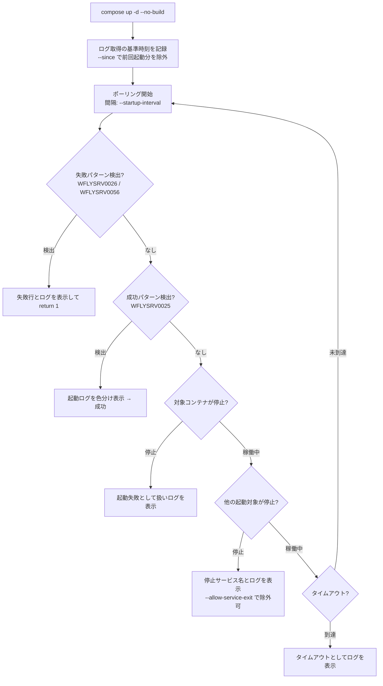

# build_and_verify.sh 詳細ガイド

`compose.yml` でイメージをビルドし、必要に応じて JBoss EAP の起動確認・URL 応答確認・
コンテナ内調査までを行うスクリプトの完全リファレンスです。ECR への操作は一切行いません。

- 対象ファイル: `build_and_verify.sh`
- 想定実行環境: RHEL 9.6 の EC2 インスタンス (bash 5.x / GNU coreutils / Docker CE)
- 呼び出し経路: 直接実行、または `build_and_push.sh --build-only` からの委譲
- 関連ドキュメント: [compose 版ガイド](build_and_push_guide.md) / [buildx 版ガイド](buildx_build_and_push_guide.md)
- Excel 版: [build_and_verify_guide.xlsx](build_and_verify_guide.xlsx) — 仕様 / パラメータ / 既定で有効な動作 / 設定例 の 5 シート構成 (Meiryo UI)。
  本ファイルを更新したら `python3 docs/generate_guide_xlsx.py` で再生成してください
- 補足資料: [build_and_verify_disk_usage.xlsx](build_and_verify_disk_usage.xlsx) — 繰り返し実行 (特に `--no-cache`) で
  ディスク使用量が増え続ける問題の原因と、`compose.yml` 側 / スクリプト側の対策をまとめた 7 シート構成。
  内容の修正は `docs/generate_disk_usage_xlsx.py` を編集して再実行してください

---

## 目次

1. [このスクリプトの役割](#1-このスクリプトの役割)
2. [全体構成](#2-全体構成)
3. [処理の流れ](#3-処理の流れ)
4. [パラメータ一覧](#4-パラメータ一覧)
5. [パラメータ詳細解説](#5-パラメータ詳細解説)
6. [出力される情報](#6-出力される情報)
7. [環境変数](#7-環境変数)
8. [終了コード](#8-終了コード)
9. [実行例](#9-実行例)
10. [エラーと対処](#10-エラーと対処)
11. [自己証明書だけがあり、秘密鍵が無い場合の対処](#11-自己証明書だけがあり秘密鍵が無い場合の対処)

---

## 1. このスクリプトの役割

`build_and_push.sh` の「ビルドのみ実行する処理」を切り出した専用スクリプトです。
ローカルでの動作確認や CI でのビルド検証に使います。

### できること

| # | 機能 | 有効化するオプション |
| --- | --- | --- |
| 1 | compose build によるイメージビルド | (既定。オプション不要) |
| 2 | JBoss EAP (WildFly) の起動完了確認 | `--verify-startup` |
| 3 | URL への HTTP リクエストと応答確認 | `--verify-url` |
| 4 | 同時起動した他 Compose サービスのログ表示 | (起動確認時に自動) |
| 5 | コンテナ内ディレクトリツリー表示 | `--directory-tree-depth` ほか |
| 6 | JBoss デプロイ構造・環境変数一覧の表示 | `--deployment-dir-env` / `--env-list-limit` |
| 7 | Java の JVM パラメータ一覧表示 | (起動確認時に自動) |
| 8 | OpenTelemetry 環境変数・JVM パラメータ一覧表示 | (起動確認時に自動) |
| 9 | 全量レポートのファイル保存 | `--report-dir` |
| 10 | 起動後の対話操作 (bash / HTTP / ログ調査) | `--keep-container-mode` |
| 11 | 終了時の Docker 完全クリーンアップ | `--cleanup-all-docker-data` |
| 11-2 | 世代交代した旧イメージ (dangling) の回収 | (既定で有効。無効化は `--no-reclaim-old-image`) |
| 11-3 | 終了時のビルドキャッシュ削除・使用量の計測 | `--prune-build-cache` / `--prune-build-cache-keep` / `--disk-usage-report` |
| 12 | JBoss マスターパスワードの伝搬検証 (取得元 → 実行時の値) | `--verify-jboss-password` |
| 13 | CloudWatch Agent (cwagent) の設定ファイルチェックとコンテナ内設定の照合 (送達レポートは `--cwagent-delivery-report` 指定時のみ) | (`compose.yml` に `cwagent` があれば自動) |
| 14 | WAR デプロイ時 Java 例外エラー解析 (原因分析・対処提案の Excel / テキスト出力) | (起動確認時に自動。ファイル出力は `--report-dir` / `--deploy-exception-excel` / `--deploy-exception-text` 指定時) |
| 15 | 読み取り専用ファイルシステム (`read_only`) の書き込み先分析 (Dockerfile のビルド時と `entrypoint.sh` などの実行時を分けた、tmpfs / バインドマウントの要否判定と Excel / テキスト出力) | (既定で自動。無効化は `--no-readonly-analysis`。ファイル出力は `--report-dir` / `--readonly-analysis-excel` / `--readonly-analysis-text` 指定時) |
| 16 | JBoss EAP Undertow バーチャルホスト (`default-host`) の分析 (`Host` ヘッダーごとの振り分け判定、`default-host` の利用状況、`Host` ヘッダーを差し替えた実リクエストによる確認) | (起動確認時に既定で自動。無効化は `--no-undertow-analysis`。テキスト出力は `--report-dir` / `--undertow-analysis-text` 指定時) |

`--verify-startup` も `--verify-url` も指定しなければ、**純粋にビルドのみ**を行って終了します
(従来の `build_and_push.sh --build-only` 相当)。

### 行わないこと

ECR 権限チェック / ECR ログイン / タグ付け / プッシュ / `imagedefinition.json` の出力。

### 前提条件

| 前提 | 内容 |
| --- | --- |
| 必須コマンド | `docker`、`docker compose` または `docker-compose` |
| 追加で必要 | `curl` (`--verify-url` / `--keep-container-mode http` 時)、`aws` (`--jboss-password-param` 時)、Python 3 (送達診断の JSON 整形時) |
| AWS 認証 | `--jboss-password-param` を使う場合のみ必要 (`aws login --remote` 済み) |

---

## 2. 全体構成

### 2.1 ファイル内のセクション構成

| 位置 | セクション | 内容 |
| --- | --- | --- |
| 冒頭 | ヘッダーコメント | 目的・機能一覧・使い方 |
| 前半 | 表示タイムゾーン設定 | 表示・保存する時刻をすべて JST に固定 |
| 前半 | 既定値 | ビルド / 起動確認 / URL 確認 / 対話操作 / 環境変数一覧 / ツリー / レポートの各既定値 |
| 前半 | ログ用ヘルパ | `log` / `warn` / `err` / `diag` / `run` / JST 変換ヘルパ |
| 中盤 | `usage()` | `--help` の本文 |
| 中盤 | 引数パース | `append_services` によるカンマ区切り分割、`need_value` による値欠落検出 |
| 中盤 | 入力値の検証 | 数値・モード・排他関係・サービス指定の整合性 |
| 中盤 | 依存コマンド / AWS 認証 / compose 判定 | 実行環境の確認 |
| 中盤 | シークレット準備・一時ファイルコピー | `prepare_jboss_password` / `prepare_copy_files` |
| 中盤 | マスターパスワードの伝搬検証 | 危険文字の分析、段ごとの比較、`compose.yml` と `standalone.xml` の解析、CredentialStore の開封確認 |
| 中盤 | 起動確認・ログ表示ヘルパ | ログ取得、ANSI 除去、色分け、companion ログ |
| 中盤 | 環境変数・ツリー・デプロイ構造 | コンテナ内情報の収集と整形 |
| 中盤 | JVM パラメータ・OpenTelemetry 設定 | `/proc/<pid>/cmdline` の走査、JVM オプションの分類、OpenTelemetry 設定の突き合わせ |
| 中盤 | 対話操作 | bash / HTTP / logs モードと、healthcheck・MySQL・可観測性の各ヘルパ |
| 後半 | Docker 完全クリーンアップ | 対象の集計、確認フレーズ、削除、検証 |
| 後半 | ビルドの停滞検知・進捗表示 | ビルド出力の読み手、監視プロセス、停滞診断、上限時間での中断 |
| 後半 | WAR デプロイ時 Java 例外解析 | 解析ヘルパー (Python 3) の埋め込みと、ログ収集・実行・表示・レポート追記 |
| 後半 | 読み取り専用ファイルシステム分析 | 分析ヘルパー (Python 3) の埋め込みと、`compose.yml` / `Dockerfile` (ビルド時) / 起動スクリプト・実行状況 (実行時) の収集・実行・表示・レポート追記 |
| 後半 | 全量レポート | `write_build_report` |
| 後半 | 後始末 (`cleanup_all`) | EXIT トラップ本体 |
| 末尾 | メイン処理 | ビルド → 起動 → 起動確認 → URL 確認 → 対話 → 情報表示 |

### 2.2 主要な関数グループ

| グループ | 代表的な関数 | 役割 |
| --- | --- | --- |
| ログ・時刻 | `log` / `warn` / `err` / `diag` / `to_jst_display_time` | 出力整形と UTC→JST 変換 |
| 引数処理 | `append_services` / `need_value` / `validate_positive_integer` / `validate_non_negative_integer` | カンマ区切り分割、値欠落検出、数値検証 (ビルド監視の各値は 0 を許す) |
| Compose 操作 | `compose_container_ids` / `compose_logs` / `compose_started_services` | 対象サービスの ID・ログ・サービス名取得 |
| 起動確認 | `start_container` / `wait_for_startup` / `containers_all_running` / `target_services_all_running` | 起動、ログポーリング、途中停止の検知 |
| ログ表示 | `show_startup_logs` / `print_startup_logs_with_highlights` / `show_companion_service_logs` | 行数制御と重要ログの色分け |
| URL 確認 | `verify_url` / `show_url_body` | curl のリトライと応答本文表示 |
| 情報表示 | `show_verified_container_envs` / `..._directory_trees` / `..._deployment_structures` | 環境変数・ツリー・デプロイ構造 |
| JVM / OTel | `show_verified_container_jvm_parameters` / `..._otel_settings` / `collect_container_java_processes` / `classify_jvm_option` / `is_otel_jvm_option` | Java プロセスの検出、JVM オプションの分類、OpenTelemetry 設定の集約 |
| 対話操作 | `run_keep_container_interaction` / `run_interactive_compose_service_menu` ほか | bash / HTTP / logs モード |
| healthcheck | `run_interactive_compose_healthcheck` / `run_healthcheck_http_probe` | healthcheck の設定・履歴・通信確認 |
| 可観測性 | `render_cloudwatch_delivery_report` / `run_otel_jaeger_trace_helper` | cwagent / OTel のローカル送達診断 |
| クリーンアップ | `cleanup_all_docker_data` / `teardown_container` / `cleanup_copied_files` | Docker 全体削除と通常後始末 |
| ビルド監視 | `run_build_with_watchdog` / `build_watchdog_reader` / `build_watchdog_monitor` / `diagnose_build_stall` / `build_phase_from_line` / `check_build_disk_space` | `exporting layers` などで出力が途切れたときの進捗表示・停滞診断・上限時間での中断 |
| cwagent 送信検証 | `verify_cwagent_config_definition` / `verify_cwagent_log_delivery` / `cwagent_config_facts` / `cwagent_verify_endpoint_override` / `cwagent_verify_log_source_mounts` | `compose.yml` と設定 JSON の静的照合、起動後のロググループへの送達確認 |
| cwagent ロググループ準備 | `prepare_cwagent_log_groups` / `cwagent_ensure_log_groups` / `cwagent_resolve_delivery_target` | 設定ファイルの `log_group_name` が実 CloudWatch Logs に無ければ作成 |
| Java 例外解析 | `analyze_war_deploy_exceptions` / `collect_deploy_exception_logs` / `resolve_analysis_output_path` / `show_war_deploy_exception_analysis` / `append_deploy_exception_report` | デプロイ処理ログの収集、解析ヘルパーの実行、画面表示と Excel 出力 |
| 読み取り専用 FS 分析 | `analyze_readonly_filesystem` / `readonly_collect_compose_facts` / `readonly_collect_dockerfile_facts` / `readonly_parse_dockerfile` / `readonly_shell_write_targets` / `readonly_scan_context_script` / `readonly_collect_runtime_facts` / `readonly_container_probe` / `readonly_collect_container_scripts` / `show_readonly_filesystem_analysis` / `append_readonly_analysis_report` | `compose.yml` の `read_only` / `tmpfs` / `volumes` の解析、`Dockerfile` からのビルド時の書き込み先の収集、起動スクリプトからの実行時の書き込み先の収集、コンテナの書き込み状況の収集、判定結果の表示と Excel / テキスト出力 |
| レポート | `write_build_report` / `append_compose_service_logs_report` / `append_jboss_password_report` / `append_cwagent_report` / `append_deploy_exception_report` / `append_readonly_analysis_report` | 全量レポートの生成 |
| パスワード伝搬検証 | `verify_jboss_password_host_stages` / `verify_jboss_password_build_secret` / `verify_jboss_password_container_stages` / `jboss_xml_attributes` / `jboss_xml_unescape` / `jboss_wildfly_literal` | 各段の値の取得、XML と WildFly 式のエスケープ解除、原本との突き合わせ |

### 2.3 EXIT トラップ (`cleanup_all`)

処理のどの経路 (成功・失敗・中断) でも、次の順で実行されます。

```
1. analyze_war_deploy_exceptions … デプロイ処理の Java 例外を解析 (削除より前・レポートより前)
                                   成功経路で実行済みなら何もしない
2. analyze_readonly_filesystem … read_only の書き込み先を分析 (削除より前・レポートより前)
                                   成功経路で実行済みなら何もしない
3. write_build_report        … --report-dir 指定時、全量レポートを保存 (削除より前に実行)
4. cleanup_all_docker_data   … --cleanup-all-docker-data 指定時、確認フレーズ入力後に全削除
5. teardown_container        … compose down (--keep-container 指定時は残す)
6. prune_build_cache         … --prune-build-cache / --prune-build-cache-keep 指定時、
                                   ビルドキャッシュを削除 (コンテナ削除の後)
7. report_disk_usage_at_exit … --disk-usage-report 指定時、終了時の使用量と増減を表示
                                   (4 が実際に削除を行った場合は重複するため出さない)
8. cleanup_copied_files      … --copy-file でコピーしたファイルを削除
                                   (既存ファイルを強制上書きした分は削除せず、
                                    退避しておいた上書き前のファイルを復元)
9. 一時ファイル削除          … Java 例外解析結果・読み取り専用 FS 分析結果・
                                   URL 応答本文・HTTP ボディ・healthcheck 診断
```

終了コードは、本処理が既に失敗していれば**元の終了コードを優先**します。
成功していた場合は、後始末の結果 (レポート保存失敗やクリーンアップ未承認なら `1`) を返します。

---

## 3. 処理の流れ

### 3.1 全体フロー

```mermaid
flowchart TD
    A[開始: タイムゾーンを JST に固定] --> B[引数パース<br/>カンマ区切りは分割]
    B --> C[入力値の検証<br/>数値・モード・排他・サービス整合性]
    C --> D[起動対象の決定<br/>COMPOSE_TARGET_SERVICES = 指定サービス - base]
    D --> E[依存コマンド確認<br/>docker / curl / aws]
    E --> F{--jboss-password-param?}
    F -- あり --> G[AWS 認証確認]
    F -- なし --> H
    G --> H[compose コマンド判定<br/>並列オプションの準備]
    H --> I[EXIT トラップ設定 cleanup_all]
    I --> J[JBoss マスターパスワード取得 → export]
    J --> J2[伝搬検証 1-2: 取得元 → 環境変数 → compose.yml の secrets<br/>--verify-jboss-password 指定時]
    J2 --> J3[cwagent 設定ファイルチェック<br/>compose.yml の定義 + 設定 JSON の静的照合]
    J3 --> J4[ロググループ準備<br/>実 CloudWatch Logs 宛てで存在しなければ設定の名前で作成]
    J4 --> K[--copy-file の事前コピー]
    K --> L{--compose-service が 2 個以上?}
    L -- はい --> M[base を単独で先行ビルド] --> N[ローカルイメージ確認] --> O[base 以外をまとめて並列ビルド]
    L -- いいえ --> P[compose build] --> Q[ローカルイメージ確認]
    O --> Q2
    Q --> Q2[伝搬検証 3: /run/secrets の到達値<br/>プローブビルド --no-cache]
    Q2 --> R{起動が必要?<br/>--verify-startup / --verify-url}
    R -- 不要 --> Z1[ビルドのみ完了 exit 0]
    R -- 必要 --> R2[イメージ事前取得<br/>compose pull --ignore-buildable --policy missing<br/>一過性エラーは --pull-retry 回まで再試行 / 失敗しても続行]
    R2 --> S[compose up -d --no-build<br/>--wait-healthy 指定時は --wait<br/>失敗時は診断を出し、一過性なら --up-retry 回まで再試行]
    S --> T{--verify-startup?}
    T -- あり --> U[起動完了ログを待つ<br/>WFLYSRV0025 検出まで]
    T -- なし --> V
    U -- デプロイエラー<br/>WFLYSRV0026 / 0056 --> U2{--exit-on-deploy-error?}
    U2 -- なし 既定 --> U3[コンテナを残したまま<br/>調査用の対話操作を開始] --> Z3[exit 1 コンテナは起動状態のまま]
    U2 -- あり --> Z4[従来どおり終了 exit 1]
    U --> V{--verify-url?}
    V -- あり --> W[curl でリトライしながら応答確認]
    V -- なし --> W2
    W --> W2[cwagent 送信状況チェック<br/>コンテナ内設定の照合 → 送達待ち: --cwagent-delivery-report 指定時のみ]
    W2 --> X{--keep-container-mode?}
    X -- あり --> Y[対話操作 bash / http / logs]
    X -- なし --> AA
    Y --> AA[環境変数一覧・ツリー・デプロイ構造を表示]
    AA --> AA2[JVM パラメータ一覧を表示<br/>/proc から Java プロセスを検出]
    AA2 --> AA3[OpenTelemetry 環境変数・JVM パラメータ一覧を表示]
    AA3 --> AA4[伝搬検証 4-7: standalone.xml / CredentialStore<br/>→ 全段の判定を出力]
    AA4 --> AA5[WAR デプロイ時 Java 例外解析<br/>スタックトレース抽出 → 原因分析 → Excel 出力]
    AA5 --> AA6[読み取り専用ファイルシステム分析<br/>compose.yml + Dockerfile ビルド時 + 起動スクリプト/実行状況 実行時<br/>→ tmpfs / マウントの要否判定 → Excel 出力]
    AA6 --> AB[EXIT: レポート保存 → Docker クリーンアップ → compose down → 一時ファイル削除]
    AB --> Z2[完了 exit 0]
```



エラー終了時は、`EXIT` の後始末でレポートのログ本文を集める直前に
`compose stop` (SIGTERM) を挟みます (3.6 参照)。
Java 例外解析は成功経路では主処理の末尾で、失敗経路では `EXIT` の後始末で
全量レポートを書く直前に実行します (いずれもコンテナ削除より前)。
**`compose up` に失敗して主処理が途中で終わった場合も、この `EXIT` 経路で
必ず実行します** (6.7 参照)。

読み取り専用ファイルシステムの書き込み先分析も同じタイミングで実行します。
こちらは `compose.yml` と `Dockerfile` の定義だけでも判定できるため、
**コンテナを起動しない実行 (ビルドのみ / ビルド失敗) でも必ず実行**し、
実行状況からの根拠が無いことを結果へ明記します (6.8 参照)。

### 3.2 ビルドフェーズの詳細

`--compose-service` の指定数によってビルド戦略が変わります。

| 指定 | 動作 |
| --- | --- |
| 未指定 | 全サービスを 1 回の `compose build` でビルド |
| 1 個 | そのサービスのみビルド |
| 2 個以上 | **第 1 フェーズ**: `base` サービスを単独で先行ビルド → ローカルイメージ確認 → **第 2 フェーズ**: `base` 以外をまとめて並列ビルド |

2 段階に分けるのは、ベースイメージを参照するサービスが `base` の完成前にビルドを始めるのを
防ぐためです。並列オプションは compose のバージョンによって使い分けます。

| compose | 並列指定 |
| --- | --- |
| v2 (`docker compose`) | グローバルオプション `--parallel <サービス数>` |
| v1 (`docker-compose`) | `build --parallel` (未対応版は `exit 1`) |

ビルド後は `docker image inspect` でローカルイメージを確認し、
`image=... id=... created=... size=... bytes` を JST 表記でログに残します。

ビルドの前後では、ディスク使用量を抑えるために次を行います (5.8-2 参照)。

| タイミング | 処理 |
| --- | --- |
| ビルド前 | `--disk-usage-report` 指定時に使用量を測定 (増減の基準にする) |
| ビルド前 | data root の空き容量を確認し、5 GiB 未満なら警告する (5.2-2 参照) |
| ビルド前 | 世代交代の判定に使う現在のローカルイメージ ID を控える |
| ローカルイメージ確認の直後 | ID が変わっていれば、タグを失った旧世代イメージを削除する |

ビルド自体は監視プロセス付きで実行し、`exporting to image` / `exporting layers` で
出力が途切れても状況が分かるようにします (5.2-2 参照)。

### 3.3 起動確認フェーズの詳細



- `--startup-service` を指定した場合は、**サービスごとに個別**に起動完了を判定し、
  指定した全サービスの完了をもって成功とします
- 未指定の場合は、起動対象全体のログをまとめて判定します
- 既存コンテナを再利用した場合に前回の `WFLYSRV0025` を誤検出しないよう、
  `compose up` の直前時刻を `--since` の基準にします
- 失敗時は `--suppress-startup-logs` を指定していてもログを表示します (原因を隠さないため)

### 3.4 URL 応答確認フェーズの詳細

```
curl -s -S -m 30 -o <一時ファイル> -w '%{http_code}' -X <URL_METHOD> \
     [-k] [-H "Content-Type: <URL_CONTENT_TYPE>"] [--data <ボディ>] <VERIFY_URL>
```

- 期待ステータス (`--expect-status`) と一致するまで `--url-interval` 秒間隔でリトライ
- `--url-timeout` 秒を超えると失敗 (最後の応答コードを表示)
- 接続不可などで応答コードが取れない場合は `000` として扱い、リトライを継続
- 成功・失敗いずれの場合も、応答本文の先頭 20 行を表示

`--verify-startup` を付けず `--verify-url` のみを指定した場合もコンテナは起動します
(起動完了のログ確認は行わず、URL のリトライで readiness を担保します)。

### 3.5 後始末フェーズの詳細

| 状況 | コンテナの扱い |
| --- | --- |
| 通常 | `compose down` で停止・削除 |
| `--keep-container` / `--keep-container-mode` 指定 | 残す (手動停止コマンドを案内) |
| `--cleanup-all-docker-data` 指定 | 確認フレーズ入力後、Docker 全体を削除 |
| `--suppress-removed-logs` 指定 | `compose down` / `compose stop` の出力を抑制 |

コンテナの削除後に、`--prune-build-cache` / `--prune-build-cache-keep` 指定時はビルド
キャッシュを削除し、`--disk-usage-report` 指定時は終了時の使用量と実行前からの増減を
表示します (5.8-2 参照)。

### 3.6 エラー終了時の終了 (SIGTERM) ログ

ECS はタスク停止時に各コンテナへ SIGTERM を送るため、adot collector のような
サイドカーは「シグナル受信 → パイプラインの graceful shutdown → 終了」までを
ログに残します。ローカル検証で `compose down` まで一気に実行すると、この終了ログは
誰にも取得されないままコンテナごと削除されてしまいます。

そこで**エラー終了時に限り**、削除の前に SIGTERM による停止を挟みます。

```
[2] 〜 [6] の収集 (起動中のコンテナが必要)
        ↓
compose stop -t <--shutdown-timeout>   ← SIGTERM。既定 30 秒後に SIGKILL
        ↓
終了ログ (停止前後のログ行数の差分) を画面へ表示
        ↓
[8] Compose サービス別ログ (終了処理込みの全文をレポートへ保存)
        ↓
compose down (削除)
```

- 対象は `compose ps --services` が返す**稼働中の全サービス**です
  (起動確認対象だけでなく adot collector などのサイドカーも含みます)
- 表示する行は「SIGTERM 送出前後のログ行数の差分」で求めるため、
  ホストとコンテナの時刻差に影響されません
- 差分が無いコンテナは `SIGTERM 受信後に追加されたログはありません。` と表示します
- `--suppress-startup-logs` を指定していても表示します (原因を隠さないため)
- `--keep-container` / `--keep-container-mode` 指定時はコンテナを停止できないため、
  終了ログの取得も行いません
- `--no-shutdown-logs` を指定すると、この停止と終了ログ取得を丸ごと無効化し、
  従来どおり `compose down` でまとめて削除します

`adot collector` の healthcheck が失敗し、`depends_on` の `condition: service_healthy`
を満たせずバックエンドが起動しなかった場合、ECS 上でも同じくタスクが停止します。
その終了処理まで含めてローカルで再現・確認できるようにするのがこの動作の狙いです。

---

## 4. パラメータ一覧

### 4.1 ビルド関連

| オプション | 値の形式 | 既定値 | 複数 | 説明 |
| --- | --- | --- | --- | --- |
| `--local-image NAME` | イメージ名 | `j1/base.local` | 不可 | compose build で生成されるローカルイメージ名 |
| `--compose-file FILE` | ファイルパス | `compose.yml` | 不可 | compose 定義ファイル |
| `--compose-service NAME` | サービス名 | (全サービス) | **可** (繰り返し / カンマ区切り) | ビルド・起動対象。複数指定時は `base` を先行ビルド。`base` は起動対象にならない |
| `--no-cache` | フラグ | `false` | — | キャッシュを破棄してビルド |
| `--build-progress-interval SEC` | 0 以上の整数 (秒) | `30` | 不可 | ビルド中に経過時間・BuildKit のフェーズ・data root の空き容量の増減を表示する間隔。`0` で表示しない |
| `--build-stall-timeout SEC` | 0 以上の整数 (秒) | `300` | 不可 | ビルド出力がこの秒数途切れたら停滞と判断し、原因の切り分け診断を表示する。`0` で検知しない。検知しても処理は中断しない |
| `--build-timeout SEC` | 0 以上の整数 (秒) | `0` (無制限) | 不可 | ビルド全体の上限秒数。超えたら診断のうえ SIGTERM で中断し (20 秒後に SIGKILL)、`exit 1` |
| `--no-build-watchdog` | フラグ | `false` | — | 上記の監視をすべて行わない。監視が有効な間は `BUILDKIT_PROGRESS=tty` を `plain` へ切り替えるため、tty 形式を使いたい場合に指定する |
| `--dry-run` | フラグ | `false` | — | ビルド/起動/URL 呼び出し/ファイル操作を行わずプレビュー |
| `--copy-file SRC:DEST_DIR` | `コピー元:コピー先ディレクトリ` | (なし) | **可** | ビルド前にコピーし、終了後に自動削除。コピー先に同名ファイルがあれば強制上書きし、終了時に上書き前のファイルへ復元 |
| `--copy-file-no-overwrite` | フラグ | `false` | — | `--copy-file` のコピー先に同名ファイルがあれば上書きせず中止 (`exit 1`) |

### 4.2 JBoss マスターパスワード (BuildKit シークレット)

| オプション | 値の形式 | 既定値 | 説明 |
| --- | --- | --- | --- |
| `--jboss-password-param NAME` | SSM パラメータ名 | (なし) | パラメータストアから取得。**このとき AWS 認証が必要** |
| `--jboss-password VALUE` | パスワード文字列 | (なし) | 直接指定。`--jboss-password-param` とは排他 |
| `--jboss-password-env NAME` | 環境変数名 | `JBOSS_MASTER_PASSWORD` | 受け渡しに使う環境変数名。単独指定時は既存の環境変数値を使用 |
| `--jboss-secret-id ID` | シークレット id | `jboss_master_password` | `compose.yml` の secrets 名 / Dockerfile の `RUN --mount=type=secret,id=...` と一致させる |
| `--region REGION` | AWS リージョン名 | `ap-northeast-1` (env `AWS_REGION`) | パラメータストア参照時のリージョン |

### 4.2-2 CA 証明書 (BuildKit シークレット)

| オプション | 値の形式 | 既定値 | 複数 | 説明 |
| --- | --- | --- | --- | --- |
| `--cacert-dir DIR` | ディレクトリのパス | (なし) | **可** | `cacert.crt` を置いたディレクトリ。指定した全ディレクトリ分を 1 つの tar にまとめてビルドへ渡す |
| `--cacert-secret-id ID` | 英数字と `. _ -` | `cacerts` | | シークレット id。`compose.yml` の secrets 名 / Dockerfile の `RUN --mount=type=secret,id=...` と一致させる |
| `--cacert-bundle PATH` | tar のパス | 一時ファイル | | 生成する tar の出力先。指定時は**自動削除しない** |
| `--cacert-bundle-env NAME` | 環境変数名 | `CACERT_BUNDLE_FILE` | | tar のパスを compose へ渡す環境変数名。`compose.yml` の `file:` が参照する変数名と一致させる |
| `--cacert-glob PATTERN` | glob パターン | `*.crt` と `*.pem` | **可** | 各ディレクトリから取り込むファイルのパターン。指定するとこの値だけが対象になる |

詳細は [5.9-2](#59-2-ca-証明書の渡し方---cacert-dir) を参照してください。

### 4.3 マスターパスワードの伝搬検証

| オプション | 値の形式 | 既定値 | 説明 |
| --- | --- | --- | --- |
| `--verify-jboss-password` | (フラグ) | `false` | 取得元から実行時に利用される値までの各段で、パスワードが一致するかを検証して出力する (6.5 参照) |
| `--jboss-password-mask` | (フラグ) | `false` | 検証出力のパスワード文字列を伏字にする (判定・バイト長・16 進ダンプは表示) |
| `--jboss-config-file PATH` | コンテナ内の絶対パス | (自動探索) | 比較対象の `standalone.xml` |
| `--jboss-cli-path PATH` | コンテナ内の絶対パス | (自動探索) | `jboss-cli.sh` |
| `--jboss-elytron-tool PATH` | コンテナ内の絶対パス | (自動探索) | `elytron-tool.sh` |
| `--jboss-credential-store PATH` | コンテナ内の絶対パス | (`standalone.xml` から特定) | CredentialStore ファイル |

パス系オプションは、`docker exec` へ渡すスクリプトへ埋め込むため
**絶対パスのみ**を受け付け、`' " ` $ ; & | < > * ?` と空白を含む場合は
起動前に `exit 2` で中止します。

### 4.3.1 CloudWatch Agent (cwagent) のログ送信検証

| オプション | 値の形式 | 既定値 | 説明 |
| --- | --- | --- | --- |
| `--verify-cwagent` | (フラグ) | `auto` | `cwagent` サービスが未定義でも検証し、見つからなければ NG とする |
| `--no-verify-cwagent` | (フラグ) | — | 検証を行わない |
| `--cwagent-service NAME` | サービス名 | `cwagent` | CloudWatch Agent の Compose サービス名 |
| `--cwagent-config-dir PATH` | コンテナ内の絶対パス | `/etc/cwagentconfig` | 設定ファイルの注入先ディレクトリ |
| `--cwagent-delivery-target auto\|mock\|aws` | 列挙 | `auto` | 送達確認先。`auto` は `logs.endpoint_override` の有無で判定 |
| `--cwagent-delivery-report` | (フラグ) | `false` | 送達を待ち合わせて送達レポートを表示する (既定では行わない) |
| `--no-cwagent-delivery-report` | (フラグ) | — | 送達レポートを行わない (既定) |
| `--cwagent-delivery-timeout SEC` | 1 以上の整数 | `60` | 送達を待つ最大秒数 (`--cwagent-delivery-report` 指定時に使用) |
| `--cwagent-delivery-interval SEC` | 1 以上の整数 | `5` | 送達確認のポーリング間隔 (`--cwagent-delivery-report` 指定時に使用) |
| `--cwagent-mock-service NAME` | サービス名 | (`endpoint_override` から解決) | 偽装 CloudWatch Logs の Compose サービス名 |
| `--cwagent-mock-port PORT` | 1〜65535 | (`endpoint_override` から解決、既定 8080) | 偽装 CloudWatch Logs のコンテナ側ポート |
| `--cwagent-required` | (フラグ) | `false` | 検証 NG を終了コード 1 として扱う |
| `--cwagent-create-log-group` | (フラグ) | `false` | 実 CloudWatch Logs 宛ての構成で、設定ファイルの `log_group_name` のロググループが存在しなければ自動作成する (既定では作成しない) |
| `--no-cwagent-create-log-group` | (フラグ) | — | ロググループの自動作成を行わない (既定)。存在しない場合は NG として報告するだけにする |

検証は `compose.yml` に `cwagent` サービスが定義されていれば自動で実行され、
オプション指定は不要です (6.6 参照)。

### 4.4 起動確認 (JBoss EAP / WildFly)

| オプション | 値の形式 | 既定値 | 複数 | 説明 |
| --- | --- | --- | --- | --- |
| `--verify-startup` | フラグ | `false` | — | ビルド後にコンテナを起動し、起動完了をログから確認 |
| `--startup-service NAME` | サービス名 | (対象全体) | **可** | 起動完了チェックの対象。指定すると `--verify-startup` を暗黙に有効化 |
| `--startup-log-pattern P` | 拡張正規表現 | `WFLYSRV0025:` | 不可 | 起動完了とみなすログのパターン |
| `--startup-timeout SEC` | 1 以上の整数 | `120` | 不可 | 起動完了を待つ最大秒数 |
| `--startup-interval SEC` | 1 以上の整数 | `3` | 不可 | ポーリング間隔 |
| `--startup-log-lines N\|all` | 1 以上の整数または `all` | `50` | 不可 | 表示するログ行数 (末尾 N 行 / 全行) |
| `--wait-healthy` | フラグ | `false` | — | `compose up` に `--wait` を付け、healthy になるまで compose 側で待つ |
| `--wait-timeout SEC` | 1 以上の整数 | `600` | 不可 | `--wait` の最大待機秒数。指定すると `--wait-healthy` を暗黙に有効化 |
| `--allow-service-exit NAME` | サービス名 | (なし) | **可** | 起動確認中に停止していても失敗扱いにしないサービス |
| `--no-pull-images` | フラグ | `false` | — | `compose up` の前に行うイメージの事前取得 (`compose pull`) を行わない |
| `--pull-retry N` | 0 以上の整数 | `2` | 不可 | 事前取得が一過性のエラーで失敗したときの再試行回数 |
| `--pull-retry-interval SEC` | 0 以上の整数 | `10` | 不可 | 事前取得の再試行間隔 |
| `--up-retry N` | 0 以上の整数 | `1` | 不可 | `compose up` が一過性の理由で失敗したときの再試行回数 |
| `--no-up-retry` | フラグ | `false` | — | `compose up` の再試行を行わない (`--up-retry 0` と同じ) |
| `--up-retry-interval SEC` | 0 以上の整数 | `15` | 不可 | `compose up` の再試行間隔 |
| `--suppress-startup-logs` | フラグ | `false` | — | 起動ログの表示を抑制 (判定は継続。失敗時は表示される) |
| `--shutdown-timeout SEC` | 1 以上の整数 | `30` | 不可 | エラー終了時の SIGTERM から SIGKILL までの猶予秒数 (ECS の StopTimeout 既定と同じ) |
| `--no-shutdown-logs` | フラグ | `false` | — | エラー終了時の SIGTERM 停止と終了ログ取得を行わない |
| `--suppress-removed-logs` | フラグ | `false` | — | `compose down` / `compose stop` の `Removed` 等の出力を抑制 |
| `--keep-container` | フラグ | `false` | — | 確認後もコンテナを停止・削除しない |

### 4.5 URL 応答確認

| オプション | 値の形式 | 既定値 | 説明 |
| --- | --- | --- | --- |
| `--verify-url URL` | URL | (なし) | 起動確認後にこの URL へリクエストして応答を確認 |
| `--expect-status CODE` | HTTP ステータスコード | `200` | 期待するステータスコード |
| `--url-method METHOD` | HTTP メソッド | `GET` | リクエストメソッド |
| `--url-content-type TYPE` | MIME タイプ | (自動) | `Content-Type` ヘッダ。`--verify-url` と併用必須 |
| `--url-body-json JSON` | JSON 文字列 | (なし) | リクエストボディ。未指定時 `Content-Type: application/json` を自動設定 |
| `--url-body-form DATA` | `key=value&...` | (なし) | リクエストボディ。未指定時 `application/x-www-form-urlencoded` を自動設定 |
| `--url-timeout SEC` | 1 以上の整数 | `60` | 期待応答を得るまでの最大秒数 |
| `--url-interval SEC` | 1 以上の整数 | `3` | リトライ間隔 |
| `--url-insecure` | フラグ | `false` | TLS 証明書検証を無効化 (`curl -k`) |

### 4.6 起動維持後の対話操作

| オプション | 値の形式 | 既定値 | 説明 |
| --- | --- | --- | --- |
| `--keep-container-mode MODE` | `bash` / `http` / `logs` | (なし) | 指定すると `--verify-startup` と `--keep-container` を暗黙に有効化 |
| `--jboss-context-root ROOT` | コンテキストルートのパス | (ログから検出) | `http` モード専用。URL 全体は指定不可 |
| `--jboss-http-port PORT` | 1〜65535 | (ログから検出。既定 8080) | `http` モード専用。公開ポートがあれば自動変換 |
| `--exit-on-deploy-error` | フラグ | `false` | デプロイエラーを検出しても調査用の対話操作へ入らず、従来どおり終了する (→ 5.10) |

### 4.7 情報表示・レポート

| オプション | 値の形式 | 既定値 | 複数 | 説明 |
| --- | --- | --- | --- | --- |
| `--env-list-limit N\|all` | 1 以上の整数または `all` | `all` | 不可 | 環境変数一覧の表示件数 (コンテナごと) |
| `--env-list-file FILE` | ファイルパス | (なし) | 不可 | 環境変数一覧をファイルにも出力 |
| `--directory-tree-depth N\|all` | 1 以上の整数または `all` | `all` | 不可 | コンテナ内ツリーの最大深さ (`/` 直下を 1 とする) |
| `--directory-file-limit N\|all` | 1 以上の整数または `all` | (ファイル非表示) | 不可 | 通常ファイルの表示を有効化。N 件超過時は拡張子別件数を表示 |
| `--deployment-dir-env NAME` | 環境変数名 | (なし) | **可** | ディレクトリパスを値に持つ環境変数。その配下を階層表示 |
| `--report-dir DIR` | ディレクトリパス | (なし) | 不可 | 全量レポートを `DIR/build_and_verify_<日時>.txt` へ保存。Java 例外解析と読み取り専用ファイルシステム分析の Excel / テキストも同じディレクトリへ追加出力 |
| `--deploy-exception-excel FILE` | `.xlsx` のパス | (なし) | 不可 | WAR デプロイ時 Java 例外解析の Excel 出力先。`--no-deploy-exception-analysis` とは排他 |
| `--deploy-exception-text FILE` | ファイルパス | (なし) | 不可 | 同じ内容のテキスト出力先。`--no-deploy-exception-analysis` とは排他。Excel と同じパスは不可 |
| `--deploy-exception-limit N` | 1 以上の整数 | `50` | 不可 | 詳細分析を行う例外の最大件数 |
| `--no-deploy-exception-analysis` | フラグ | `false` | 不可 | Java 例外の解析と Excel 出力を行わない |
| `--readonly-analysis-excel FILE` | `.xlsx` のパス | (なし) | 不可 | 読み取り専用ファイルシステム分析の Excel 出力先。`--no-readonly-analysis` とは排他 |
| `--readonly-analysis-text FILE` | ファイルパス | (なし) | 不可 | 同じ内容のテキスト出力先。`--no-readonly-analysis` とは排他。Excel と同じパスは不可 |
| `--no-readonly-analysis` | フラグ | `false` | 不可 | 読み取り専用ファイルシステムの書き込み先分析とファイル出力を行わない |
| `--undertow-host-header NAME` | ホスト名 (カンマ区切りも可) | (なし) | **可** | Undertow バーチャルホスト分析で振り分けを判定する `Host` ヘッダー名を追加する。ポート付きでも可 (Undertow と同じ規則で落とす)。`--no-undertow-analysis` とは排他 |
| `--undertow-probe-path PATH` | `/` で始まるパス | (`WFLYUT0021` から検出) | 不可 | `Host` ヘッダーを差し替えた実リクエストの送信先パス。`--no-undertow-analysis` とは排他 |
| `--no-undertow-probe` | フラグ | `false` | 不可 | 実リクエストを送らず、`standalone.xml` の解析だけで判定する |
| `--undertow-analysis-text FILE` | ファイルパス | (なし) | 不可 | Undertow バーチャルホスト分析のテキスト出力先 (内容は画面表示と同一)。`--no-undertow-analysis` / `--no-undertow-analysis-text` とは排他 |
| `--no-undertow-analysis-display` | フラグ | `false` | 不可 | 画面出力だけを抑制する。`--no-undertow-analysis-text` との同時指定は出力先が無くなるため不可 |
| `--no-undertow-analysis-text` | フラグ | `false` | 不可 | テキスト出力だけを抑制する。`--no-undertow-analysis-display` との同時指定は不可 |
| `--no-undertow-analysis` | フラグ | `false` | 不可 | Undertow バーチャルホスト (`default-host`) の分析と出力を一切行わない |

### 4.8 終了時のクリーンアップ

| オプション | 値の形式 | 既定値 | 説明 |
| --- | --- | --- | --- |
| `--cleanup-all-docker-data` | フラグ | `false` | 終了時に確認フレーズ入力のうえ、Docker context の全データを削除。`--keep-container` とは排他 |

### 4.8-2 ディスク使用量の抑制

検証を繰り返すと、ローカルイメージの旧世代 (dangling) とビルドキャッシュが実行のたびに
積み上がります。`--cleanup-all-docker-data` は Docker 全体を空にするため日常の検証には
使えないので、増えた分だけを戻す細粒度の後始末をここに用意しています。
詳細は補足資料 [build_and_verify_disk_usage.xlsx](build_and_verify_disk_usage.xlsx) を参照してください。

| オプション | 値の形式 | 既定値 | 説明 |
| --- | --- | --- | --- |
| (オプション不要) | — | **有効** | 旧世代イメージの回収。ビルド前後で image ID を突き合わせ、世代交代した旧 ID がどのタグからも参照されていない場合だけ削除する |
| `--no-reclaim-old-image` | フラグ | `false` | 旧世代イメージの回収を行わない (従来どおり残す) |
| `--prune-build-cache` | フラグ | `false` | 終了時に `docker builder prune --all --force` を実行 |
| `--prune-build-cache-keep SIZE` | サイズ (`10GB` / `512MB`) | (なし) | 終了時に `docker builder prune --force --keep-storage SIZE` を実行。指定すると `--prune-build-cache` も暗黙に有効化 |
| `--disk-usage-report` | フラグ | `false` | ビルド前と終了時に Docker 管理対象の使用量を測定し、実行前からの増減を表示 (削除は行わない) |

### 4.9 その他

| オプション | 説明 |
| --- | --- |
| `-h`, `--help` | ヘルプを表示して `exit 0` |

---

## 5. パラメータ詳細解説

### 5.1 `--compose-service` と `base` サービスの扱い

```bash
# 繰り返し指定
./build_and_verify.sh --compose-service app --compose-service db
# カンマ区切り (同じ意味)
./build_and_verify.sh --compose-service app,db
```

| 指定 | ビルド対象 | 起動対象 |
| --- | --- | --- |
| 未指定 | 全サービス | 全サービス |
| `app` | `app` | `app` |
| `app,db` | `base` を先行 → `app`,`db` を並列 | `app`,`db` |
| `base,app` | `base` を先行 → `app` | `app` のみ (`base` は除外) |
| `base` のみ | `base` | なし → 起動確認を伴う場合は `exit 2` |

`base` はベースイメージを提供する**ビルド専用サービス**であり、起動しても即終了するため、
明示指定されていても起動・ログ収集・生存監視の対象からは除外されます。

### 5.2-0 ビルドの停滞検知・進捗表示 (`--build-progress-interval` / `--build-stall-timeout` / `--build-timeout`)

> 節番号は既存の並びを崩さないため `5.2-0` としています (`5.2` の直前に読む内容です)。

#### 何が起きているのか

`exporting to image` は、ビルドしたレイヤを Docker のイメージストアへ書き出す段です。
1 レイヤずつ順に「tar 化 → DiffID (sha256) の再計算 → data root への展開・登録」を行い、
並列化されないため、ベースイメージのようにレイヤが大きいと**この段だけで数分〜数十分**
かかります。

一方 `--progress=plain` は `#12 exporting layers` の 1 行を出したあと、完了して
`#12 exporting layers 45.2s done` を出すまで**何も表示しません**。このため、
次のどれであっても画面上は「`exporting layers` から動かない」という同じ見え方になります。

| # | 原因 | 見分け方 |
| --- | --- | --- |
| 1 | **遅いだけで進んでいる** (最も多い) | data root の空き容量が減り続けている |
| 2 | data root の空き容量・inode の不足 | 空き容量が数 GiB を切っている / `df -i` の使用率が 100% 近い |
| 3 | ディスク I/O の枯渇 (EBS のバーストクレジット切れ等) | `iostat -x 1` の `%util` が張り付き `await` が大きい |
| 4 | 同じ daemon の別操作との競合 (`image rm` / `system prune` / 別ビルド) | 他の docker コマンドも返らない |
| 5 | Docker daemon 自体の停止 | `docker version` / `docker system df` が応答しない |
| 6 | 端末のフロー制御 (Ctrl+S) で画面表示だけが止まっている | Ctrl+Q で再開する |
| 7 | ウイルス対策 / EDR による data root のリアルタイムスキャン | スキャン除外で改善する |

#### 監視の構成

ビルドコマンドは `run_build_with_watchdog` 経由で実行します。

| プロセス | 役割 |
| --- | --- |
| ビルド本体 | パイプ左辺。`$BASHPID` を控えてから `exec` するため、PID = `docker` プロセスとなり中断できる |
| 読み手 (`build_watchdog_reader`) | パイプ右辺。行をそのまま流しつつ「最後に出力があった時刻」と「BuildKit のフェーズ」を一時ディレクトリへ記録する |
| 監視 (`build_watchdog_monitor`) | 別プロセス。一時ディレクトリを見て進捗表示・停滞検知・上限時間での中断を行う |

#### (1) 進捗表示 (`--build-progress-interval`、既定 30 秒)

```text
[2026-08-05 09:41:50 JST] ビルド継続中 (全サービス): 経過 4分30秒 / 直近の出力から 4分12秒 / フェーズ: exporting layers (レイヤをイメージストアへ書き出し中) 継続 4分12秒
[2026-08-05 09:41:50 JST]   data root の空き容量: 10.35 GiB (前回から 820.00 MiB 減少 → 書き出しは進んでいます) /var/lib/docker
```

BuildKit の出力から検出するフェーズは次のとおりです。

| 出力に含まれる文字列 | 表示するフェーズ |
| --- | --- |
| `exporting layers` | `exporting layers (レイヤをイメージストアへ書き出し中)` |
| `exporting manifest` / `exporting config` / `exporting attestation` | `exporting manifest/config (メタデータの書き出し)` |
| `writing image` | `writing image (イメージ ID の確定)` |
| `naming to` | `naming to (ローカルイメージ名の付与)` |
| `importing to docker` / `sending tarball` / `unpacking to docker` | `importing to docker (docker イメージストアへの取り込み)` |
| `exporting to image` / `exporting to docker image format` | `exporting to image (イメージ書き出しの開始)` |
| `pushing layers` / `pushing manifest` | `pushing (レジストリへの送信)` |
| `transferring context` / `transferring dockerfile` | `transferring context (ビルドコンテキストの転送)` |

data root の空き容量は `df` から取得します (daemon には問い合わせないため、daemon が
busy でも取得できます)。**減り続けていれば上表の 1、変化がなければ 2〜7 を疑います。**

#### (2) 停滞検知 (`--build-stall-timeout`、既定 300 秒)

出力が指定秒数途切れたら、次を timeout 付きで調べて診断を表示します。
**処理は中断しません** (遅いだけの場合にビルドを捨てないため)。

| 確認項目 | 判断材料 |
| --- | --- |
| `docker version --format '{{.Server.Version}}'` (10 秒) | 応答しなければ daemon 全体が停止している (上表 5) |
| data root の空き容量 (`df -Pk`) | 数 GiB を切っていれば上表 2 |
| data root の inode (`df -Pi`) | 使用率が 100% 近ければ上表 2 |
| `docker system df` (15 秒) | 応答しなければ daemon がイメージストアのロックを掴んで動けない疑い (上表 4・5) |

続けて上表の 7 原因と対処方法、別端末で実行する確認コマンドを一覧表示します。
出力が再開すれば検知状態は解除され、次に途切れたときに再び診断します。

#### (3) 上限時間での中断 (`--build-timeout`、既定 0 = 無制限)

| 段階 | 動作 |
| --- | --- |
| 上限超過 | `err` で通知し、(2) と同じ診断を「上限時間超過」として表示 |
| SIGTERM | ビルド本体の PID へ送信。`docker` CLI が落ちると BuildKit のセッションも切れ、daemon 側のビルドもキャンセルされる |
| 20 秒待っても残っていれば SIGKILL | `BUILD_TIMEOUT_KILL_GRACE` |
| 中断指示 (`abort`) | 読み手へ通知。ビルドの子プロセスが出力パイプを掴んだままでも読むのをやめ、パイプラインが完了する |

終了コードは `1`。全量レポートの `[1] ビルド結果` には
`詳細: compose build が上限時間 (N 秒) を超えたため中断しました。` と記録します。

#### (4) ビルド前の空き容量チェック

上表 2 を事前に潰すため、ビルド開始前に data root の空き容量を表示し、
5 GiB (`BUILD_MIN_FREE_GIB`) を下回っていれば警告します。

#### 制約

- 監視は BuildKit の出力を**行単位**で読むため、行末が改行にならない tty 形式とは
  併用できません。`BUILDKIT_PROGRESS=tty` を指定した場合は警告のうえ `plain` へ
  切り替えます。tty 形式のまま実行するには `--no-build-watchdog` を指定します。
- data root は Docker がローカル接続 (`unix://` / `npipe://`) のときだけ特定します。
  リモート daemon ではホスト側の `df` を見ても意味がないため、空き容量の表示は行いません。
- `--dry-run` では監視を行いません (ビルドを実行しないため)。

### 5.2 起動完了の判定パターン

JBoss EAP 8.1 のメッセージ ID で判定します。

| 種別 | パターン (既定) | 意味 |
| --- | --- | --- |
| 成功 | `WFLYSRV0025:` | 正常起動 |
| 失敗 | `WFLYSRV0026:` / `WFLYSRV0056:` | エラー付き起動 / 起動失敗 |

`WFLYSRV0026` を成功扱いしないよう、正常系と異常系を明確に分離しています。
`--startup-log-pattern` で成功パターンを変更できます (拡張正規表現)。

起動ログは意味別に色分けされます (端末へ直接表示する場合のみ。`NO_COLOR` 優先)。

| 色 | 対象 |
| --- | --- |
| 緑 (成功) | `WFLYSRV0025` / `WFLYJCA0018` / `WFLYJCA0001` / `WFLYJCA0098` / `WFLYUT0006` / `WFLYUT0021` / `WFLYSRV0010` |
| シアン (重要) | ドライバー・データソース・デプロイ・リスナー関連の各メッセージ |
| 黄 (警告) | `WARN` / `WARNING` レベル |
| 赤 (エラー) | `ERROR` / `FATAL` レベル、`WFLYSRV0026` / `WFLYSRV0056` |

### 5.3 `--wait-healthy` と依存サービス

`compose up` に `--wait` を付け、対象サービスが healthy (healthcheck 未定義なら running)
になるまで compose 側で待機します。依存サービスの準備完了前にアプリが起動して
失敗するのを防げます。`compose.yml` 側で次の定義が前提です。

```yaml
services:
  db:
    healthcheck:
      test: ["CMD", "mysqladmin", "ping", "-h", "localhost"]
      interval: 5s
      retries: 10
  app:
    depends_on:
      db:
        condition: service_healthy
```

依存サービス (adot collector など) の healthcheck が失敗すると、
`condition: service_healthy` を満たせないまま `compose up` が
`dependency failed to start: container ... is unhealthy` で失敗します。
この場合もエラー終了時の SIGTERM 停止が働くため、依存サービス側の
終了処理ログまで画面と全量レポートに残ります (3.6 参照)。

### 5.3-2 イメージ・キャッシュ削除直後の実行 (コールド実行)

`docker system prune -a` や `--cleanup-all-docker-data` の直後に実行すると、
**1 回目だけ `compose up` で失敗し、再実行すると成功する**ことがあります。
ウォーム実行がローカルのイメージで飛ばしている取得処理が、コールド実行では
実際に走るためです。

| 起きること | 症状 |
| --- | --- |
| レジストリからの取得が実際に走る | `toomanyrequests` / TLS handshake timeout などで `compose up` が失敗 |
| 取得・展開の I/O が healthcheck と競合する | `dependency failed to start: container ... is unhealthy` |
| DB のデータボリュームが初期化からやり直しになる | 同上 (猶予内に healthy にならない) |

対策は 2 段構えです。

1. **事前取得** — `compose up` の前に
   `compose pull --ignore-buildable --policy missing` でイメージだけを取得します。
   一過性のエラーなら `--pull-retry` 回 (既定 2) 再試行し、**失敗しても警告に留めて
   処理を続行**します (取得は `compose up` 側でも再度試みられるため)。
   取得済みイメージは問い合わせないので、ウォーム実行はほぼ無処理です。
   `--no-pull-images` で無効化できます。
2. **`compose up` の診断と再試行** — 失敗時はコンテナを削除する前に、失敗の分類・
   実行開始時のローカルイメージ件数・サービスごとの状態・unhealthy なコンテナの
   healthcheck 実行履歴を表示します。分類が「一過性」または「依存サービスが期限内に
   healthy にならなかった」の場合のみ `--up-retry` 回 (既定 1) 再試行します。
   ポート衝突などやり直しても直らない失敗は 1 回で切り上げます。
   `--no-up-retry` で再試行を無効化できます。

全量レポートには `開始時の Docker` / `イメージ取得` / `コンテナ起動` の 3 行が
残るため、後から「コールド実行の 1 回目だけ失敗した」ことを切り分けられます。

コールド実行で毎回 `dependency failed to start` になる場合は、再試行ではなく
`compose.yml` の `healthcheck` の `start_period` / `retries`、`--wait-timeout`、
`--startup-timeout` を広げてください。

### 5.4 `--keep-container-mode` の 3 モード

| モード | 動作 |
| --- | --- |
| `bash` | 検証対象コンテナへ `docker exec -it <container> /bin/bash` で直接接続。終了してもコンテナは残る |
| `http` | JBoss EAP のコンテキストルートと HTTP ポートを解決し、パス・メソッド・ボディを対話入力して `curl` を実行 |
| `logs` | 起動中の Compose サービスを番号で選択し、ログ表示・bash 接続・healthcheck 調査・MySQL 実行・送達診断・証明書チェック・ALB ヘルスチェック確認を繰り返す |

いずれも `--verify-startup` と `--keep-container` を暗黙に有効化します。
対象が複数ある場合は番号選択ダイアログが表示されます。

#### `logs` モードで選べる操作

| 操作 | 内容 | 追加要件 |
| --- | --- | --- |
| ログ表示 | 選択サービスのログを `--startup-log-lines` の行数で表示 | — |
| bash 接続 | 選択サービスへ対話接続 | 接続先に `/bin/bash` |
| healthcheck 調査 | 設定・実行履歴・実際の通信確認を表示 (機微情報はマスク) | — |
| MySQL 実行 | MySQL サーバーで SQL を対話実行 | MySQL クライアント |
| CloudWatch Logs 送達診断 | `cwagent` / `cloudwatch-logs-mock` への偽装送達を確認 | `curl` + Python 3 |
| X-Ray トレース診断 | `otel` / `adot-collector` / `jaeger` への偽装トレースを確認 | `curl` + Python 3 |
| 証明書チェック | 自己証明書を取り込んだコンテナ (front / back 等) から、HTTPS の REST API (`secure-api` / ALB 等) へ接続できるかを確認 | コンテナ内の `curl` + `keytool` |
| ALB ヘルスチェック確認 | ALB ヘルスチェック偽装サービス (`alb-healthcheck`) の状態を確認し、そこから ALB と同じヘルスチェックを実行して**ステータスコードと成功失敗判定**を表示 | 偽装サービスが起動しており、選択サービスがそのターゲットであること |

証明書チェックと ALB ヘルスチェック確認は常に**最後の操作番号**へ追加されるため、既存操作の番号は変わりません。
表示条件と検出内容は次のとおりで、選択後の入力は一切ありません。

| 項目 | 内容 |
| --- | --- |
| 表示条件 | コンテナ内に `curl` と `keytool` があり、JVM トラストストア (起動中プロセスの `-Djavax.net.ssl.trustStore` または絶対パスを値に持つ `*TRUSTSTORE*` 環境変数) と `https://` を値に持つ環境変数の両方がある |
| トラストストア | 起動中 JVM の `-Djavax.net.ssl.trustStore` → `*TRUSTSTORE*` / `*TRUST_STORE*` 環境変数 (最大 3 件) |
| JVM の検出経路 | `/proc/<pid>/cmdline` に無ければ `/proc/<pid>/environ` の `JAVA_TOOL_OPTIONS` / `JAVA_OPTS` / `JDK_JAVA_OPTIONS` を見る。`standalone.sh` のように `JAVA_TOOL_OPTIONS` で渡した `-D` は argv に現れず、`docker exec` の環境にも入らないため |
| パスワード | `-Djavax.net.ssl.trustStorePassword` → 対応する `*_PASSWORD` 環境変数 → `changeit` → 無し (整合性チェックを省略) |
| 接続先 | `https://` で始まる値を持つ環境変数 (`SECURE_API_URL` 等、最大 4 件) |
| CA 証明書 | `${PKI_TRUST_DIR}/*.crt` → `*CACERT*` / `*CA_CERT*` / `*CA_BUNDLE*` 環境変数 |
| 実行内容 | `keytool -list -rfc` で PEM バンドルへ書き出し → `curl --cacert` で接続 → `--cacert` 無しの対照テスト → CA 証明書の SHA-256 照合 → **失敗時はチェーン解析による原因特定** (下表) |
| タイムアウト | `curl` は接続 5 秒 / 全体 15 秒 |
| 上限超過時 | 結果欄へ `注意: 検出した接続先 N 件のうち先頭 M 件のみ確認しました。` を出し、未確認分が残ることを判定と同じ場所に示す |
| 終了扱い | `判定: NG` は診断結果としてそのまま操作選択へ戻る。設定を検出できない場合のみヘルパー失敗として扱う |

パスワードはコンテナ内でだけ解決するため、`docker exec` のコマンドライン (ホストのプロセス引数)
にも画面出力にも現れません。

#### 証明書チェックが出す詳細診断

`curl exit=60` のような終了コードだけでは「何が足りないのか」が分かりません。
コンテナ内に `openssl` があるとき、証明書チェックは次の情報まで出します
(`openssl` が無い場合は合否判定までを行い、その旨を `[SKIP]` で示します)。

| セクション | 出力内容 |
| --- | --- |
| `0.` | `keytool` / `openssl` の所在。`openssl` が無ければ原因特定まで至らないことを明示 |
| `1-N.` | **独自に追加された CA** — トラストストアの中身を JDK 標準 `cacerts` と SHA-256 で差分比較し、「このストアが標準に対して何を足したものか」だけを別名・subject・SHA-256・有効期限つきで表示。0 件なら取り込み漏れとして `[WARN]` |
| `2-N.` | 接続先 URL のホスト・ポート・名前解決結果 |
| `2-N.` | **サーバが提示した証明書チェーン** (`openssl s_client -showcerts`) を 1 枚ずつ subject / issuer / SHA-256 / 有効期間で表示。チェーン最上位が自己署名かどうかも判定 |
| `2-N.` | サーバ証明書の **SAN と接続先ホスト名の一致**判定 (ワイルドカードは 1 ラベルまで) |
| `2-N.` | 失敗時: `openssl verify` の原文 (`error 19` / `error 20` / `error 10` の意味を併記) |
| `2-N.` | 失敗時: **サーバ証明書の発行者 CA がこのストアにあるか**を DN の正規化ハッシュで判定。無ければ「不足している CA」の subject と SHA-256 を提示 |
| `2-N.` | 失敗時: **受領した CA 証明書は入っているのに発行者が別**という状態を専用に判定 (→ 11 章) |
| `2-N.` | 失敗時: サーバ提示チェーンを `--cacert` に渡して再試行し、「不足は CA 1 点だけ」なのかを確定 |
| `3.` | 検出した原因ごとの **次の一手** (実行できる形の `keytool -importcert` 等) |

対照テスト (`--cacert` 無しの接続) は、**トラストストア経由の接続が成功しているときだけ**
`[PASS]` になります。両方失敗している状態では対照テストは何も証明しないため、
`[PASS]` とは数えず情報行として表示します。

#### ALB ヘルスチェック確認 (ステータスコード / 成功失敗判定)

ECS 構成のヘルスチェックは 2 系統あり、**片方が OK でももう片方は NG になり得ます**。

| | 定義 | 実行場所 | 判定材料 | 失敗時 |
| --- | --- | --- | --- | --- |
| コンテナ | タスク定義の `healthCheck` (= compose の `healthcheck:`) | コンテナの**中** | コマンドの終了コード | ECS がコンテナを置き換え |
| ALB | ターゲットグループのヘルスチェック設定 | コンテナの**外** | **HTTP ステータスコード**と連続成功・連続失敗の回数 | ALB がルーティングを外す |

前者は「healthcheck 調査」で確認できます。後者はコンテナの外から投げられるため
コンテナ内からは確認できず、ローカルでは**偽装サービス**が肩代わりします
(このリポジトリの姉妹構成では `alb-healthcheck` サービス。実装は
`Container_Compose_file/compose/alb-healthcheck/`)。この操作はその偽装サービスの状態を
確認し、そこからヘルスチェックを実行して結果を表示します。

| 項目 | 内容 |
| --- | --- |
| 表示条件 | `alb-healthcheck` サービスが起動しており、選択サービスがそのターゲット (`frontend` / `backend` 等) であること。偽装サービス自身を選ぶと全ターゲットをまとめて確認する |
| 表示対象の判定 | 偽装サービスのコンテナ内 CLI へ `has-service <サービス名>` を問い合わせる。対象一覧は偽装サービスのターゲット定義 (`targets.json`) が唯一の情報源なので、ターゲットを増やせば自動で増える |
| CLI の解決 | コンテナの環境変数 `ALB_HEALTHCHECK_CLI` → 既定 `/opt/alb-healthcheck/healthcheck.py`。インタプリタ (`python3` / `python`) もコンテナ内で解決するため、ホスト側に Python は不要 |
| (1) 偽装サービスの状態 | 起動状態・自身の `healthcheck`・連続失敗回数・再起動回数・起動時刻・状態参照 API の URL。`running` でない / `unhealthy` のときは警告を出す (判定元が壊れていれば以降の判定は当てにならない) |
| (2) ターゲットの状態 | ALB と同じ規則で導出した `initial` / `healthy` / `unhealthy`、理由コード (`Elb.RegistrationInProgress` / `Elb.InitialHealthChecking` / `Target.ResponseCodeMismatch` / `Target.Timeout` / `Target.FailedHealthChecks`)、連続成功・連続失敗回数、定期チェックの履歴 (ステータスコード・`matcher` 判定・成否・戻り値) |
| (3) その場のチェック | 偽装サービスのコンテナから ALB と同じ要求 (`GET <path>` / `User-Agent: ELB-HealthChecker/2.0`) を 1 回投げた結果。ステータスコード・`matcher` 判定・成功失敗判定・戻り値 (exit)・応答本文。**ALB の状態機械 (連続回数) には反映しない** |
| 判定表示 | `OK` (healthy かつその場のチェックも成功) / `NG` (unhealthy またはその場のチェックが失敗) / `判定保留` (`initial`。healthy の連続成功回数に未到達) |
| 終了扱い | `NG` と `判定保留` は診断結果としてそのまま操作選択へ戻る。偽装サービスから状態を取得できない場合のみヘルパー失敗として扱う |

戻り値 (exit) は、コンテナ内 healthcheck が使う `curl -fs` の終了コードに合わせてあるため、
「healthcheck 調査」の結果と同じ尺度で比べられます。

| 戻り値 | 意味 | ALB の理由コード |
| --- | --- | --- |
| `0` | ステータスコードが `matcher` に合致 (成功) | — |
| `22` | ステータスコードが `matcher` に合致しない | `Target.ResponseCodeMismatch` |
| `28` | `timeout` 超過 | `Target.Timeout` |
| `7` | 接続できない | `Target.FailedHealthChecks` |
| `6` | 名前解決できない | `Target.FailedHealthChecks` |
| `56` | 応答を解釈できない / TLS ハンドシェイク失敗 | `Target.FailedHealthChecks` |

偽装サービスの Compose サービス名を変えている場合は、スクリプト冒頭の
`ALB_HEALTHCHECK_SERVICE` (既定 `alb-healthcheck`) を合わせてください。

### 5.4-2 デプロイエラー時の調査モード (既定) / `--exit-on-deploy-error`

AP サーバ (JBoss EAP 等) は起動したものの、アプリのデプロイでエラーとなった場合
(`WFLYSRV0026` / `WFLYSRV0056` を検出)、**既定ではコンテナと AP サーバを起動したまま残し、
デプロイ成功後と同じ対話操作を開始**します。コンテナを落とさずに中を調査できます。

| 項目 | 内容 |
| --- | --- |
| 対象 | 起動失敗ログ (`WFLYSRV0026` / `WFLYSRV0056`) を検出したデプロイエラー |
| 対象外 | 起動確認のタイムアウト、コンテナの途中停止、`compose up` の失敗 (いずれも従来どおり終了) |
| 開始する操作 | `--keep-container-mode` 指定時はそのモード。未指定時は `logs` (→ 5.4) |
| 対話の前 | 失敗した起動ログと、WAR デプロイ時 Java 例外解析の結果を先に表示する |
| 対話の後 | コンテナは起動状態のまま残る。不要になったら `docker compose -f compose.yml down` |
| 終了コード | デプロイエラーは失敗のままなので `1` |

```
起動確認 → WFLYSRV0026 検出
  → 起動ログを表示
  → WAR デプロイ時 Java 例外解析を表示
  → 対話操作 (logs) を開始  ← 各 Compose サービスへ bash 接続 / ログ確認
  → 対話操作を終了してもコンテナは残したまま exit 1
```

**端末から入力できない場合 (CI など)**、対話操作は開始できません。この場合はコンテナを
残さず、従来どおりの終了処理 (SIGTERM による終了ログ取得 → `compose down`) へ自動的に
切り替わります。CI でもコンテナを残したい場合は `--keep-container` を併用してください。

`--exit-on-deploy-error` を指定すると、デプロイエラーでも対話操作へ入らず、
従来どおりログを出力して終了します。

```bash
# 既定: デプロイエラーでもコンテナを残して調査できる
./build_and_verify.sh --verify-startup

# デプロイエラー時は bash 接続で調査する
./build_and_verify.sh --verify-startup --keep-container-mode bash

# 従来どおり、デプロイエラーならそのまま終了する
./build_and_verify.sh --verify-startup --exit-on-deploy-error
```

### 5.5 `--verify-url` 関連オプションの組み合わせ

| 組み合わせ | 可否 |
| --- | --- |
| `--verify-url` 単独 | 可 (コンテナを起動して確認) |
| `--url-body-json` + `--url-body-form` | **不可** (`exit 2`) |
| `--url-content-type` / `--url-body-*` を `--verify-url` 無しで指定 | **不可** (`exit 2`) |
| `--jboss-context-root` / `--jboss-http-port` を `http` モード以外で指定 | **不可** (`exit 2`) |

### 5.6 コンテナ内ディレクトリツリーの表示制御

| オプション | 効果 |
| --- | --- |
| `--directory-tree-depth N` | `/` 直下を深さ 1 として N 階層まで表示 (既定 `all` は最下層まで) |
| `--directory-file-limit N` | 通常ファイルを表示。各ディレクトリ直下が N 件以下なら全ファイル名、超過時は拡張子別件数 |
| `--directory-file-limit all` | 件数にかかわらず全ファイル名を表示 |
| (未指定) | ディレクトリのみ表示 |

巨大・仮想・実行基盤固有のディレクトリは探索を打ち切ります (枝刈り)。

| 扱い | 対象 |
| --- | --- |
| 枝刈り (ノードは表示) | `/proc` `/sys` `/etc` `/usr/lib` `/usr/lib64` `/usr/local` `/aws` `/afs` `/opt/jboss-eap/.galleon` `/opt/jboss-eap/modules/system/layers/base` ほか |
| 非表示 (ノードも出さない) | `/usr/share/X11` `/usr/share/doc` `/usr/share/icons` `/usr/share/licenses` `/usr/share/man` `/usr/share/osinfo` `/usr/share/zoneinfo` |

> これらの表示はコンテナ起動を伴う場合のみ有効です。ビルドのみの実行で指定すると警告が出ます。

### 5.7 `--report-dir` (全量レポート)

| 項目 | 内容 |
| --- | --- |
| ファイル名 | `build_and_verify_<YYYYMMDDHHMMSS>.txt` (同名があれば `_1`, `_2` … を付与) |
| 保存タイミング | EXIT トラップの**最初**。コンテナ削除や Docker 削除より前に取得する |
| 保存内容 | ヘッダー (開始日時・全体結果・compose 定義・ビルド/起動対象) と後述のセクション `[1]`〜`[8]` |
| 失敗時 | `[8]` へ全 Compose サービスのログをサービス単位で全行追記。`[2]`〜`[6]` を集めた後に SIGTERM で停止するため、終了処理のログまで含まれる (3.6 参照) |
| 画面表示との違い | 画面の表示上限 (`--env-list-limit` 等) にかかわらず**常に全量** |
| `--dry-run` | ファイル出力はスキップ (予定のみ表示) |

### 5.8 `--cleanup-all-docker-data` (取り扱い注意)

終了時に、現在の Docker context の**ローカルデータを全削除**します。

| 削除・停止する | 削除しない |
| --- | --- |
| 実行中の全コンテナ (Compose 含む。一時停止中は解除後に停止) | Docker daemon / Docker Desktop |
| 停止済みを含む全コンテナ | 標準ネットワーク |
| 全ローカルイメージ / タグ | Docker context |
| 全ローカルボリュームと永続データ | レジストリ認証情報 |
| 未使用のユーザー定義ネットワーク | daemon 設定 |
| 削除可能な全ビルドキャッシュ | — |

実行直前に対象と件数を表示し、**確認フレーズの入力が必須**です。

```
確認フレーズ: DELETE ALL DOCKER DATA
```

入力できない場合はクリーンアップを実行せず、終了コード `1` になります。
`--keep-container` とは同時に指定できません (`exit 2`)。

> 同じ Docker daemon を使う他プロジェクトにも影響し、元に戻せません。

### 5.8-2 ディスク使用量の抑制 (旧イメージ回収 / キャッシュ削除 / 使用量計測)

#### 何が実行のたびに積み上がるのか

| 対象 | 増える理由 | `--no-cache` 指定時 |
| --- | --- | --- |
| 旧世代イメージ | `compose build` は `j1/base.local` のタグを新しいイメージへ付け替えるだけで、直前の世代はタグを失った `<none>:<none>` として残る | 全レイヤが作り直され、直前世代と共有するレイヤが 1 つも無いため、**イメージ 1 個分がまるごと**積み上がる |
| ビルドキャッシュ | BuildKit が各レイヤの結果をキャッシュレコードとして書き込む | `--no-cache` は「既存のキャッシュを**読まない**」指定であって「**書かない**」指定ではないため、毎回まったく新しいレコードが全レイヤ分書き足される |

`compose down` が消すのはコンテナと Compose が作ったネットワークだけで、イメージ・ボリューム・
ビルドキャッシュには触れません。

#### 旧世代イメージの回収 (既定で有効)

ビルドの前後で `docker image inspect --format '{{.Id}}'` の結果を突き合わせ、次の条件を
**すべて**満たすときだけ旧 ID を削除します。

1. ビルド前に取得できた ID がある
2. ビルド後の ID が、ビルド前の ID と異なる (= 世代交代した)
3. 旧 ID に紐づく `RepoTags` が 0 件 (= dangling であり、他のタグから参照されていない)

`docker image prune` と違い、**今回のビルドで生じた 1 件だけ**を対象とするため、同じ
Docker daemon を使う他プロジェクトの dangling イメージには影響しません。削除に失敗しても
警告のみで、ビルドの成否や終了コードは変えません。

| 状況 | 表示 |
| --- | --- |
| 削除した | `世代交代した旧イメージを削除します: <ID>` |
| ID が変わらなかった | `ローカルイメージは世代交代していないため、削除するイメージはありません: <イメージ名>` |
| 旧 ID にタグが残っていた | `旧世代イメージは別のタグから参照されているため残します: <ID>` |
| 削除に失敗した | `[WARN] 旧イメージを削除できませんでした (他から使用中の可能性があります): <ID>` |

世代を比較したい調査時は `--no-reclaim-old-image` で無効化できます (このとき判定用の
`image inspect` 自体を実行しません)。

> **複数サービス構成での注意**
> 他のサービスの Dockerfile が `FROM j1/base.local` でベースイメージを参照している場合、
> 前回の実行で作られた子イメージが旧世代のベースイメージを参照したままです。この状態では
> Docker が削除を拒否するため (`image has dependent child images`)、警告を表示して残します。
> 旧世代のベースイメージまで確実に回収したい場合は、子イメージ側も削除するか
> `--prune-build-cache` と併せて定期的に `docker image prune` を実行してください。

#### ビルドキャッシュの削除

| 指定 | 実行するコマンド |
| --- | --- |
| `--prune-build-cache` | `docker builder prune --force --all` |
| `--prune-build-cache-keep 10GB` | `docker builder prune --force --keep-storage 10GB` |

EXIT トラップの中で、コンテナ削除 (`compose down`) の**後**に実行します。

- 値は `10GB` / `10G` / `512MB` / `1.5GB` / バイト数の形式のみ受け付けます (不正なら `exit 2`)
- `--keep-storage` を持たない buildx (0.17 以降は `--max-used-space` へ改名) では、
  削除を行わず警告のみを表示します
- **同じ Docker daemon を使う他プロジェクトのビルドキャッシュも削除されます**。
  常設したいだけなら、`/etc/docker/daemon.json` の `builder.gc` で上限を決める方が安全です

#### 使用量の計測 (`--disk-usage-report`)

`docker system df` の合計をビルド前と終了時に測り、実行前からの増減を表示します
(削除は行いません)。Docker data root を特定できる場合は空き容量も併せて表示します。

```
[... JST] Docker 使用量 (ビルド前): 2.79 GiB (docker system df による概算)
[... JST] Docker 使用量 (終了時): 3.17 GiB (docker system df による概算)
[... JST]   実行前からの増減: +381.47 MiB
```

`--cleanup-all-docker-data` が実際に削除を行った場合は、そちらが削除前後の容量を表示するため
終了時の計測は行いません (二重表示の防止)。

#### 使い方の目安

```bash
# 日常の検証 (増えた分をその実行のうちに戻す)
bash build_and_verify.sh --no-cache --verify-startup \
  --disk-usage-report --prune-build-cache-keep 10GB
```

### 5.9 `--dry-run` の挙動

| 処理 | `--dry-run` 時の動作 |
| --- | --- |
| ビルド / 起動 / down | 実行せず `[DRY-RUN]` 付きで表示 |
| 起動確認 | ポーリング内容を説明するのみ (成功扱い) |
| URL 確認 | curl を実行せず内容を説明 |
| 対話操作 | 実行内容の説明のみ |
| デプロイエラー時の調査モード | 対話操作へは入らず、調査できる状態にする旨だけを表示 |
| `--copy-file` | コピー・上書き・退避・復元・削除を行わず予定を表示 |
| `--report-dir` | ファイル出力をスキップ |
| ローカルイメージ確認 | スキップ |
| 旧世代イメージの回収 | ID の取得・削除とも行わず `[DRY-RUN] 世代交代した旧イメージの削除は行いません` と表示 |
| `--prune-build-cache` | 削除せず `[DRY-RUN] docker builder prune ...` と実行予定を表示 |
| `--disk-usage-report` | `docker system df` は読み取りのみのため通常どおり測定・表示する |
| AWS 未認証 (`--jboss-password-param` 時) | 中止せず警告のみ |
| `--cacert-dir` | tar を作成せず、作成予定と `export` 予定を表示 |

### 5.9-2 CA 証明書の渡し方 (`--cacert-dir`)

提供元ごとにディレクトリを分けて `cacert.crt` を置き、そのディレクトリを
`--cacert-dir` で**繰り返し指定**します。

```bash
./build_and_verify.sh \
  --cacert-dir secrets/extraslb \
  --cacert-dir secrets/others1 \
  --cacert-dir secrets/others2
```

スクリプトは指定された全ディレクトリの証明書 (既定で `*.crt` / `*.pem`) を
1 つの tar へまとめます。tar の中身は `<ディレクトリ名>/<ファイル名>` になり、
**ディレクトリ名がそのまま提供元名**になります。

```
extraslb/cacert.crt
others1/cacert.crt
others2/cacert.crt
```

#### なぜ tar でまとめるのか

BuildKit のシークレットは**ディレクトリをマウントできません**
([moby/buildkit#970](https://github.com/moby/buildkit/issues/970))。
提供元ごとにシークレットを分けると Dockerfile の `RUN --mount` 行も提供元の数だけ
増えてしまうため、1 ファイル (tar) に詰めて**シークレットは常に 1 つ**とし、
展開と提供元の列挙はビルドコンテナ側で行います。
これにより**提供元が増えても Dockerfile と `compose.yml` は変更不要**です
(増やすのは `--cacert-dir` の指定だけ)。

#### compose への受け渡し

`docker compose build` には buildx のような `--secret` オプションがありません。
そこで生成した tar のパスを環境変数 (既定 `CACERT_BUNDLE_FILE`) へ `export` し、
`compose.yml` の file 型シークレット定義経由で渡します。

```yaml
# compose.yml (抜粋)
services:
  base:
    build:
      secrets:
        - cacerts                            # ← --cacert-secret-id と一致させる
secrets:
  cacerts:
    file: ${CACERT_BUNDLE_FILE:-/dev/null}   # ← --cacert-bundle-env と一致させる
```

```dockerfile
# Dockerfile (抜粋) — tar はレイヤ・履歴に残らない
RUN --mount=type=secret,id=cacerts \
    mkdir -p /tmp/cacerts && \
    tar -xf /run/secrets/cacerts -C /tmp/cacerts && \
    ...  # /tmp/cacerts/<提供元名>/<ファイル名> を取り込む
```

`compose.yml` を展開して受け取り側の定義 (`secrets.<id>.file` と
`services.<名前>.build.secrets` の参照) が揃っているかを確認し、
足りない場合は追加すべき定義を添えて警告します (処理は継続します)。

#### 配置漏れをその場で失敗させる

証明書の入っていないイメージが黙って完成しないよう、次はいずれもエラーで終了します。

| 状況 | 動作 |
| --- | --- |
| 指定したディレクトリが存在しない | エラー終了 (exit 1) |
| ディレクトリに証明書が 1 つも無い | エラー終了 (exit 1) |
| 指定したディレクトリ名が重複する | エラー終了 (exit 1)。tar の中で同じパスになり片方が失われるため |
| `--cacert-secret-id` が `--jboss-secret-id` と衝突 | エラー終了 (exit 2) |
| 証明書ファイルが空 | 警告して 1 件スキップ (他に証明書があれば継続) |

取り込んだ提供元と件数は全量レポートの `[1] ビルド結果` に
`CA 証明書 : 提供元: extraslb others1 others2 / 証明書 3 件 / シークレット id=cacerts`
として残るため、想定した提供元が全て並んでいるかを後から突き合わせられます。

> 生成した tar は EXIT トラップ (`cleanup_all`) で自動削除されます
> (`--cacert-bundle` で出力先を明示した場合のみ残ります)。
> `--cacert-dir` を指定しない実行では、従来どおり証明書なしでビルドされます。

---

## 6. 出力される情報

### 6.1 画面出力の構成

```
[日時 JST] ログメッセージ …
───────────────────────────────────────────────
コンテナ起動ログ (対象サービス: app, 末尾 50/312 行):
───────────────────────────────────────────────
色分け: 成功 / 重要 / 警告 / エラー
  … (JBoss EAP のログ) …
───────────────────────────────────────────────
(同時起動サービスのログをサービス単位で順次表示)
(URL 応答本文 先頭 20 行)
(環境変数一覧 → ディレクトリツリー → JBoss デプロイ構造
 → JVM パラメータ → OpenTelemetry 環境変数・JVM パラメータ)
(WAR デプロイ時 Java 例外解析 → 読み取り専用ファイルシステムの書き込み先分析)
```

エラー終了時は、後始末の中で SIGTERM 送出後の終了ログも続けて表示します。

```
───────────────────────────────────────────────
終了 (SIGTERM) 時のコンテナログ (サービス: adot-collector, 追加 3 行):
コンテナ      : adot-collector (状態: exited, 終了コード: 0)
───────────────────────────────────────────────
  … (Received signal from OS … Shutdown complete.) …
───────────────────────────────────────────────
```

### 6.2 出力ファイル

| ファイル | 生成条件 | 内容 |
| --- | --- | --- |
| `--env-list-file` のパス | 指定時 | 環境変数一覧 |
| `--report-dir/build_and_verify_<日時>.txt` | 指定時 | 全量レポート (デプロイ結果ファイル) |
| `--report-dir/build_and_verify_<日時>_java_exceptions.xlsx` | `--report-dir` 指定時 (コンテナ起動を伴う実行) | WAR デプロイ時 Java 例外エラー解析の Excel ブック |
| `--report-dir/build_and_verify_<日時>_java_exceptions.txt` | `--report-dir` 指定時 (コンテナ起動を伴う実行) | 同じ内容のテキスト版 (全スタックフレーム + 区分付きデプロイログ) |
| `--deploy-exception-excel` / `--deploy-exception-text` のパス | 指定時 | 同上 (出力先を明示した場合) |
| `--report-dir/build_and_verify_<日時>_readonly_filesystem.xlsx` | `--report-dir` 指定時 (コンテナ未起動の実行を含む) | 読み取り専用ファイルシステム分析の Excel ブック |
| `--report-dir/build_and_verify_<日時>_readonly_filesystem.txt` | `--report-dir` 指定時 (コンテナ未起動の実行を含む) | 同じ内容のテキスト版 (全ディレクトリの判定・根拠・参考知識) |
| `--readonly-analysis-excel` / `--readonly-analysis-text` のパス | 指定時 | 同上 (出力先を明示した場合) |

全量レポートのセクション構成は次のとおりです。

| セクション | 内容 | コンテナ未起動時 |
| --- | --- | --- |
| `[1] ビルド結果` | 結果 / 詳細 / イメージ情報 / 保存ポリシー | 記録される |
| `[2] 環境変数一覧 (全件)` | コンテナごとの環境変数を種別付きで全件 | 「未取得」と記録 |
| `[3] コンテナ内ディレクトリツリー (全深度・全ファイル名)` | `/` 起点のツリー | 「未取得」と記録 |
| `[4] JBoss EAP デプロイ構造 (全深度・全ファイル名)` | デプロイ先 / Web ルート / クラスパスルート | 「未取得」と記録 |
| `[5] Java JVM パラメータ (全件)` | Java プロセスごとの JVM パラメータ (分類別) | 「未取得」と記録 |
| `[6] OpenTelemetry 環境変数・JVM パラメータ (全件)` | OpenTelemetry 関連の環境変数と JVM パラメータ | 「未取得」と記録 |
| `[7] JBoss マスターパスワードの伝搬検証` | `--verify-jboss-password` 指定時、段ごとの判定・パスワード文字列・16 進ダンプ | 段 1〜3 のみ記録し、残りは「未確認」 |
| `[8] CloudWatch Logs 送信検証 (cwagent)` | `cwagent` サービス定義時、設定ファイルチェックと送信状況チェックの段ごとの判定 (送達の段は `--cwagent-delivery-report` 未指定なら「情報」) | 設定ファイルチェックのみ記録し、送達は「未確認」 |
| `[9] Compose サービス別ログ (全サービス・全行)` | 失敗時のみ全サービスのログ全文 (`[9-1]`, `[9-2]` … と採番)。SIGTERM 送出後の終了処理ログまで含む | 定義済みサービスを見出しとして記録 |
| `[10] WAR デプロイ時 Java 例外解析` | デプロイ処理で投げられた Java 例外の分析結果 (画面と同じ全文)、`ログ取得状況`、出力した Excel ブック / テキストのパス | **解析は必ず実行**。ログを取得できない場合も「未評価」として結果を記録 |
| `[11] 読み取り専用ファイルシステム (read_only) の書き込み先分析` | サービスごとの判定と、書き込み先が必要なディレクトリの一覧 (要約)、ビルド時にだけ書き込むディレクトリの一覧、`情報の取得状況`、出力した Excel ブック / テキストのパス | **分析は必ず実行**。`compose.yml` と `Dockerfile` の定義だけで判定し、その旨を記録 |

一時ファイル (URL 応答本文、対話 HTTP のボディ、healthcheck 診断結果) は
終了時に自動削除されます。

### 6.3 JVM パラメータ一覧

起動確認を伴う実行では、専用オプションなしで自動表示されます。
対象コンテナ内の `/proc/<pid>/cmdline` を走査し、実行ファイル名が `java` の
プロセスを検出します。コンテナ側へ `ps` / `jcmd` / `jinfo` を要求しないため、
JDK ツールを持たないランタイム専用イメージでも取得できます。

```
[Java プロセス 1] PID: 1
実行ファイル     : /opt/java/openjdk/bin/java
バージョン       : openjdk version "17.0.11" 2024-04-16 LTS
起動対象         : -jar /opt/jboss-eap/jboss-modules.jar
JVM パラメータ数 : 17 件
起動対象への引数 : 4 件
```

JVM パラメータは次の分類で出力します (該当 0 件の分類は表示しません)。

| 分類 | 判定するパラメータ |
| --- | --- |
| ヒープ・メモリ | `-Xms` / `-Xmx` / `-Xss` / `-Xmn` / `-XX:*Metaspace*` / `-XX:*Heap*` / `-XX:*RAM*` / `-XX:MaxDirectMemorySize` / `-XX:*CodeCache*` / `-XX:*CompressedOops*` |
| GC (ガベージコレクション) | `-Xlog:gc*` / `-Xloggc:` / `-XX:*GC*` / `-XX:*SurvivorRatio*` / `-XX:*NewRatio*` / `-XX:*Tenuring*` |
| Java エージェント | `-javaagent:` / `-agentlib:` / `-agentpath:` |
| OpenTelemetry | `-Dotel.*` / `-Dio.opentelemetry.*` |
| JBoss / WildFly | `-Djboss.*` / `-Dorg.jboss.*` / `-Dwildfly.*` / `-Dorg.wildfly.*` / `-Dlogging.configuration` / `-Dmodule.path` |
| システムプロパティ (-D) | 上記に当てはまらない `-D` 指定 |
| クラスパス・モジュール | `-cp` / `-classpath` / `--class-path` / `-p` / `--module-path` / `--add-opens` / `--add-exports` / `--add-modules` / `--add-reads` / `--patch-module` / `-Djava.class.path` / `-Djava.library.path` / `-Xbootclasspath*` |
| その他 JVM オプション | `-server` など上記以外の JVM オプション |
| 起動対象へ渡される引数 | `-jar` / 主クラス / `--module` より後ろの引数 |

- 分類は上表の順に判定し、最初に一致した分類へ入ります。OpenTelemetry の
  `-javaagent:` は「Java エージェント」へ入りますが、OpenTelemetry 一覧側でも
  再掲されます。
- `-cp` のように**値を次の引数として取る**書式は、次の引数を値として取り込みます。
- `-Dkey=value` / `-XX:key=value` / `-javaagent:path` は名前と値に分けて桁揃えします。
- 値を持たないオプション (`-server`、`-XX:+UseG1GC`、`-Xmx1024m` など) は名前だけを出します。
- 名前に `PASSWORD` / `TOKEN` / `SECRET` / `HEADERS` などを含む場合は
  値を `[REDACTED]` にします (`-Djboss.password=...` など)。
- 次の環境変数は指定内容が起動コマンドラインに現れないため、
  `[JVM オプションを渡す環境変数]` として別枠で表示します。

  `JAVA_OPTS` / `JAVA_OPTS_APPEND` / `JAVA_TOOL_OPTIONS` / `JDK_JAVA_OPTIONS` /
  `_JAVA_OPTIONS` / `JBOSS_JAVA_OPTS` / `JBOSS_JAVA_SIZING` / `JAVA_ARGS`

- Java プロセスを検出できないコンテナ (DB、Collector など) では、その旨を表示して
  次のコンテナへ進みます (失敗扱いにはしません)。

### 6.4 OpenTelemetry 環境変数・JVM パラメータ一覧

OpenTelemetry の設定は「環境変数」と「JVM システムプロパティ」の 2 経路で与えられます。
どちらか一方だけでは実際の構成が判断できないため、両方を 1 つの一覧にまとめます。
Java を実行しないコンテナ (OTel Collector など) でも環境変数側は同じ形式で確認できます。

| 種別 | 判定条件 |
| --- | --- |
| OpenTelemetry 標準環境変数 (`OTEL_*`) | 名前が `OTEL_` で始まる環境変数すべて |
| OpenTelemetry 関連環境変数 | `AWS_XRAY_DAEMON_ADDRESS` / `AWS_XRAY_CONTEXT_MISSING` / `AWS_XRAY_TRACING_NAME` / `AWS_LAMBDA_EXEC_WRAPPER` / `AOT_CONFIG_CONTENT`。加えて `JAVA_TOOL_OPTIONS` / `JDK_JAVA_OPTIONS` / `_JAVA_OPTIONS` / `JAVA_OPTS` / `JAVA_OPTS_APPEND` / `JBOSS_JAVA_OPTS` は、値が OpenTelemetry を参照している場合のみ |
| OpenTelemetry 関連 JVM パラメータ (コマンドライン) | `-Dotel.*` / `-Dio.opentelemetry.*` / 値に `opentelemetry` を含むもの / `-javaagent:*otel*` などの各エージェント指定 |
| OpenTelemetry 関連 JVM パラメータ (環境変数由来) | 上記の JVM オプション用環境変数の値に含まれる同じパラメータ (`<環境変数名>: <パラメータ名>` の形式で表示) |
| 未設定の主要 OpenTelemetry 設定 | 主要設定のうち、環境変数と対応するシステムプロパティのどちらにも指定が無いもの |

- `OTEL_` は OpenTelemetry 仕様が定める設定名の接頭辞です。接頭辞で判定するため、
  `OTEL_SERVICE_NAME` / `OTEL_RESOURCE_ATTRIBUTES` / `OTEL_TRACES_EXPORTER` /
  `OTEL_METRICS_EXPORTER` / `OTEL_LOGS_EXPORTER` / `OTEL_EXPORTER_OTLP_*` /
  `OTEL_PROPAGATORS` / `OTEL_TRACES_SAMPLER` / `OTEL_BSP_*` /
  `OTEL_INSTRUMENTATION_*` / `OTEL_JAVAAGENT_*` / `OTEL_SDK_DISABLED` などを
  個別に列挙しなくても検出でき、仕様追加で増えた設定名にも追随します。
- 環境変数とシステムプロパティの対応は、Java エージェントの規則に合わせて
  「小文字化して `_` を `.` へ置換」で求めます (`OTEL_SERVICE_NAME` ⇔ `otel.service.name`)。
- 「未設定」の判定対象は次の 10 件です。トレースやメトリクスが届かないときに
  「そもそも設定されていない」ケースを切り分けられます。

  `OTEL_SERVICE_NAME` / `OTEL_RESOURCE_ATTRIBUTES` / `OTEL_TRACES_EXPORTER` /
  `OTEL_METRICS_EXPORTER` / `OTEL_LOGS_EXPORTER` / `OTEL_EXPORTER_OTLP_ENDPOINT` /
  `OTEL_EXPORTER_OTLP_PROTOCOL` / `OTEL_PROPAGATORS` / `OTEL_TRACES_SAMPLER` /
  `OTEL_SDK_DISABLED`

- `OTEL_EXPORTER_OTLP_HEADERS` のように認証情報を載せやすい名前の値は
  `[REDACTED]` で表示します。
- 4 種別すべてが 0 件の場合は
  「OpenTelemetry 関連の環境変数・JVM パラメータは検出されませんでした。」とだけ表示します。
- Collector 側の稼働確認・送達確認は `--keep-container-mode logs` の
  送達診断 (5.4 参照) を使います。この一覧は**設定値の確認**が目的です。

### 6.5 JBoss マスターパスワードの伝搬検証

`--verify-jboss-password` を指定すると、`compose.yml` の環境変数へ設定した
マスターパスワードが、**実行時に利用される値まで同じ文字列のままか**を段ごとに
突き合わせて出力します。`$` `#` `"` `` ` `` などは、シェル (変数展開・コマンド置換・
コメント)、XML (実体参照)、WildFly の式 (`${...}` と `$$`) のそれぞれで別の意味を
持つため、**途中の段までは一致しているのに最後で化ける**ことがあります。

#### 検証する段と取得方法

| # | 段 | 取得方法 | 実行タイミング |
| --- | --- | --- | --- |
| 1 | 取得元 → 環境変数 | `prepare_jboss_password` が export した値と原本を比較。`--jboss-password-param` 利用時は `--output json` の生値とも比較し、`--output text` によるタブ・末尾空白の欠落を検出 | ビルド前 |
| 2 | 環境変数 → `compose.yml` の secrets 定義 | `compose.yml` を awk で解析し、`secrets.<名前>.environment` と `services.<名前>.build.secrets` の参照を突き合わせる | ビルド前 |
| 3 | BuildKit シークレット → `/run/secrets/<id>` | ビルド済みイメージをベースにした**プローブビルド**でマウント内容を base64 で取り出す | ビルド直後 |
| 4 | `standalone.xml` のファイル上の表記 | コンテナ内の設定ファイルを base64 で取り出し、`credential-store` 直下の `credential-reference` の `clear-text` を抽出 | 起動確認後 |
| 5 | → WildFly が実行時に解釈する値 | 4 の値から XML 実体参照と WildFly の `$$` → `$` を戻す | 起動確認後 |
| 6 | Elytron CredentialStore | `elytron-tool.sh credential-store --location <store> --password <原本> --aliases` が成功するか | 起動確認後 |
| 7 | 利用箇所の一覧 | `credential-reference` の `store` / `alias` を持つリソースを列挙 | 起動確認後 |

段 3 は **必ず `--no-cache` で実行**します。BuildKit はシークレットの内容を
キャッシュキーに含めないため、キャッシュを使うと前回のビルド結果を拾ってしまい、
検証にならないからです。プローブの最終ステージは `scratch` で、
取り出した値はイメージにもレイヤにも残りません。
またプローブの `RUN` だけは `USER root` で実行します。BuildKit はシークレットを
`uid=0` / `mode=0400` でマウントするため、JBoss EAP のイメージのように既定の
`USER` が非 root だと読み取れず、値が届いていても「マウントされていない」と
誤判定してしまうためです (読み取るのはファイルの内容だけなので、実行ユーザーの
違いは結果に影響しません)。

段 2 では、`compose.yml` のシークレット名が `--jboss-secret-id` と異なる場合に
補足として警告します。Dockerfile は `/run/secrets/<compose のシークレット名>` を
参照するため、名前がずれていると段 3 のプローブが実際とは違うマウント先を
見ることになります。表示された名前を `--jboss-secret-id` に指定して再実行してください。

段 4〜7 はコンテナ内のファイルを読むため、`--verify-startup` または `--verify-url`
との併用が必要です。単独指定時は段 1〜3 のみ検証し、残りは `未確認` と記録します。

#### 判定の種類

| 判定 | 意味 |
| --- | --- |
| `一致` | 原本とバイト列が完全に一致 |
| `一致 (エスケープ済み)` | ファイル上の表記は異なるが、XML 実体参照と `$$` を戻すと一致。ファイル上の表記も併記する |
| `不一致` | 原本と異なる。原本と「実際に設定されている文字列」の双方を、可視化表記・16 進ダンプ・最初に相違したバイト位置とともに表示 |
| `不一致 (式が未解決)` | `clear-text` に `${...}` が残り、かつ原本に `$` が含まれる。`$$` へのエスケープ漏れの可能性が高い |
| `未確認` | 対象ファイル・コマンドが無い、またはコンテナ未起動のため比較していない |
| `情報` | 比較対象ではなく、参考として表示する内容 (ファイル上の表記、利用箇所の一覧) |

#### 可視化表記

目に見えない差分を判別するため、`可視化表記` 行では次のように置き換えます。

| バイト | 表記 |
| --- | --- |
| 0x20 (空白) | `<SP>` |
| 0x09 (タブ) | `<TAB>` |
| 0x0A (LF) | `<LF>` |
| 0x0D (CR) | `<CR>` |
| その他の制御文字・非 ASCII | `<xNN>` (16 進) |

#### 出力例

```text
  [一致] (3) BuildKit シークレット → ビルド中コンテナの /run/secrets/jboss_master_password
      一致した文字列: pa$w#o"r`d&x
      可視化表記    : pa$w#o"r`d&x
      16 進ダンプ   : 70 61 24 77 23 6f 22 72 60 64 26 78
      バイト長      : 12 バイト

  [不一致] (5) standalone.xml → WildFly が実行時に解釈する値 (利用される値)
      原本 (取得元) : pa$w#o"r`d&x
        16 進ダンプ : 70 61 24 77 23 6f 22 72 60 64 26 78
      実際に設定されている文字列: pa$w
        16 進ダンプ : 70 61 24 77
      相違位置      : 5 バイト目から相違 (原本: 23 / 実際: (ここで終端))
```

#### 注意

- 既定では**パスワードを平文で出力**します。`--jboss-password-mask` で伏字にできます
  (判定・バイト長・16 進ダンプは残ります)。
- 不一致を検出しても**終了コードは変わりません**。画面に `[WARN]` を出し、
  全量レポートの `[7]` に記録します。
- CredentialStore は鍵ストアのため、**登録済みのパスワード文字列は取り出せません**。
  段 6 は「原本で開けるか」による確認です。実際の文字列は段 4・5 で確認します。
- 段 6 のパスワードは、ホストの `ps` に残さないよう **base64 で標準入力から**
  コンテナへ渡します (`docker exec -i`)。
- `--dry-run` 併用時は実際の値を取得しないため、検証を行いません。

### 6.6 CloudWatch Logs 送信検証 (cwagent)

`compose.yml` に CloudWatch Agent サイドカー (`cwagent`) が定義されていると、
**設定ファイルのチェック (ビルド前)** と **送信状況のチェック (起動確認後)** を
自動で実行します。設定不備があってもエージェント自体は正常に起動してしまい、
CloudWatch Logs へ 1 件も届かないまま気付かない構成を検出することが目的です。

#### (A) 設定ファイルのチェック (ビルド前)

`compose.yml` を `compose_yaml_entries` で展開し (JBoss シークレット検証と共用)、
`cwagent` の `image` / `environment` / `volumes` / `depends_on` と、マウントする
設定 JSON をホスト側だけで突き合わせます。

| 段 | 判定 | 主な NG 条件 |
| --- | --- | --- |
| `compose.yml` の cwagent サービス定義 | OK / NG | サービスが存在しない (`--verify-cwagent` 指定時のみ NG) |
| 設定ファイルの注入 | OK / NG / 未確認 | 設定ディレクトリへの `volumes` が無い / マウント元がホストに存在しない / 注入元が名前付きボリューム。`CW_CONFIG_CONTENT` 使用時と `volumes` 長記法は「未確認」 |
| 設定ファイルの内容 | OK / NG / 未確認 | JSON 構文エラー / `logs` セクションが無い / `collect_list` が空 / `file_path`・`log_group_name` の欠落 / 命名規則違反。Python 3 が無い場合は「未確認」 |
| 送信先 (`logs.endpoint_override`) | OK / NG / 情報 / 未確認 | ホストが `compose.yml` のサービス名・`container_name` と一致しない / `localhost` を指す。未設定なら実 CloudWatch Logs 宛てとして「情報」、IP 直指定は「未確認」 |
| 収集対象ログファイルのマウント | OK / NG / 注意 / 未確認 | `file_path` が `cwagent` の `volumes` に含まれない。書き込み可能なマウントを持つ他サービスが無い場合は「注意」 |
| リージョン | OK / NG | `agent.region` も `AWS_REGION` / `AWS_DEFAULT_REGION` も無い |
| 認証情報 | OK / NG / 注意 | クレデンシャルのマウント元がホストに存在しない。指定が一切無い場合は「注意」 |

ロググループ名は `[A-Za-z0-9_./#-]{1,512}`、ログストリーム名は `:` と `*` を含まない
1〜512 文字という CloudWatch Logs の制約で検証します。`log_stream_name` を省略した
エントリは `logs.log_stream_name` の既定値へフォールバックし、それも無ければ
「実行環境で変わるため送達確認では照合できない」旨を「注意」として記録します。

存在しないパスを bind mount すると Docker が空のディレクトリを作るため、
CloudWatch Agent は既定設定のまま起動してログだけが送信されません。この
「マウント元がホストに存在しない」ケースは特に見つけにくいため、明示的に NG とします。

#### (B) 送信状況のチェック (起動確認後)

| 段 | 実行条件と内容 |
| --- | --- |
| cwagent コンテナの起動 | 常時。実行中か。停止していれば状態と終了コードを表示し、警告・エラーログを抜き出す |
| コンテナ内の設定ファイル | 常時。`docker exec <cid> cat <設定ファイル>` の内容をホスト側と比較。不一致なら「編集が反映されていない」ことが分かる |
| ロググループの自動作成 | `--cwagent-create-log-group` 指定時のみ。実 CloudWatch Logs 宛ての構成で、設定ファイルの `log_group_name` が存在しなければ作成する (下記) |
| ログイベントの送達 | `--cwagent-delivery-report` 指定時のみ。設定済みのロググループ / ログストリームへイベントが届くまで待ち合わせる (下記) |
| cwagent の警告・エラーログ | 常時。`E!` / `W!` / `ERROR` / `WARN` / `failed` / `denied` / `timeout` / `no such file` を含む行を最大 20 行 |

「ロググループの自動作成」と「ログイベントの送達」は、いずれも AWS / 偽装サービスへ
実際に問い合わせる (前者は書き込みを伴う) ため、**既定では実行しません**。オプションを
指定した実行だけで行い、既定の実行では送達の段を「情報」として記録するにとどめます
(「情報」は総合判定に影響しません)。送達レポートを行わない実行では `curl` と
Python 3 も不要で、コンテナ内設定の照合 (`docker` のみ) は従来どおり実行します。

#### ロググループの自動作成 (`--cwagent-create-log-group`)

ロググループが CloudWatch Logs に無い状態では `PutLogEvents` が
`ResourceNotFoundException` となり、`cwagent` 側に `logs:CreateLogGroup` 権限が
無ければログは 1 件も残りません。そこで確認先が `aws` (実 CloudWatch Logs) の
場合に限り、**設定ファイルに記載されている `log_group_name` のロググループが存在しなければ、
その名前で作成できます**。AWS アカウントへ実体を残す副作用があるため既定では作成せず、
`--cwagent-create-log-group` を指定した実行だけで作成します。指定が無い場合は
「ロググループ自動作成は行いません」の 1 行を表示して何もしません。

- 作成は `aws logs describe-log-groups` で存在を確認した後、`aws logs create-log-group`
  で行い、リージョンは `agent.region` (無ければ `--region`) を使います。
- **コンテナ起動前** ((A) の直後) に作成するため、`cwagent` の最初の送信から
  取りこぼしません。送達チェックの直前にも同じ確認を行いますが、確認済みの
  ロググループへは再度問い合わせません。
- 同じロググループを複数の `collect_list` エントリが共有する場合は 1 回だけ作成します。
- 他の実行やエージェント自身が先に作成していた場合 (`ResourceAlreadyExistsException`)
  は「既存」として扱います。
- 権限不足などで作成できなかった場合は NG とし、必要な権限
  (`logs:CreateLogGroup`) とリージョンを表示します。
- ログストリームは `cwagent` が `CreateLogStream` で作成するため、スクリプトでは作成しません。
- `--dry-run` / コンテナを起動しない実行 / 確認先が `mock` の場合は作成しません。

#### 送達レポート (`--cwagent-delivery-report`)

`--cwagent-delivery-report` を指定した実行だけ、設定済みのロググループ /
ログストリームへログイベントが届くまで `--cwagent-delivery-timeout` (既定 60 秒) まで
`--cwagent-delivery-interval` (既定 5 秒) 間隔で待ち合わせ、収集対象ごとの結果を
送達レポートとして表示します。確認先は `--cwagent-delivery-target` で切り替えます。

- `mock` (既定: `logs.endpoint_override` あり)
  `endpoint_override` のホスト名から Compose サービスを解決し、WireMock の
  request journal (`/__admin/requests`) を `--cwagent-delivery-interval` 間隔で
  ポーリングします。設定済みの全 (log group, log stream) にログイベントが現れた
  時点で成功とし、`CreateLogGroup` / `CreateLogStream` / `PutLogEvents` の受信総数と
  受信したログイベント本文を表示します。
- `aws` (既定: `endpoint_override` なし)
  `aws logs describe-log-groups` / `describe-log-streams` / `filter-log-events` で、
  ロググループの存在・ログストリームの最終イベント時刻・**今回の実行開始時刻
  (`RUN_STARTED_EPOCH_MS`) 以降に届いたイベント**を確認します。`aws` コマンドと
  AWS 認証 (`aws sts get-caller-identity`) が必要で、いずれかが無い場合は「未確認」です。
  ロググループが存在しない場合は NG とし、`--cwagent-create-log-group` を併用すると
  設定ファイルの名前で作成してから確認します。

指定しない場合は待ち合わせも問い合わせも行わず、「ログイベントの送達」の段に
`--cwagent-delivery-report が指定されていないため、送達レポートは実行していません` を
「情報」として記録します。

ログイベント本文は `password` / `token` / `authorization` / `credential` などの名前で
値が続く箇所を `[REDACTED]` に置き換えてから表示します。

#### 終了コードの扱い

NG を検出しても**既定では終了コードを変えません** (`--verify-jboss-password` と同じ扱い)。
画面へ `[WARN]` を出し、全量レポートの `[8]` へ記録します。`--cwagent-required` を
指定した場合のみ、NG があれば `exit 1` で終了します。

### 6.7 WAR デプロイ時の Java 例外解析

専用オプションなしで自動実行されます (`--no-deploy-exception-analysis` / `--dry-run`
のときだけ行いません)。
JBoss EAP のデプロイ処理 (WAR の展開 → 記述子の解析 → モジュール依存の解決 →
CDI / JPA / Servlet の初期化) で Java の例外が投げられると、そのデプロイユニットは
`failed` となり `WFLYCTL0080` / `WFLYSRV0021` でロールバックされます。
ログにはスタックトレースがそのまま出るものの、**どの例外が根本原因で、なぜそうなり、
何を直せばよいのか**はログを読む側の知識に依存していました。この解析はその部分を
スクリプト側へ持たせ、原因分析と対処提案までを出力します。

**コンテナの起動 (`compose up`) に失敗した実行でも必ず実行し、結果を出力します。**
起動できない原因そのものがデプロイ処理中の Java 例外であることが多く、
デプロイ結果ファイル (`build_and_verify_<日時>.txt`) だけが残って解析結果が無い
状態では、原因調査の手掛かりが失われるためです。

#### 解析の流れ

| 段階 | 内容 |
| --- | --- |
| ログ収集 | 全 Compose サービスのログをサービス単位で取得し、ANSI 色コードを除去する。サービスをまたいでデプロイ対象を取り違えないよう、区切りを入れて渡す。`compose up` に失敗した実行では、失敗するまでに出力されたログを対象とする |
| 例外ブロックの切り出し | `at ...` のスタックフレームの並びを手掛かりに、ヘッダー行・フレーム・`Caused by:` / `Suppressed:` / `... N more` をひとまとまりとして抽出する |
| 根本原因の特定 | `Caused by` の連鎖をたどり、**最終段**を根本原因とする。`org.jboss.msc.service.StartException` のような「入れ物」の例外に惑わされないようにするため |
| 発生箇所の特定 | スタックフレームのうち、`java.` / `jakarta.` / `org.jboss.` などの基盤パッケージに属さない**最初のアプリケーションフレーム**を抜き出す |
| 例外クラスの分類 | 完全修飾クラス名 → 単純名 → `Error` / `Exception` の順に照合し、分類・深刻度・分析文・対処手順を決める |
| メッセージ本文の追加解析 | `Metaspace` / `Connection refused` / `Access denied` / `class file version` / `WELD-001408` など、本文から具体策が言えるパターンを追加所見として付ける |
| デプロイ関連の判定 | `jboss.deployment.unit."<アーカイブ>"` の有無、`WFLYSRV0027` 以降かどうか、ロガーがデプロイヤかどうかで判定し、**判定の根拠も併記**する |
| 出力 | 画面 (例外を検出したときのみ全文) / 全量レポート `[10]` / Excel ブック / 同じ内容のテキストファイル |

#### 分類する例外クラス

| 分類 | 主な例外クラス |
| --- | --- |
| クラスロード・依存関係 | `ClassNotFoundException`, `NoClassDefFoundError`, `ExceptionInInitializerError`, `NoSuchMethodError`, `NoSuchFieldError`, `IncompatibleClassChangeError`, `UnsupportedClassVersionError`, `ModuleNotFoundException`, `ModuleLoadException`, `ClassCastException` |
| JNDI・リソース参照 | `NameNotFoundException`, `NamingException`, `NoInitialContextException` |
| データソース・JDBC | `SQLException`, `SQLNonTransientConnectionException`, `SQLTransientConnectionException`, `SQLTimeoutException`, `SQLInvalidAuthorizationSpecException`, `PSQLException`, `CommunicationsException` |
| ネットワーク接続 | `ConnectException`, `NoRouteToHostException`, `UnknownHostException`, `BindException` |
| TLS・証明書 | `SSLHandshakeException`, `SSLException`, `SunCertPathBuilderException`, `CertificateException`, `SSLPeerUnverifiedException` |
| CDI (Weld) | `org.jboss.weld.exceptions.DeploymentException`, `UnsatisfiedResolutionException`, `AmbiguousResolutionException`, `DefinitionException`, `CreationException` |
| JPA・Hibernate | `PersistenceException`, `HibernateException`, `JDBCConnectionException`, `SchemaManagementException`, `MappingException`, `AnnotationException` |
| MSC サービス起動 | `StartException`, `DuplicateServiceException`, `ServiceNotFoundException` |
| デプロイ処理 | `DeploymentUnitProcessingException`, `OperationFailedException` |
| デプロイメント記述子 (XML) | `SAXParseException`, `SAXException`, `XMLStreamException` |
| Servlet・Web 層 | `ServletException`, `UnavailableException` |
| メモリ・リソース | `OutOfMemoryError`, `StackOverflowError` |
| ファイル・権限 | `FileNotFoundException`, `NoSuchFileException`, `AccessDeniedException`, `AccessControlException` |
| セキュリティ・認証情報 | `CredentialStoreException`, `RealmUnavailableException`, `UnrecoverableKeyException` |
| アプリケーション実装 | `NullPointerException`, `IllegalStateException`, `IllegalArgumentException`, `UnsupportedOperationException` |
| 設定値 | `NumberFormatException`, `MissingResourceException` |
| タイムアウト | `TimeoutException`, `SocketTimeoutException` |
| ネイティブライブラリ | `UnsatisfiedLinkError` |

18 分類・72 クラスを収録しています。一致しないクラスは `Error` / `Exception` の
汎用項目へ落とし、根本原因のたどり方を示します。

#### 例外 1 件あたりの出力

```
-------------------------------------------------------------------
[例外 1/2] org.jboss.msc.service.StartException
  判定: デプロイ失敗の原因 / 深刻度: 致命的 / 分類: CDI (Weld)
-------------------------------------------------------------------
発生日時 / サービス / デプロイ対象 / ログレベル / ロガー / スレッド / EAP コード
例外クラス / 例外メッセージ / 根本原因 / アプリ内発生点 / 連鎖の段数

■ 何が起きたか                     … 1〜2 文で結論
■ 発生の仕組み (なぜこの例外になるのか) … JVM / EAP の内部動作
■ ログから読み取れる事実           … 見つからないクラス名、JNDI 名、接続先、
                                      枯渇した領域、SQLState など
■ このログ特有の追加所見           … メッセージ本文から言える具体策
■ デプロイ処理との関連 (判定の根拠) … なぜデプロイ関連と判定したか
■ 前後に出ている EAP メッセージ    … WFLYSRV0021 などの意味
■ 想定される原因 (可能性の高い順)  … 番号付き
■ 確認手順                         … 実行できる docker exec / jboss-cli コマンド
■ 対処方法                         … 効果の高い順。設定ファイルの記述例つき
■ 再発防止
■ 参考情報
■ 例外の連鎖とスタックトレース     … 各段の先頭 12 フレーム
```

例外が 1 件も無い場合、画面へは
`WAR デプロイ時の Java 例外は検出されませんでした。` の 1 行だけを出します。

#### 解析対象ログの状況 (`ログ取得状況`)

解析はどの経路でも実行するため、「どこまでのログを解析できたのか」を
画面・全量レポート `[10]`・Excel の「概要」シートへ同じ文言で残します。

| 状況 | `ログ取得状況` | 総合判定 |
| --- | --- | --- |
| コンテナ起動後 (通常) | `コンテナ起動後のデプロイ処理ログを解析しました。` | 検出結果どおり |
| `compose up` に失敗 | `コンテナの起動 (compose up) に失敗したため、失敗するまでに出力されたログを解析しました。` | 検出結果どおり |
| `compose up` は試みたがログが 0 行 | `Compose サービスのログを 1 行も取得できませんでした (…)。` | `未評価 (解析対象のログが無いため判定できません)` |
| `compose up` まで未到達 (ビルド失敗 / ビルドのみ) | `コンテナ起動 (compose up) まで到達しなかったため、解析対象のログがありません (…)。` | `未評価 (解析対象のログが無いため判定できません)` |

解析対象のログが 1 行も無いときの 0 件は「例外が無かった」ことを意味しないため、
`OK` ではなく **`未評価`** として区別します (Excel の「概要」でも `OK` の色は使いません)。

#### 出力ファイル (Excel とテキスト)

`--report-dir` を指定していれば、デプロイ結果ファイル
(`build_and_verify_<日時>.txt`) と**同じディレクトリへ追加で**次の 2 つを出力します。
出力先は `--deploy-exception-excel FILE` / `--deploy-exception-text FILE` で
個別に明示することもできます。

| ファイル | 内容 |
| --- | --- |
| `build_and_verify_<日時>_java_exceptions.xlsx` | 後述の 6 シート構成の Excel ブック |
| `build_and_verify_<日時>_java_exceptions.txt` | 同じ内容のテキスト版。Excel を開けない環境や、`grep` / `diff` で追いたい場合に使う |

テキスト版は画面表示と違い、**全スタックフレーム**と**区分付きデプロイログ**まで
含むため、Excel と同じ情報量になります (画面と全量レポート `[10]` は、
スタックトレースを各段 12 フレームまでに要約します)。

| シート | 内容 | 使いどころ |
| --- | --- | --- |
| 概要 | 実行情報、検出サマリ (深刻度別・分類別)、総合判定、優先対応すべき例外、ブックの読み方 | まず開く |
| 例外一覧 | 1 行 1 例外。判定 / 深刻度 / 分類 / デプロイ関連 / デプロイ対象 / サービス / 発生時刻 / ロガー / 例外クラス / 根本原因 / アプリ内発生点 など 21 列 | オートフィルタで絞り込む |
| 原因分析 | 何が起きたか / 発生の仕組み / 想定される原因 / 読み取れる事実 / 判定根拠 / 関連 EAP メッセージ (1 項目 = 1 行) | 原因を理解する |
| 対処方法 | 確認手順 / 対処方法 / 再発防止 / 参考情報 (1 手順 = 1 行) | 手順書として使う |
| スタックトレース | 連鎖 (`Caused by`) の段ごとに全フレーム (1 フレーム = 1 行) | 失敗箇所を特定する |
| デプロイログ | 解析対象ログを区分 (デプロイ開始 / 例外 / スタックフレーム / エラー / 警告 …) 付きで時系列に | 前後関係を確認する |

**表示の作り**

| 項目 | 内容 |
| --- | --- |
| フォント | すべて **Meiryo UI** (等幅箇所は 10pt、本文は 11pt) |
| 行高 | 内容と列幅から必要な行数を計算し、行ごとに明示指定する。Excel の自動調整に頼らないため、開いた直後から折り返した本文が切れない |
| 長文の扱い | 「原因分析」「対処方法」は 1 項目 = 1 行の縦持ち、「スタックトレース」は 1 フレーム = 1 行に展開する。1 セルへ長文を詰めて Excel の行高上限 (409.5pt) を超え、末尾が読めなくなるのを避けるため |
| その他 | 見出し行の固定、オートフィルタ、列幅、折り返し、深刻度の色分けを設定済み |

例外が 0 件でも Excel とテキストは出力し、「概要」に
`OK (Java 例外は検出されませんでした)` と記録します。コンテナの起動に失敗した
場合や解析対象のログが無い場合も同じ 2 ファイルを出力し、「概要」の
`ログ取得状況` と `未評価 (解析対象のログが無いため判定できません)` で
理由が分かるようにします。

#### 実行タイミングと前提

| 項目 | 内容 |
| --- | --- |
| 実行タイミング | 成功時は主処理の末尾 (OpenTelemetry 設定表示の後)、失敗時は EXIT トラップで全量レポートを書く直前。いずれも**コンテナを削除する前** |
| 二重実行 | しない (成功経路で実行済みなら EXIT 側は何もしない) |
| 前提ツール | Python 3 (`python3` / `python` / `/usr/libexec/platform-python` のいずれか)。Excel は標準ライブラリだけで生成するため `openpyxl` などは不要 |
| Python 3 が無い場合 | 解析をスキップし `[WARN]` を出す。ビルドの成否は変えない |
| 終了コードへの影響 | **なし**。例外を検出しても終了コードは変わらない (起動確認や URL 応答確認の結果で決まる) |
| `--dry-run` | 解析しない |
| `compose up` 失敗 | **解析する**。失敗するまでに出力されたログを対象とし、Excel / テキストも通常どおり出力する |
| 起動確認失敗・URL 応答確認失敗 | **解析する** (コンテナは起動しているため通常どおり) |
| コンテナ未起動 (ビルドのみ / ビルド失敗) | 解析は実行するが、対象ログが無いため `未評価` として出力する。前回の実行が残したコンテナのログを今回の結果として解析しないよう、ログ収集そのものを行わない |

---

### 6.8 読み取り専用ファイルシステム (`read_only`) の書き込み先分析

既定で毎回実行されます (`--no-readonly-analysis` / `--dry-run` のときだけ行いません)。
`compose.yml` の `read_only: true` は、コンテナのルートファイルシステムを丸ごと
書き込み不可にします (ECS の `readonlyRootFilesystem: true` と同じ)。
このとき、アプリケーションが実行時に書くディレクトリへ `tmpfs` かマウントを
用意していないと、その書き込みは `EROFS` で失敗します。失敗するのは
「起動時に 1 回だけ書く場所」であることが多く、ログには
`java.io.FileNotFoundException: ... (Read-only file system)` が 1 行出るだけで、
原因が `read_only` にあるとは気付きにくいのが実情です。

この分析は、`compose.yml` の設定・`Dockerfile` の内容・実際に動いたコンテナの
状態・ソフトウェア別の知識を突き合わせ、ディレクトリごとに「書き込むのに
書き込み先が無い」状態を判定します。`read_only` を使っていない構成でも、
**書き込みが発生するディレクトリを洗い出し、有効化するなら `tmpfs` と
バインドマウントのどちらを割り当てるべきか**を出力します。

#### ビルド段階と実行段階を分ける

`read_only: true` が妨げるのは**実行中の書き込みだけ**です。`Dockerfile` の
`RUN mkdir` や `COPY` でビルド時に作ったディレクトリは、イメージのレイヤへ
焼き込まれた後であり、実行時に読むだけなら読み取り専用のままで問題ありません。
一方 `entrypoint.sh` が起動のたびに行う `mkdir` や設定ファイルの書き換えは、
書き込み先が無ければ毎回失敗します。同じディレクトリでも段階によって結論が
正反対になるため、次のように別々の事実として集めてから判定します。

| 段階 | 収集対象 | 収集方法 | 判定 |
| --- | --- | --- | --- |
| ビルド時 | `Dockerfile` の `RUN` / `COPY` / `ADD` / `WORKDIR` / `VOLUME` / `ENTRYPOINT` / `CMD` | `compose.yml` の `build.context` / `build.dockerfile` / `build.target` から `Dockerfile` を解決し、**イメージに残る最終ステージ**と、そこへ `FROM` で引き継がれる前段だけを解析する | 実行時の書き込みが無ければ `ビルド時のみ` (対応不要) |
| 実行時 | `ENTRYPOINT` / `CMD` が指す起動スクリプトの中身 | ビルドコンテキスト側の実体 (`COPY` の対応から特定) と、実行中のコンテナ内 (`docker exec` で読み出し) の両方。`source` / `.` で読み込む先も 1 段たどる | 書き込み先が無ければ `要対応` |

シェルのコマンド列からの書き込み先の取り出しは、`RUN` と起動スクリプトで同じ
処理を使います。対象は `mkdir` / `install` / `touch` / `cp` / `mv` / `ln` /
`tee` / `sed -i` / `dd` / `rm` / `rmdir` / `chown` / `chmod` / `chgrp` /
`truncate` / `tar -C` / `unzip -d` / `mktemp` / `curl -o` / `wget -O` /
`keytool` / `openssl` と、リダイレクト (`>` / `>>`) です。

`Dockerfile` の `ENV` / `ARG` と、スクリプト内の代入
(`LOG_DIR="${LOG_DIR:-/var/log/app}"` のような既定値付きを含む) は展開に使います。
**値が決まらないパス (未解決の変数・glob・作業ディレクトリが不明な相対パス) は、
誤った指摘を避けるため候補にしません。** `/dev`・`/proc`・`/sys`・`/run/secrets`
配下も対象外です。

`Dockerfile` から得た事実は**イメージ名で記録**するため、`base` サービスが
ビルドしたイメージを `app` サービスが使う構成でも、両方のサービスの判定で
参照できます。イメージの `VOLUME` 宣言は、`read_only: true` でも匿名ボリュームが
読み書き可でマウントされるため、書き込みできる場所として扱います。

#### 判定に使う情報

| 分類 | 収集方法 | 内容 |
| --- | --- | --- |
| `compose.yml` の定義 | ファイルの解析 | サービスごとの `read_only` / `tmpfs` / `volumes` (短記法・長記法とも) / `image` / `user` / `environment` / `build` |
| `Dockerfile` (ビルド時) | ファイルの解析 | 最終ステージの `RUN` / `COPY` / `ADD` / `WORKDIR` が書き込むディレクトリ、`VOLUME` 宣言、`ENTRYPOINT` / `CMD` |
| 起動スクリプト (実行時) | ビルドコンテキストの読み取り / `docker exec` (1 回) | `entrypoint.sh` などの中身から取り出した書き込み先 |
| コンテナの実状態 | `docker inspect` | `HostConfig.ReadonlyRootfs`、`Mounts` (種別・ソース・マウント先・読み書き)、`HostConfig.Tmpfs`、`Config.Entrypoint` / `Config.Cmd` / `Config.WorkingDir` |
| 書き込みの実績 | `docker diff` | 書き込み層に残った追加・変更・削除。**アプリが実行中に実際へ書いた場所** |
| コンテナ内の状態 | `docker exec` (1 回) | `/proc/self/mounts` の `ro` フラグ、ディレクトリごとの存在・書き込み可否 (`test -w`)・ファイル数・起動後 (PID 1 より新しい) に更新されたファイル数、`JBOSS_HOME` の解決結果 |
| 起動パラメータ | `/proc/<pid>/cmdline` | `-Djava.io.tmpdir` / `-XX:HeapDumpPath` / `-Xloggc` など書き込み先を明示している JVM パラメータ |
| 環境変数 | `/proc/1/environ` | ディレクトリを指す名前 (`*_DIR` / `*_LOG` / `*_TMP` / `*_DATA` / `*_CACHE` など)。`*_HOME` はインストール先を指すため対象外。認証情報を持ちやすい名前は収集しない |
| ログ | `compose logs` | `Read-only file system` / `EROFS` / `Permission denied` / `AccessDeniedException` / `FileSystemException` の各行 (値は `[REDACTED]` でマスク) |

ファイル数の集計は、大きなディレクトリで時間を使わないよう深さ 3・2000 件で
打ち切ります。`JBOSS_HOME` は環境変数、無ければ `bin` と `standalone` を持つ
候補ディレクトリから特定するため、イメージごとにパスが違っても追随します。

#### ソフトウェア別の知識

| 対象 | ディレクトリ | 書き込む内容 | 推奨 |
| --- | --- | --- | --- |
| 全サービス | `/tmp` | JVM の `hsperfdata_*`・`.java_pid<pid>` (attach ソケット)、`java.io.tmpdir` を使う処理、JBoss の VFS 展開 | `tmpfs` (必須) |
| 全サービス | `/run` / `/var/run` | PID ファイル、UNIX ソケット、ロック | `tmpfs` |
| 全サービス | `/var/log` / `/var/tmp` / `/var/cache` | ログ、一時ファイル、キャッシュ | ログはボリューム、他は `tmpfs` |
| JBoss EAP | `<JBOSS_HOME>/standalone/tmp` | VFS によるデプロイの展開、`vfs/temp` | `tmpfs` (必須) |
| JBoss EAP | `<JBOSS_HOME>/standalone/log` | `server.log`、GC ログ | ボリューム (必須) |
| JBoss EAP | `<JBOSS_HOME>/standalone/data` | content リポジトリ、`timer-service-data`、`tx-object-store` | `tmpfs` (必須) |
| JBoss EAP | `<JBOSS_HOME>/standalone/configuration` | `standalone_xml_history/`、設定の書き戻し、Elytron CredentialStore | ボリューム (必須。`tmpfs` 不可) |
| JBoss EAP | `<JBOSS_HOME>/standalone/deployments` | `.dodeploy` / `.deployed` / `.failed` マーカー | ボリューム (`tmpfs` 不可) |
| CloudWatch Agent | `.../amazon-cloudwatch-agent/logs`・`var`・`etc` | 自身のログ、収集位置の記録、TOML への変換結果 | `logs` / `var` は `tmpfs`、`etc` はボリューム |
| MySQL | `/var/lib/mysql` / `/var/run/mysqld` | テーブルデータ・InnoDB ログ / ソケット・PID | データはボリューム (必須。`tmpfs` 不可)、ソケットは `tmpfs` |
| nginx | `/var/cache/nginx` | proxy / client / fastcgi の一時ファイル | `tmpfs` |
| Tomcat | `work` / `temp` / `logs` | JSP のコンパイル結果、一時領域、ログ | work・temp は `tmpfs`、logs はボリューム |
| JVM | `<JDK>/lib/security` | 実行中の `cacerts` へのインポート | 実行時は書かない構成にする |

サービスの種別は `image` 名・コンテナ内のプロセス名・環境変数・サービス名から
判定し、該当する知識だけを適用します。コンテナ内で確認して**存在しない
ディレクトリは候補から外す**ため、使っていないソフトウェアの項目は出ません。

#### 判定

| 判定 | 条件 | 意味 |
| --- | --- | --- |
| `要対応` | `read_only` 有効 + 書き込み先が無い + (必須のディレクトリ、または実行時の書き込みを確認できた) | そのままでは起動・デプロイが失敗する |
| `要確認` | 書き込み先はあるが副作用がある / 書き込みの有無を確認したい | 永続が必要なディレクトリへ `tmpfs`、イメージ内のファイルを隠す `tmpfs`、読み取り専用マウント など |
| `推奨` | `read_only` が未設定・`false` で、実行時に書き込みが発生する | 有効化するなら書き込み先の用意が必要 |
| `OK` | 書き込み先が確保されている | 対応不要 |
| `ビルド時のみ` | ビルド段階の書き込みだけを検出し、実行時の書き込みが無い | イメージへ焼き込み済みのため `read_only: true` のままで動く (対応不要) |
| `情報` | 必須でなく、書き込みの実績も確認できていない | 参考情報 |

`ビルド時のみ` と判定したディレクトリは、`compose.yml` の設定例にも含めません
(用意しても意味が無いため)。ディレクトリごとの「書き込み時期」
(`ビルド時` / `実行時` / `ビルド時+実行時` / `未確認`) も併せて出力するため、
なぜ対応が要る / 要らないのかを根拠から追えます。

なお、`Dockerfile` を読めない場合 (`compose.yml` に `build` 定義が無い、
イメージを pull しているだけ、など) はビルド時の書き込み先を判別できないため、
`ビルド時のみ` の判定は付きません。その旨を `情報の取得状況` へ明記したうえで、
実行時の書き込みだけで判定します。

判定は**実際のコンテナの状態を優先**します。`compose.yml` が `read_only: true` でも
コンテナを作り直していなければ実状態は `false` のことがあるため、両者が食い違う
場合はその旨を結果へ残します。

ディレクトリ 1 件ごとに、用途 / 書き込む内容 / 書き込み時期 / 必須度 /
現在の設定 / 推奨する設定 / 理由 / 対処 / 判定の根拠 (実測値・ログ) を出力し、
不足分だけを埋めた **`compose.yml` の設定例**をサービス単位で生成します。

`tmpfs` とボリュームの使い分けも判定に含みます。消えてよい一時領域は `tmpfs`、
残す必要があるディレクトリ、またはイメージ内のファイルを読む必要がある
ディレクトリはボリュームを推奨します。`tmpfs` は同じパスにあるイメージ内の
ファイルを覆い隠すのに対し、名前付きボリュームは初回作成時にイメージの内容が
コピーされるためです。

#### 出力

| 出力先 | 内容 |
| --- | --- |
| 画面 | 要約 (要対応・要確認は理由付き、推奨は 1 行ずつの一覧、`compose.yml` の設定例) |
| 全量レポート `[11]` | 画面と同じ要約と、出力ファイルのパス・情報の取得状況 |
| Excel (`..._readonly_filesystem.xlsx`) | 概要 / サービス別判定 / ディレクトリ判定 / ビルド時/実行時の書き込み / 判定の根拠 / 書き込み実績 / 推奨 compose 設定 / 参考: 書き込み先の知識 の 8 シート |
| テキスト (`..._readonly_filesystem.txt`) | Excel と同じ内容。全ディレクトリの判定・根拠・参考知識を含む |

Excel はフォント Meiryo UI、行高を内容と列幅から計算して明示し、見出し行の固定と
オートフィルタ、判定の色分けを設定します (Java 例外解析の Excel と同じ作り)。

#### 実行タイミングと前提

| 項目 | 内容 |
| --- | --- |
| 実行タイミング | 成功時は主処理の末尾 (Java 例外解析の後)、失敗時は EXIT トラップで全量レポートを書く直前。いずれも**コンテナを削除する前** |
| 二重実行 | しない (成功経路で実行済みなら EXIT 側は何もしない) |
| 前提ツール | Python 3 (`python3` / `python` / `/usr/libexec/platform-python` のいずれか)。Excel は標準ライブラリだけで生成するため `openpyxl` などは不要 |
| Python 3 が無い場合 | 分析をスキップし `[WARN]` を出す。ビルドの成否は変えない |
| 終了コードへの影響 | **なし**。`要対応` を検出しても終了コードは変わらない |
| `--dry-run` | 分析しない (全量レポート `[11]` へ理由を記録) |
| コンテナ未起動 (ビルドのみ / ビルド失敗) | **分析する**。`compose.yml` と `Dockerfile` の定義だけで判定し、実行状況からの根拠が無いことを `情報の取得状況` へ明記する。起動スクリプトはビルドコンテキスト側の実体だけを読む |
| `compose up` 失敗・起動確認失敗 | **分析する**。停止済みコンテナでもマウント定義と書き込み層の情報は取得できるため、分かる範囲を残す |

---

## 7. 環境変数

### 7.1 入力として参照する環境変数

| 環境変数 | 説明 |
| --- | --- |
| `AWS_REGION` → `AWS_DEFAULT_REGION` | `--region` の既定値 (パラメータストア参照時) |
| `JBOSS_MASTER_PASSWORD` (既定名) | `--jboss-password-env` 単独指定時に使用 |
| `CACERT_BUNDLE_FILE` (既定名) | `--cacert-dir` 未指定時、事前 export 済みならその tar のパスをそのまま使用 |
| `BUILDKIT_PROGRESS` | ビルドログの表示形式。未指定時は `plain` を使用 |
| `NO_COLOR` | 定義されていれば色分けを無効化 |
| `CLICOLOR_FORCE` | `0` 以外なら、非 tty でも色分けを強制 |
| `TERM` | `dumb` の場合は色分けしない |

### 7.2 スクリプトが設定する環境変数

| 環境変数 | 用途 |
| --- | --- |
| `TZ` | `Asia/Tokyo` または `JST-9`。表示・保存時刻を JST に統一 |
| `BUILDKIT_PROGRESS` | 既定 `plain`。tty の上書き表示でビルドログが欠落するのを防ぐ |
| `<--jboss-password-env の値>` | BuildKit シークレットとして compose へ渡す |
| `JBOSS_MASTER_PASSWORD` | 同梱 `compose.yml` 用に必ず定義 (未使用時は空文字) |
| `<--cacert-bundle-env の値>` | CA 証明書をまとめた tar のパス。compose の file 型シークレットへ渡す。`--cacert-dir` 未指定時は「空の tar」のパスが入り、従来どおり証明書なしでビルドされる |

### 7.3 コンテナ側で検出する環境変数

7.1 / 7.2 はスクリプト自身が実行ホストで参照・設定する環境変数です。
これとは別に、**起動したコンテナ内の環境変数**を収集して一覧表示します
(スクリプトの動作は変えません)。

| 用途 | 環境変数 | 出力先 |
| --- | --- | --- |
| JVM オプションの受け渡し | `JAVA_OPTS` / `JAVA_OPTS_APPEND` / `JAVA_TOOL_OPTIONS` / `JDK_JAVA_OPTIONS` / `_JAVA_OPTIONS` / `JBOSS_JAVA_OPTS` / `JBOSS_JAVA_SIZING` / `JAVA_ARGS` | JVM パラメータ一覧 (6.3) |
| OpenTelemetry 標準設定 | `OTEL_` で始まる環境変数すべて | OpenTelemetry 一覧 (6.4) |
| OpenTelemetry 関連設定 | `AWS_XRAY_DAEMON_ADDRESS` / `AWS_XRAY_CONTEXT_MISSING` / `AWS_XRAY_TRACING_NAME` / `AWS_LAMBDA_EXEC_WRAPPER` / `AOT_CONFIG_CONTENT` | OpenTelemetry 一覧 (6.4) |
| ディレクトリ構造の起点 | `--deployment-dir-env` で指定した名前 | JBoss デプロイ構造 |

---

## 8. 終了コード

| コード | 意味 | 主な発生条件 |
| --- | --- | --- |
| `0` | 正常終了 | ビルド (と指定した確認) がすべて成功 |
| `1` | 実行時エラー | 必須コマンド不足、AWS 未認証、SSM 取得失敗、コピー失敗、コピー先が通常ファイルでない、`--copy-file-no-overwrite` 指定時にコピー先へ同名ファイルが存在、ビルド失敗、`--build-timeout` の上限超過によるビルド中断、ローカルイメージ未検出、コンテナ起動失敗、起動確認失敗 (タイムアウト・失敗パターン検出・途中停止)、URL 応答確認失敗、対話操作失敗、レポート保存失敗、Docker クリーンアップ未承認、`--cwagent-required` 指定時の cwagent 検証 NG |
| `2` | 引数エラー | 不明なオプション、値の欠落、数値が 1 未満 (ビルド監視の各値は 0 未満か非数値)、`--keep-container-mode` の不正値、`--jboss-http-port` / `--cwagent-mock-port` の範囲外、`--cwagent-delivery-target` の不正値、`--cwagent-config-dir` が絶対パスでない、`--deploy-exception-excel` が `.xlsx` でない、`--deploy-exception-excel` と `--deploy-exception-text` が同一パス、`--readonly-analysis-excel` が `.xlsx` でない、`--readonly-analysis-excel` と `--readonly-analysis-text` が同一パス、オプションの排他違反、`--startup-service` が `--compose-service` に含まれない、起動対象が `base` のみ、`--copy-file` の書式不正 |

本処理が失敗している場合は、後始末の結果にかかわらず**元の終了コードが優先**されます。

---

## 9. 実行例

```bash
# 1) ビルドのみ
./build_and_verify.sh

# 2) ビルド + JBoss EAP の起動確認
./build_and_verify.sh --verify-startup

# 3) 起動確認 + ヘルスチェック URL の応答確認
./build_and_verify.sh --verify-startup \
    --verify-url http://localhost:8080/health --expect-status 200

# 4) 複数サービスを同時に起動し、app のみ起動確認する
./build_and_verify.sh --compose-service app,db --startup-service app

# 5) 依存サービスが healthy になるまで待ってから起動確認
./build_and_verify.sh --compose-service app,db --startup-service app \
    --wait-healthy --wait-timeout 300

# 6) 初期化専用サービスの停止を失敗扱いにしない
./build_and_verify.sh --compose-service app,db,init --startup-service app \
    --allow-service-exit init

# 7) POST でボディを送って確認
./build_and_verify.sh --verify-startup \
    --verify-url http://localhost:8080/app/api --url-method POST \
    --url-body-json '{"id":1}' --expect-status 201

# 8) 起動後にコンテナへ bash で入る
./build_and_verify.sh --keep-container-mode bash

# 9) 起動後に対話式 HTTP リクエストを送る
./build_and_verify.sh --keep-container-mode http \
    --jboss-context-root /app --jboss-http-port 8080

# 10) 起動中サービスのログ・healthcheck・送達診断を調べる
./build_and_verify.sh --compose-service app,db,cwagent --keep-container-mode logs

# 10-2) デプロイエラーになってもコンテナを残して調査する (既定の動作)
#       AP サーバ起動後にデプロイが失敗すると、そのまま対話操作が始まる
./build_and_verify.sh --verify-startup --compose-service app,db

# 10-3) 従来どおり、デプロイエラーならそのまま終了する (CI 向け)
./build_and_verify.sh --verify-startup --exit-on-deploy-error

# 11) 全量レポートとコンテナ内ツリーを保存
#     (JVM パラメータと OpenTelemetry 設定も同じレポートへ保存される)
./build_and_verify.sh --verify-startup \
    --report-dir ./reports --directory-tree-depth 3 --directory-file-limit 20

# 12) デプロイ構造を環境変数から特定して表示
./build_and_verify.sh --verify-startup \
    --deployment-dir-env JBOSS_HOME,APP_DEPLOY_DIR

# 13) 認証情報を一時配置してビルド
#     (コピー先に .npmrc があっても強制上書きし、終了時に元のファイルへ戻す)
./build_and_verify.sh --copy-file .npmrc:./app

# 13-2) コピー先の既存ファイルには一切触れず、あれば中止する
./build_and_verify.sh --copy-file-no-overwrite --copy-file .npmrc:./app

# 14) パラメータストアのマスターパスワードを使ってビルド
./build_and_verify.sh --jboss-password-param /j1/jboss/master-password

# 14-2) マスターパスワードが実行時の値まで一致しているかを検証
#       (standalone.xml と CredentialStore まで見るので起動確認と併用する)
export JBOSS_MASTER_PASSWORD='pa$w#o"r`d&x'
./build_and_verify.sh --verify-startup --verify-jboss-password

# 14-3) パラメータストアから取得した値で検証し、平文は伏せる
./build_and_verify.sh --verify-startup \
    --jboss-password-param /j1/jboss/master-password \
    --verify-jboss-password --jboss-password-mask

# 14-4) 既定以外のパスに設定ファイル・CredentialStore がある場合
./build_and_verify.sh --verify-startup --verify-jboss-password \
    --jboss-config-file /opt/eap/standalone/configuration/standalone-full.xml \
    --jboss-credential-store /opt/eap/standalone/data/credential-store.jceks

# 14-5) cwagent の設定ファイルチェックとコンテナ内設定の照合を行う
#       (compose.yml に cwagent があれば自動。送達レポートは既定では行わない)
./build_and_verify.sh --verify-startup \
    --compose-service app,cwagent,cloudwatch-logs-mock --startup-service app

# 14-6) 送達レポートまで行い、送達待ちを 3 分へ延ばして届かなければビルド失敗とする
./build_and_verify.sh --verify-startup \
    --compose-service app,cwagent,cloudwatch-logs-mock --startup-service app \
    --cwagent-delivery-report \
    --cwagent-delivery-timeout 180 --cwagent-required

# 14-7) 実 CloudWatch Logs のロググループへ届いたかを aws logs で確認する
#       (ロググループが無ければ設定ファイルの名前で作成してから確認する)
./build_and_verify.sh --verify-startup \
    --compose-service app,cwagent --startup-service app \
    --cwagent-delivery-target aws \
    --cwagent-delivery-report --cwagent-create-log-group

# 15) 検証後に Docker を完全クリーンアップ (確認フレーズ入力が必要)
./build_and_verify.sh --verify-startup --cleanup-all-docker-data

# 15-2) ディスクを増やさずに --no-cache の検証を回す
#       旧世代イメージの回収は既定で有効。ビルドキャッシュは 10GB まで残して削除し、
#       実行前からの増減を表示する
./build_and_verify.sh --no-cache --verify-startup \
    --disk-usage-report --prune-build-cache-keep 10GB

# 15-3) 使用量の増減だけを先に測る (削除は行わない)
./build_and_verify.sh --no-cache --disk-usage-report

# 15-4) 世代を比較したいので旧イメージを残す (調査用)
./build_and_verify.sh --no-cache --no-reclaim-old-image

# 16) build_and_push.sh 経由での呼び出し (同じ処理)
./build_and_push.sh --build-only --verify-startup --log-dir ./logs

# 17) デプロイ結果ファイルと Java 例外解析 (Excel + テキスト) をまとめて保存
#     (reports/build_and_verify_<日時>.txt、
#      reports/build_and_verify_<日時>_java_exceptions.xlsx、
#      reports/build_and_verify_<日時>_java_exceptions.txt が出力される)
./build_and_verify.sh --verify-startup \
    --compose-service app --startup-service app \
    --report-dir ./reports

# 17-2) Java 例外解析の Excel / テキストを任意のパスへ出力する
./build_and_verify.sh --verify-startup \
    --compose-service app --startup-service app \
    --deploy-exception-excel ./reports/deploy-errors.xlsx \
    --deploy-exception-text ./reports/deploy-errors.txt

# 17-3) Java 例外解析を行わない (ログ量を抑えたい場合)
./build_and_verify.sh --verify-startup --no-deploy-exception-analysis

# 17-4) 読み取り専用ファイルシステム (read_only) の書き込み先分析
#       既定で毎回実行される。--report-dir があれば
#       reports/build_and_verify_<日時>_readonly_filesystem.xlsx / .txt も出力される
#       Dockerfile のビルド時に書くだけのディレクトリは「ビルド時のみ」として
#       対象から外し、entrypoint.sh などが起動のたびに書く場所を「要対応」に挙げる
./build_and_verify.sh --verify-startup \
    --compose-service app --startup-service app \
    --report-dir ./reports

# 17-5) 読み取り専用ファイルシステム分析の Excel / テキストを任意のパスへ出力する
./build_and_verify.sh --verify-startup \
    --compose-service app --startup-service app \
    --readonly-analysis-excel ./reports/readonly.xlsx \
    --readonly-analysis-text ./reports/readonly.txt

# 17-6) 読み取り専用ファイルシステムの分析を行わない
./build_and_verify.sh --verify-startup --no-readonly-analysis

# 18) ビルドが exporting layers から進まないときの調査
#     進捗を 10 秒ごとに表示し、60 秒出力が途切れたら診断を出す
./build_and_verify.sh --build-progress-interval 10 --build-stall-timeout 60

# 19) 30 分を超えたらビルドを中断して確実にプロンプトを戻す
./build_and_verify.sh --build-timeout 1800
```

---

## 10. エラーと対処

| メッセージ | 原因 | 対処 |
| --- | --- | --- |
| `必須コマンドが見つかりません: curl` | `--verify-url` / `http` モードで curl が無い | curl をインストール |
| `AWS 認証が確認できません` | `--jboss-password-param` 指定時に未認証 | `aws login --remote` を実行 |
| `docker compose / docker-compose が見つかりません` | compose 未導入 | compose プラグインを導入 |
| `複数サービスの並列ビルドには --parallel 対応の docker-compose が必要です` | v1 が古い | compose v2 へ移行 |
| `オプションに値が指定されていません: --verify-url` | 値の欠落 | 値を指定する |
| `--startup-log-lines には 1 以上の整数を指定してください` | 0 や非数値 | 1 以上の整数か `all` |
| `--startup-service 'x' が --compose-service で指定した対象に含まれていません` | 指定の不整合 | 起動対象にも同じサービスを含める |
| `--compose-service にベースサービス 'base' しか指定されていないため、起動対象がありません` | `base` のみ指定で起動確認 | 起動したいサービスも指定する |
| `--cleanup-all-docker-data と --keep-container は同時に指定できません` | 排他違反 | どちらか一方にする |
| `--jboss-context-root / --jboss-http-port は --keep-container-mode http と併用してください` | 併用条件違反 | `--keep-container-mode http` を付ける |
| `--url-body-json と --url-body-form は同時に指定できません` | ボディの二重指定 | どちらか一方にする |
| `ローカルベースイメージが見つかりません` | `compose.yml` の `image:` と `--local-image` が不一致 | 両者を一致させる |
| `ビルド出力が … 途切れています … 停滞の可能性があるため診断します。` | `exporting layers` などで BuildKit の出力が `--build-stall-timeout` 秒途切れた | 続けて表示される「ビルド停滞の診断」を確認する。data root の空き容量が減り続けていれば遅いだけで進行中 (→ 5.2-0) |
| `ビルドが上限時間 … 秒を超えました … 中断します。` | `--build-timeout` の指定値を超えた | 診断結果で原因を切り分ける。遅いだけなら上限値を延ばすか `--build-timeout 0` で無制限にする (→ 5.2-0) |
| `data root の空き容量が 5 GiB を下回っています` | 書き出し先の空き容量が不足 | `docker builder prune --all --force` / `docker image prune --all --force` で空けてから再実行する (`--prune-build-cache` も利用可) |
| `BUILDKIT_PROGRESS=tty はビルド監視と併用できないため plain へ切り替えます。` | 行単位で読めない tty 形式が指定された | tty 形式のまま実行するには `--no-build-watchdog` を指定する |
| `コピー先に同名ファイルが既に存在します: … (--copy-file-no-overwrite が指定されているため中止します)` | 上書き禁止指定でコピー先に同名ファイルがある | 既存ファイルを退避する、コピー先を変える、または `--copy-file-no-overwrite` を外して強制上書き (終了時に復元) させる |
| `コピー先が通常ファイルではありません` | コピー先が既存のディレクトリ・シンボリックリンク等 | 上書きも自動削除も行わないため、コピー先を変えるか対象を手動で片付ける |
| `上書き前のファイルを復元できませんでした: … -> …` | 退避先からの `mv` に失敗 (権限・容量など) | 表示された退避先パスから手動で戻す。退避先ディレクトリは削除されずに残る |
| `JBoss EAP 8.1 が正常起動しませんでした` | `WFLYSRV0026` / `WFLYSRV0056` を検出 (デプロイエラー) | 既定ではコンテナを残したまま調査用の対話操作へ入る (→ 5.4-2)。表示された失敗行と Java 例外解析を確認 |
| `対話操作を開始できなかったため、通常のエラー終了として後始末します` | デプロイエラーを検出したが、端末から入力できず調査モードへ入れなかった (CI 等) | 対話実行するか、`--keep-container` を併用してコンテナを残す |
| `起動中のコンテナが無いため、デプロイエラーの調査用対話操作へは入りません` | デプロイエラー検出後にコンテナが残っていない | コンテナが落ちた原因を起動ログで確認する |
| `コンテナの起動に失敗しました (compose up)` | 依存サービスの healthcheck 失敗で `condition: service_healthy` を満たせない等 | 直前に表示される「コンテナ起動失敗の診断 (compose up)」の失敗の分類・サービス状態・healthcheck 実行履歴と、続けて表示される `終了 (SIGTERM) 時のコンテナログ` を確認 |
| `compose up に失敗しました (…)。… 後に再試行します` | イメージ・キャッシュ削除直後 (コールド実行) に起きやすい一過性の失敗を検知した | 再試行で成功すればそのまま続行する。毎回失敗する場合は `healthcheck` の `start_period` / `retries` や `--wait-timeout` を広げる (→ 5.3-2) |
| `イメージの事前取得に失敗しました (…)` | `compose pull` が失敗 (レジストリ到達不可・イメージ不在など) | 警告のみで処理は続行する。`compose up` 側の取得も失敗する場合はレジストリ認証・プロキシ設定を確認する (→ 5.3-2) |
| `コンテナが起動途中で停止しました` | アプリの異常終了 | 表示されたログで原因を確認 |
| `SIGTERM による停止に失敗しました (compose stop, exit=…)` | `compose stop` が失敗 (daemon 応答なし等) | 終了処理のログが欠ける場合がある。`docker ps -a` で状態を確認 |
| `起動対象の Compose サービスが停止しました` | 依存サービスの準備不足など | `--wait-healthy` の利用、`--allow-service-exit` での除外を検討 |
| `起動確認がタイムアウトしました` | 起動が遅い / パターン不一致 | `--startup-timeout` を延長、`--startup-log-pattern` を確認 |
| `URL 応答の確認に失敗しました` | ポート・パス・期待ステータスの誤り | 表示された最後の応答コードと本文を確認 |
| `全量ビルドレポートの出力先を作成できませんでした` | `--report-dir` の権限不足 | 書き込み可能なパスを指定 |
| `Java プロセスを検出できませんでした。` | 対象コンテナが JVM を実行していない、または `/proc` / `/bin/sh` を読み取れない | JVM を持たないコンテナ (DB / Collector など) なら想定どおり。JBoss のコンテナで出る場合は起動状態と `docker exec <cid> /bin/sh` の可否を確認 |
| `バージョン       : (取得できませんでした)` | `java -version` を実行できない (実行ファイルのパスを解決できない等) | JVM パラメータ自体は表示されるため情報表示のみの影響。必要なら `docker exec <cid> <java> -version` を直接確認 |
| `OpenTelemetry 関連の環境変数・JVM パラメータは検出されませんでした。` | `OTEL_*` も `-Dotel.*` も javaagent も設定されていない | `compose.yml` の `environment` や `JAVA_TOOL_OPTIONS` の設定漏れを確認 |
| `--verify-jboss-password には検証対象のマスターパスワードが必要です` | 取得元を指定せず、環境変数も未設定 (exit 2) | `--jboss-password-param` / `--jboss-password` を指定するか、環境変数を export する |
| `--jboss-secret-id には英数字と . _ - のみ指定できます` | シークレット id に記号・空白が含まれる (exit 2) | `/run/secrets/<id>` として使える名前にする |
| `--jboss-config-file にはコンテナ内の絶対パスを指定してください` | 相対パス、または引用を壊す文字を含む (exit 2) | コンテナ内の絶対パスを指定する |
| `[不一致] compose.yml の secrets 定義` | `secrets.<名前>.environment` と `--jboss-password-env` の名前が食い違う、または `build.secrets` から参照されていない | `compose.yml` と `--jboss-password-env` を一致させ、`build.secrets` へ追加する |
| `[不一致] BuildKit シークレット → …/run/secrets/…` | ビルドへ届いた値が原本と違う | 表示された 16 進ダンプと相違位置を確認。末尾の改行落ち・`#` 以降の切り捨て・`$` の展開が典型 |
| `[不一致 (式が未解決)]` | `standalone.xml` の `clear-text` に `${...}` が残っている | `jboss-cli` への登録時にリテラルの `$` を `$$` へエスケープする |
| `[不一致] Elytron CredentialStore をマスターパスワードで開けるか` | CredentialStore が原本と違うパスワードで作られている | 段 4・5 に表示された「実際に設定されている文字列」と突き合わせ、作成時のエスケープを見直す |
| `[未確認] プローブビルドに失敗しました` | `docker build --secret` / `--output type=local` が使えない。ベースイメージにシェルが無い (distroless) | BuildKit を有効にする (`DOCKER_BUILDKIT=1`)。Docker のバージョンとベースイメージを確認 |
| `注意: シークレット名 '…' が --jboss-secret-id '…' と異なります` | `compose.yml` の secrets 名と既定の id がずれている | 表示された名前を `--jboss-secret-id` に指定して再実行する |
| `[未確認] elytron-tool.sh が見つかりません` | 自動探索でパスを特定できない | `--jboss-elytron-tool` で指定する |
| `[未確認] Elytron の credential-store 定義が見つかりませんでした` | `jboss-cli` による生成前、または別方式でパスワードを渡している | 生成後のイメージで実行する。設定ファイルが既定以外なら `--jboss-config-file` を指定 |
| `[NG] マウント元のファイルがホストに存在しません` | cwagent の設定 JSON のパスが間違っている。存在しないパスの bind mount は空ディレクトリになる | 表示された解決先パスにファイルを置く。`compose.yml` からの相対パスであることに注意 |
| `[NG] /etc/cwagentconfig … へ設定ファイルをマウントする volumes がありません` | 設定の注入経路が無く、CloudWatch Agent が既定設定で起動している | `volumes` に `./cwagent-config.json:/etc/cwagentconfig/cwagent-config.json:ro` を追加するか、`CW_CONFIG_CONTENT` で注入する |
| `[NG] endpoint_override のホスト '…' が compose.yml のサービス名・container_name のいずれとも一致しません` | 送信先サービスを `compose.yml` へ入れ忘れている。コンテナ内で名前解決できず送信が全滅する | 送信先サービスを同じ `compose.yml` へ定義し、`--compose-service` の起動対象にも含める |
| `[NG] 収集対象パスが cwagent にマウントされていません` | `collect_list` の `file_path` が `cwagent` の `volumes` に無く、tail 対象が存在しない | ログ出力元と同じボリュームを `cwagent` へマウントする (読み取り専用で可) |
| `[NG] log_group_name が CloudWatch Logs の命名規則に反します` | 空白など使用できない文字が含まれる | `[A-Za-z0-9_./#-]` の範囲・512 文字以内へ直す |
| `[NG] リージョンが設定ファイルにも cwagent の environment にもありません` | `agent.region` も `AWS_REGION` も無く、送信先エンドポイントを決められない | 設定 JSON の `agent.region` か `cwagent` の `environment.AWS_REGION` を設定する |
| `WAR デプロイ時に Java の例外を N 件検出しました` | デプロイ処理で例外が投げられた | 直前に出力された例外ごとの `■ 対処方法` を上から実施する。Excel の「対処方法」シートにも同じ内容がある |
| `Java 例外解析をスキップしました: Python 3 が見つかりません` | `python3` / `python` / `/usr/libexec/platform-python` のいずれも無い | Python 3 を導入する (Excel 生成に標準ライブラリだけを使うため追加パッケージは不要) |
| `WAR デプロイ時 Java 例外解析に失敗しました (exit=…)` | 解析ヘルパーが異常終了した | 続けて表示されるヘルパーのメッセージを確認。ビルドの成否には影響しない |
| `Java 例外解析 Excel / テキストの出力先を作成できませんでした` | 出力先ディレクトリを作れない (権限不足) | 書き込み可能なパスを `--report-dir` / `--deploy-exception-excel` / `--deploy-exception-text` に指定する |
| `--deploy-exception-excel には .xlsx で終わるパスを指定してください` | 拡張子が `.xlsx` でない (exit 2) | `.xlsx` で終わるパスにする |
| `--deploy-exception-excel と --no-deploy-exception-analysis は同時に指定できません` | 排他違反 (exit 2) | どちらか一方にする |
| `--deploy-exception-text と --no-deploy-exception-analysis は同時に指定できません` | 排他違反 (exit 2) | どちらか一方にする |
| `--deploy-exception-excel と --deploy-exception-text に同じパスは指定できません` | 両方へ同じパスを指定した (exit 2) | 別々のパスにする |
| `読み取り専用ファイルシステムの書き込み先分析をスキップしました: Python 3 が見つかりません` | 分析ヘルパーに必要な Python 3 が無い | Python 3 を入れる。分析以外の処理には影響しない |
| `--readonly-analysis-excel には .xlsx で終わるパスを指定してください` | 拡張子が `.xlsx` でない (exit 2) | `.xlsx` で終わるパスにする |
| `--readonly-analysis-excel と --no-readonly-analysis は同時に指定できません` | 排他違反 (exit 2) | どちらか一方にする |
| `--readonly-analysis-text と --no-readonly-analysis は同時に指定できません` | 排他違反 (exit 2) | どちらか一方にする |
| `--readonly-analysis-excel と --readonly-analysis-text に同じパスは指定できません` | 両方へ同じパスを指定した (exit 2) | 別々のパスにする |
| `[NG] コンテナ内に設定ファイルがありません` | マウントが効いていない (ディレクトリが作られた・パス違い) | 表示された設定ディレクトリの内容と `compose.yml` の `volumes` を突き合わせる |
| `[NG] ホスト側の … とコンテナ内の … の内容が一致しません` | 設定ファイルを編集したがコンテナを作り直していない | `docker compose up -d --force-recreate <cwagent>` で作り直す |
| `[NG] … 秒待っても送達を確認できない送信先があります` | 収集対象ファイルへ誰も書いていない、送信先が listen していない、認証・権限不足など | 表示された cwagent の警告・エラーログを確認し、`--cwagent-delivery-timeout` を `force_flush_interval` より十分長くして再実行 |
| `[情報] ログイベントの送達 … 送達レポートは実行していません` | `--cwagent-delivery-report` が未指定 (既定) | 送達まで確認する場合は `--cwagent-delivery-report` を指定して再実行 |
| `[NG] ロググループが存在しません` | 設定ファイルの `log_group_name` が CloudWatch Logs に無い | 先に作成しておくか、`--cwagent-create-log-group` を指定して再実行 |
| `[未確認] Python 3 が見つからないため、設定ファイルの内容を解析できません` | 設定 JSON の解析に必要な Python 3 が無い | `python3` を利用可能にする (静的チェックの他の段は Python 無しでも動作する) |
| `[未確認] aws コマンドが見つからない / AWS 認証が確認できない` | `--cwagent-delivery-target aws` で実 CloudWatch Logs を確認しようとした | `aws` を導入し `aws login --remote` で認証する。ローカル検証なら `logs.endpoint_override` で偽装サービスへ向ける |
| `[FAIL] … 由来の PEM で接続失敗 (curl exit=60)` | サーバ証明書をトラストストアの CA 一式で検証できない | 続けて出る「詳細診断」を読む。`★発行者 CA がこのトラストストアに無い` なら不足している CA を取り込む (→ 11 章) |
| `★発行者 CA がこのトラストストアに無い: …` | サーバ証明書を発行した CA がストアに入っていない | 表示された subject / SHA-256 の CA を配布元から入手し `keytool -importcert` で取り込む。JVM の再起動が必要 |
| `★取り込み自体は成功している: cacert.crt はこのストアに入っている。` | 受領 CA は入っているが、サーバ証明書の発行元が別の CA | **秘密鍵の無い自己証明書を受領した構成の典型**。→ 11 章の A / B / C から選ぶ |
| `[WARN] 独自に追加された CA: 0 件 (このストアは JDK 標準 … と同じ内容)` | 自己証明書がストアへ 1 枚も追加されていない | 取り込み先のストアの取り違え (JDK 同梱 `cacerts` と AP 用ストアの混同)、ビルド時の証明書の配置漏れを確認 |
| `[FAIL] 接続先ホスト名 … がサーバ証明書の SAN に含まれていない` | CA は信頼できているが名前検証で落ちる | 接続先 URL を SAN 記載の名前へ合わせるか、その名前を SAN に含む証明書を発行し直す |
| `対照テスト: --cacert 無しでも検証に失敗した (curl exit 60)。` | トラストストア経由も失敗しているため対照テストが成立していない | この行自体は原因ではない。上の `[FAIL]` と詳細診断を読む |
| `[SKIP] openssl が無いため、サーバが提示する証明書チェーンは確認しない` | コンテナに `openssl` が無い | 合否判定のみ行われる。原因まで特定したい場合は調査用イメージへ `openssl` を入れる |
| `[FAIL] 追加された CA '…' は有効期限が切れている` | トラストストア内の CA が期限切れ | 更新された CA 証明書へ入れ替える。コンテナの時刻ずれでも同じ症状になるため `date` も確認 |

---

## 11. 自己証明書だけがあり、秘密鍵が無い場合の対処

「社内 CA から `cacert.crt` **だけ**を受領した」「サーバから証明書をエクスポートしたが
`.key` が付いてこない」という状況は非常によくあります。この章はその状態で
**何ができて何ができないのか**、**なぜ HTTPS が通らないのか**、**どう直すのか**を
順を追って説明します。

### 11.1 結論 (先に読む 3 行)

1. **秘密鍵の無い証明書は「信じる側」でしか使えません。**「名乗る側」では使えません。
2. したがって、`cacert.crt` を持っているだけでは、**その CA が発行したサーバ証明書を
   サーバに用意することはできません**。サーバは別の CA が発行した証明書を出すしかありません。
3. その結果クライアントは `curl exit 60`
   (`self-signed certificate in certificate chain`) で必ず失敗します。
   **トラストストアへの取り込みが失敗しているのではありません。**

### 11.2 なぜそうなるのか — 証明書と秘密鍵の役割分担

TLS で使う鍵ペアには、はっきり分かれた 2 つの役割があります。

| 持ち物 | 中身 | できること | できないこと |
| --- | --- | --- | --- |
| **証明書** (`cacert.crt`) | 公開鍵 + 名前 + 署名 | 相手の署名を**検証**する。トラストアンカーとして配布する | 署名を**作る**。サーバとして名乗る |
| **秘密鍵** (`cacert.key`) | 秘密鍵 | 署名を**作る** (= 証明書を発行する)。サーバとして名乗る | (公開してはいけない) |

HTTPS の検証は「サーバ証明書 → その発行者 → …」とたどって、
**クライアントが信頼している CA にたどり着けるか**で決まります。

```
サーバが提示するもの        クライアントが持っているもの
─────────────────────      ─────────────────────────────
[1] サーバ証明書            トラストストア
    subject: secure-api       ├ (JDK 標準の公開 CA 群)
    issuer : ★A              └ cacert.crt  (= 受領した自己署名 CA)
      ↑ この ★A と同じ証明書がストアにあれば OK
[2] ★A の証明書
```

`cacert.crt` の**秘密鍵が無い**と、`★A = cacert.crt` にすることが
**暗号的に不可能**です。サーバ証明書に「cacert.crt が発行した」という署名を付けるには
`cacert.key` が要るからです。そのため実際には別の CA (以下 `local-test-ca`) が
サーバ証明書を発行し、チェーンは次のようになります。

```
サーバが提示するもの                クライアントが持っているもの
─────────────────────────────      ─────────────────────────────
[1] サーバ証明書                    トラストストア
    issuer : local-test-ca            ├ (JDK 標準の公開 CA 群)
[2] local-test-ca (自己署名)          └ cacert.crt   ← 入っている。が、関係ない
      ↑ これがストアに無い  ✗ 検証失敗 (curl exit 60)
```

**取り込みは成功しているのに接続できない**のはこのためです。

### 11.3 エラーメッセージの読み方

#### curl

| 終了コード / メッセージ | 意味 |
| --- | --- |
| `exit 60` + `self-signed certificate in certificate chain` | **チェーンの途中/最上位**に自己署名証明書があり、それを信頼していない。**本章の状況はこれ**。サーバ証明書自体が自己署名という意味ではない |
| `exit 60` + `self-signed certificate` | **サーバ証明書そのもの**が自己署名 (CA を介していない)。その 1 枚をトラストストアへ入れる必要がある |
| `exit 60` + `unable to get local issuer certificate` | 発行者 CA が見つからない。サーバが中間 CA を提示していない場合にも出る |
| `exit 51` + `subject name does not match` | CA は信頼できているが、**ホスト名が SAN と一致しない** |
| `exit 35` | TLS ハンドシェイク失敗 (プロトコル / 暗号スイート) |
| `exit 7` / `exit 6` | 接続不可 / 名前解決失敗。**証明書以前の問題** |

`exit 60` は「CA 証明書がこのストアに入っているか確認する」で止めず、
**「どの CA が」入っていないのかまで**特定してください。証明書チェックの詳細診断
(→ 5.4) がそれを出します。

#### openssl verify

| 出力 | 意味 |
| --- | --- |
| `error 19 … self-signed certificate in certificate chain` | チェーン最上位の自己署名 CA を信頼していない (**本章の状況**) |
| `error 20 … unable to get local issuer certificate` | 発行者 CA をトラストストアから見つけられない |
| `error 18 … self-signed certificate` | サーバ証明書そのものが自己署名 |
| `error 10 … certificate has expired` | 期限切れ (コンテナの時刻ずれでも出る) |
| `error 2 … unable to get issuer certificate` | 中間 CA が足りない |

#### Java (JVM) 側

同じ状態を JVM 側から見ると次の例外になります。curl の `exit 60` と同じ原因です。

```
javax.net.ssl.SSLHandshakeException: PKIX path building failed:
  sun.security.provider.certpath.SunCertPathBuilderException:
  unable to find valid certification path to requested target
```

### 11.4 手元で状態を確認する

#### (1) 受領物に秘密鍵はあるか

```bash
ls -l cacert.crt cacert.key   # cacert.key が無ければ「鍵なし」

# 鍵がある場合、その鍵が本当にその証明書の鍵かを確認する
# (2 つの出力が一致すればペア。一致しなければ別物を渡されている)
openssl x509 -noout -modulus -in cacert.crt | openssl sha256
openssl rsa  -noout -modulus -in cacert.key | openssl sha256
```

#### (2) 受領物は「CA 証明書」か「自己署名リーフ」か

```bash
openssl x509 -in cacert.crt -noout -text | grep -A1 'Basic Constraints'
```

| 表示 | 種類 | 信頼できる範囲 |
| --- | --- | --- |
| `CA:TRUE` | 自己署名 **CA** 証明書 | その CA が発行した**すべての**サーバ証明書 |
| `CA:FALSE` (または項目自体が無い) | 自己署名 **リーフ**証明書 | **その 1 枚だけ**。サーバ証明書そのものをストアへ入れる運用になる |

自己署名リーフを受領した場合、そもそも「この CA が発行した証明書」という考え方が
成立しません。サーバが提示する証明書そのものをトラストストアへ入れてください。

#### (3) サーバが実際に何を提示しているか

```bash
openssl s_client -connect secure-api:8443 -servername secure-api -showcerts </dev/null
```

`Certificate chain` の各段の `s:` (subject) と `i:` (issuer) を見て、
**最上位の issuer と同じ証明書が自分のトラストストアにあるか**を確認します。

#### (4) トラストストアに何が入っているか

```bash
keytool -list -v -keystore /opt/jboss-eap/standalone/configuration/extraslb-truststore.p12 \
        -storetype PKCS12 -storepass changeit | grep -E 'Alias name|Owner|SHA-256'
```

`build_and_verify.sh --keep-container-mode logs` の証明書チェックを使うと、
(3) と (4) を突き合わせた結果と、**JDK 標準 `cacerts` に対して何を追加したのか**の
差分まで自動で表示されます。エントリが 100 件を超えるストアでも、
独自に足した CA だけが抜き出されます。

### 11.5 対処 — 3 つの選択肢

| | 方法 | 何をするか | 向いている場面 | 注意 |
| --- | --- | --- | --- | --- |
| **A** | 受領 CA で発行し直す | CSR を作り、CA 管理者に**その CA で**サーバ証明書を発行してもらう | 本番・本番相当の検証 | CA 側の作業が必要。リードタイムがかかる |
| **B** | 発行元 CA も信頼する | サーバ証明書を発行した CA (`local-test-ca` 等) も**追加で**トラストストアへ入れる | ローカル検証で経路だけ確認したい | 「受領 CA で検証できている」ことの証明にはならない |
| **C** | 秘密鍵も受領する | `cacert.key` を入手し、その CA でサーバ証明書を発行する | 検証用 CA を自分たちで管理している | **本番 CA の秘密鍵を配ってはいけません** |

**どれを選ぶべきか**: 目的が「受領した自己証明書を配布・取り込みできているか」の確認なら
**B** で十分です (取り込み確認は証明書チェックの `1-N.` セクションで別途できます)。
目的が「受領 CA を信頼したから通る」ことの証明なら **A** しかありません。

#### A: 受領 CA でサーバ証明書を発行してもらう

```bash
# 1) サーバ側で鍵と CSR を作る (秘密鍵はサーバから出さない)
openssl req -new -newkey rsa:2048 -nodes \
  -keyout server.key -out server.csr \
  -subj "/C=JP/O=Example/CN=secure-api" \
  -addext "subjectAltName=DNS:secure-api,DNS:secure-api.example.internal"

# 2) server.csr を CA 管理者へ提出し、cacert.crt と同じ CA で発行してもらう
#    → server.crt を受領

# 3) サーバへ配置する。JBoss / Jetty 等は PKCS#12 を要求することが多い
openssl pkcs12 -export -inkey server.key -in server.crt -certfile cacert.crt \
  -name secure-api -out server.p12 -passout pass:<password>
```

**SAN を必ず依頼してください。** CN だけの証明書は最近の JVM / curl では
名前検証に通りません (`exit 51`)。

#### B: サーバ証明書を発行した CA もトラストストアへ入れる

```bash
keytool -importcert -trustcacerts -noprompt \
  -alias local-test-ca \
  -file  local-test-ca.crt \
  -keystore  /opt/jboss-eap/standalone/configuration/extraslb-truststore.p12 \
  -storetype PKCS12 \
  -storepass <password>
```

イメージへ焼き込む構成 (`build-truststore.sh` 等) では、**実行中コンテナで
`keytool` を叩いても次回起動で消えます**。Dockerfile 側を直してビルドし直してください。
トラストストアは **JVM 起動時に読み込まれる**ため、いずれの場合も再起動が必要です。

#### C: 秘密鍵も受領して発行し直す

`cacert.key` を入手できるなら、受領 CA でサーバ証明書を発行できます。
この場合トラストアンカーは `cacert.crt` 1 枚のままで全経路が通り、
**「受領した自己証明書を信頼したから通っている」ことをそのまま示せます**。

### 11.6 `Container_Compose_file` での動き

参照先の
[ProjectRubyRing/Container_Compose_file](https://github.com/ProjectRubyRing/Container_Compose_file)
は、この状況を**設計として明示的に扱っています** (`compose/pki/gen-certs.sh`)。

| 受領物 | サーバ証明書の発行元 | トラストストアへ入るもの |
| --- | --- | --- |
| `cacert.crt` + `cacert.key` | **受領 CA** | `cacert.crt` (これ 1 枚で全経路を検証できる) |
| `cacert.crt` のみ (鍵なし) | `local-test-ca` (コンテナが生成) | `cacert.crt` + `local-test-ca.crt` (`PKI_TRUST_LOCAL_CA=1` のとき) |

つまり**鍵なしで受領した場合、`local-test-ca.crt` も信頼させないと
`https://secure-api:8443/api/v1/ping` は通りません**。関係する設定は次のとおりです。

| 環境変数 | 既定 | 意味 |
| --- | --- | --- |
| `PKI_MODE` | `auto` | `provided` (受領物必須) / `generate` (自動発行) / `auto` (受領物があれば使う) |
| `PKI_TRUST_LOCAL_CA` | `1` | `1` = `local-test-ca` も配布して HTTPS の正常系を通す。`0` = 受領 `cacert.crt` 1 枚だけを信頼し、**PKIX で失敗するのが期待値**の対照実験 |
| `PKI_PROVIDED_DIR` | `./compose/pki/provided` | 受領物の投入口 (ホストパス) |

```bash
# 鍵なしでも HTTPS 疎通の正常系まで通す (既定)
PKI_TRUST_LOCAL_CA=1 docker compose up -d

# 受領 cacert.crt 1 枚だけを信頼する = 失敗することを確認する対照実験
PKI_TRUST_LOCAL_CA=0 docker compose up -d

# 後から秘密鍵を入手したら置くだけでよい (入力の変化を検知して自動で作り直す)
cp cacert.key compose/pki/provided/
docker compose run --rm pki-init --oneshot
```

`docker logs pki-init` に、どちらの系統で動いているかが出ます。

```
受領物に秘密鍵が無いため、サーバ証明書は local-test-ca が発行しています
  ・受領 cacert.crt   → トラストアンカーとして front/back へ配布 (trust/cacert.crt)
  ・local-test-ca     → secure-api / alb(ca-issued) / rds-proxy の発行元
```

#### トラストストアをイメージへ焼き込んでいる場合

`PKI_TRUST_LOCAL_CA=1` が効くのは、**起動時に `${PKI_TRUST_DIR}/*.crt` を取り込む**
構成 (`Container_Compose_file` の `app-front` / `app-back`) です。
`docker build --secret` でトラストストアを**ビルド時に作り込む**構成
(`Container_ExtraSLB_JVM_https_outbounds` の `base/Dockerfile` +
`build-truststore.sh` など) では、実行中コンテナで `keytool` を叩いても
次回起動で消えるため、**ビルドし直す**必要があります。

このとき、ビルドへ渡す証明書ファイルを `cacert.crt` 単体ではなく
**`verify-bundle.crt` (受領 CA + サーバ証明書の発行元 CA)** にすれば、
1 回のビルドで両方が入ります。`build-truststore.sh` は PEM が連結されていても
1 枚ずつに分割して**すべて**取り込む実装のため、そのまま渡せます。

```bash
# 1) secure-api のサーバ証明書を検証できる CA バンドルを取り出す
#    (鍵なし受領時は cacert.crt + local-test-ca.crt の連結になっている)
docker compose exec -T pki-init cat /pki/ca/verify-bundle.crt > ./secrets/cacert.crt

# 2) そのまま再ビルドする (alias は extraslb-ca-1, extraslb-ca-2 … と連番で入る)
DOCKER_BUILDKIT=1 docker build \
  --secret id=extraslb_cacert,src=./secrets/cacert.crt \
  -t eap81-extraslb-base:1.0 base/
```

ビルド後、`build_and_verify.sh --keep-container-mode logs` の証明書チェックで
`独自に追加された CA: 2 件` と表示され、接続が `[PASS]` になれば完了です。

### 11.7 秘密鍵が無くても確認できること / できないこと

| 確認したいこと | 鍵なしでも可能か | 方法 |
| --- | --- | --- |
| 受領した `cacert.crt` がトラストストアへ正しく取り込まれたか | **可能** | 証明書チェックの `1-N.` (SHA-256 照合と、JDK 標準 `cacerts` との差分) |
| 取り込み先・別名・有効期限が意図どおりか | **可能** | 同上 (`alias` / `有効期限` が出る) |
| `keytool` / Dockerfile の取り込み手順が壊れていないか | **可能** | 同上 (`独自に追加された CA: 0 件` なら壊れている) |
| その CA を信頼したことで HTTPS が通るか | **不可能** | サーバ証明書をその CA で発行できないため。→ 11.5 の A か C |
| TLS の経路・SAN・プロトコルが正しいか | **可能** | 発行元 CA を信頼させた状態 (11.5 の B) で確認する |

### 11.8 よくある取り違え

| 症状 / 思い込み | 実際 |
| --- | --- |
| 「`exit 60` だからトラストストアへの取り込みに失敗している」 | 取り込みは成功していることが多い。**発行元が別 CA** なだけ。証明書チェックの `★取り込み自体は成功している` を確認する |
| 「`self-signed certificate in certificate chain` だからサーバ証明書が自己署名」 | 違う。**チェーンの最上位 (CA) が自己署名**で、それを信頼していないという意味 |
| 「対照テストが `--cacert` 無しで失敗しているから、ストアは効いている」 | 本命も失敗しているなら**何も示していない**。両方失敗 = どこからも CA を信頼できていない |
| 「`keytool -importcert` をコンテナ内で実行したのに直らない」 | JVM は**起動時**にトラストストアを読む。再起動が必要。さらにイメージ焼き込み構成では次回起動で消える |
| 「CA を入れたのに `exit 51`」 | CA の問題ではなく**ホスト名 (SAN) 不一致**。別の原因 |
| 「`cacerts` に入れたのに効かない」 | `-Djavax.net.ssl.trustStore` で**別のストア**を指している。証明書チェックの `0.` で実際に使われているストアを確認する |
| 「有効期限は先なのに期限切れと出る」 | **コンテナの時刻ずれ**。`docker exec <cid> date` を確認する |
